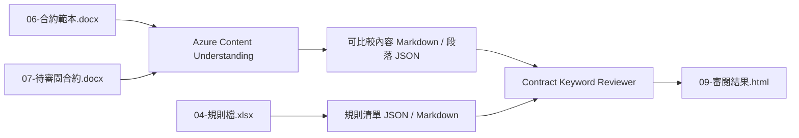

## AI 合約關鍵字審閱 demo

這一頁整理一個可直接展示的合約審閱最小案例，目標不是重演技術驗證過程，而是讓觀眾快速看懂：

1. 真實輸入是什麼
2. Azure Content Understanding 先幫我們產生哪些正式中間產物
3. AI reviewer 之後如何根據規則與段落結構輸出審閱建議

## Demo 目標

這個 demo 要回答的問題是：

當使用者提供契約範本、待審閱合約與規則檔後，系統能不能先把內容轉成可比較結構，再直接產出可操作的審閱建議。

## 展示流程圖



## 情境摘要

這個案例用兩份真實合約版本做比較：

1. 一份是契約範本
2. 一份是待審閱版本
3. 另外再搭配一份規則檔，作為 reviewer 的判斷依據

展示時建議聚焦在四類最容易被理解的審閱點：

1. 專案名稱與基本欄位是否填對
2. 付款條件與匯款手續費負擔是否符合預設原則
3. 廉潔條款是否仍維持制式版本
4. 資訊安全條款是否應保留或需另向資安單位確認

## 展示順序

建議依下面順序操作：

1. 先展示真實輸入檔
2. 再展示已產生完成的可比較內容與規則清單
3. 說明 reviewer 實際消費的是段落 JSON 與規則 JSON
4. 最後開啟審閱結果 HTML，對照 AI 建議與原始差異

## 真實輸入

資料夾：`data/contract_keyword_review/input/`

這一版 demo 使用的正式輸入包括：

1. `06-合約範本.docx`
2. `07-待審閱合約.docx`
3. `04-規則檔.xlsx`

其中：

1. `06-合約範本.docx` 是基準版本
2. `07-待審閱合約.docx` 是待審閱版本
3. `04-規則檔.xlsx` 是 reviewer 使用的規則來源

`04-規則檔.xlsx` 的 `規則` 工作表目前提供的是 reviewer policy table，主要告訴系統：

1. 哪些條款屬於哪一類規則
2. 哪些欄位或關鍵字需要特別命中
3. 哪些內容原則可改、不可改，或必須人工確認
4. 命中後應輸出什麼提醒或建議

## 已產生的中間產物

資料夾：`data/contract_keyword_review/intermediate/`

### 合約可比較內容

1. `06-合約範本-可比較內容.md`
2. `06-合約範本-可比較段落.json`
3. `07-待審閱合約-可比較內容.md`
4. `07-待審閱合約-可比較段落.json`

這四個檔案把兩份 Office 合約先轉成 AI 更容易消費的結構：

1. Markdown 版本適合展示與人工快速閱讀
2. JSON 版本適合 reviewer 直接做段落比對與條文定位
3. 每段都帶有固定編號，方便對照審閱意見

### 規則清單

1. `04-規則清單.json`
2. `04-規則清單.md`

這兩個檔案把 Excel 規則檔整理成正式展示素材：

1. JSON 版提供 agent 精準讀取欄位
2. Markdown 版適合現場展示與快速說明

### 差異參考頁

1. `ref-08-差異比較.html`

這份 HTML 只保留作為 reference，不再是主流程的必要中間產物。展示主線仍以可比較段落結構與最終審閱結果為主。

## 最終審閱結果

資料夾：`data/contract_keyword_review/output/`

正式展示輸出為：

1. `09-審閱結果.html`

這份結果頁的角色是把：

1. 原始差異
2. 命中的規則
3. AI reviewer 給出的審閱建議

放在同一個可展示的畫面中，方便直接做 workshop 示範。

## 最小必要腳本

目前主流程只保留兩支最小必要腳本：

1. `generate_content_artifacts.py`
2. `analyze_data_upload.py`

### `generate_content_artifacts.py`

用途：

1. 使用真實 Azure Content Understanding 產生兩份合約的可比較內容
2. 把規則檔萃取成規則清單 JSON / Markdown
3. 在 live CU 不可用時，允許退回本機 Office XML fallback 以重建展示素材

目前正式主流程固定以 data upload 為優先路徑，並已用真實 Azure 驗證可行。

建議重建指令：

```bash
.venv-cu/bin/python data/contract_keyword_review/generate_content_artifacts.py \
    --cu-analyzer-id prebuilt-layout \
    --use-local-fallback
```

### `analyze_data_upload.py`

用途：

1. 直接把本機文件以 data upload 送進 Azure Content Understanding
2. 驗證特定檔案在目前 Azure 環境下是否可成功回傳 markdown

建議驗證指令：

```bash
set -a && source .azure/fdry-payton-1/.env && set +a && \
.venv-cu/bin/python data/contract_keyword_review/analyze_data_upload.py \
    --file data/contract_keyword_review/input/06-合約範本.docx
```

## Reviewer 展示方式

最小 reviewer 流程建議直接讀取：

1. `06-合約範本-可比較段落.json`
2. `07-待審閱合約-可比較段落.json`
3. `04-規則清單.json`

然後輸出審閱建議，不必再額外依賴 Blob URL 路徑或診斷腳本。

可直接沿用：

1. `config/reviewer_prompt.txt`
2. `config/sample_questions.txt`

## 檢查點

!!! success "最小版合約關鍵字審閱 demo 已就緒"
    你應該能完成以下展示：

    - [x] 展示真實輸入檔
    - [x] 展示由真實 Azure Content Understanding 產生的正式中間產物
    - [x] 展示規則檔如何被轉成規則清單 JSON / Markdown
    - [x] 讓 reviewer 根據段落結構與規則輸出審閱建議
    - [x] 用 `09-審閱結果.html` 做最後對照

## 來源對照

本資料夾內容來自：`ref/AI合約審閱/`

這一版只保留展示頁、正式素材與最小必要腳本，方便後續再往全文審閱或合約自動生成擴充。
