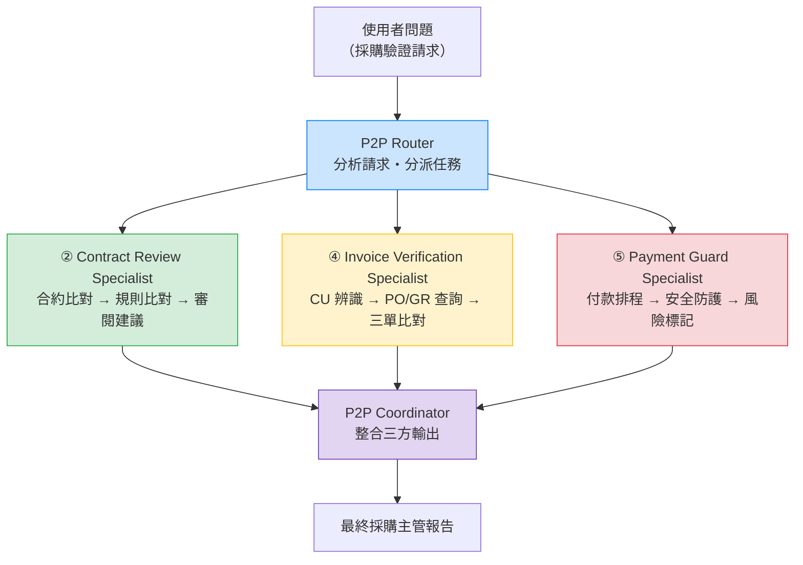

# P2P Multi-Agent Workflow 示意

本資料夾包含 P2P 採購到付款的多 Agent Workflow 定義，結構沿用零售 demo 的 router → specialists → coordinator 模式。

> **定位：** 這是示意用途，讓學員知道 P2P 五個 Agent「原則上可以串成一條完整 workflow」。
> 主線展示仍以三個獨立 Agent（②④⑤）為主。

## 架構圖

```
                          ┌─────────────────────┐
                          │     使用者問題        │
                          │  （採購驗證請求）      │
                          └──────────┬──────────┘
                                     │
                                     ▼
                          ┌─────────────────────┐
                          │    P2P Router        │
                          │   分析請求、分派      │
                          └──┬───────┬────────┬──┘
                             │       │        │
                     ┌───────┘       │        └───────┐
                     ▼               ▼                ▼
            ┌──────────────┐ ┌──────────────┐ ┌──────────────┐
            │  ② 採購       │ │  ④ 發票       │ │  ⑤ 付款       │
            │  Contract    │ │  Invoice     │ │  Payment     │
            │  Review      │ │  Verification│ │  Guard       │
            │  Specialist  │ │  Specialist  │ │  Specialist  │
            │              │ │              │ │              │
            │ • 合約比對    │ │ • CU 辨識     │ │ • 付款排程    │
            │ • 規則比對    │ │ • 三單比對    │ │ • 安全防護    │
            │ • 審閱建議    │ │ • 差異報告    │ │ • 風險標記    │
            ├──────────────┤ ├──────────────┤ ├──────────────┤
            │ tool: search │ │ tool: both   │ │ tool: both   │
            └──────┬───────┘ └──────┬───────┘ └──────┬───────┘
                   │                │                │
                   └────────┬───────┘────────┬───────┘
                            │                │
                            ▼                │
                 ┌──────────────────────┐    │
                 │   P2P Coordinator     │◀──┘
                 │  整合三方輸出          │
                 │  產出經理可用的摘要     │
                 └──────────┬───────────┘
                            │
                            ▼
                 ┌──────────────────────┐
                 │   最終採購主管報告     │
                 │  • 合約審閱結論       │
                 │  • 三單比對結果       │
                 │  • 付款建議          │
                 │  • 風險與待辦事項     │
                 └──────────────────────┘
```

## Mermaid 流程圖



## 與零售 demo 的對照

| 零售 Workflow            | P2P Workflow                | 說明 |
|-------------------------|-----------------------------|------|
| `retail-incident-router` | `p2p-router`               | 分析問題、分派 specialist |
| `retail-store-ops`       | `contract-review-specialist` | 查文件 + 查資料的 specialist |
| `retail-launch-comms`    | `invoice-verification-specialist` | 查文件 + 查資料的 specialist |
| —                       | `payment-guard-specialist`   | 新增：含 Content Safety guardrail |
| `retail-incident-coordinator` | `p2p-coordinator`      | 整合上游輸出 |

## 使用方式

### 方式一：視覺示意

直接展示本檔的架構圖和 `p2p_workflow.yaml`，口頭說明 P2P 如何對應 router → specialists → coordinator 模式。

### 方式二：實際執行

如果環境已準備好，可使用 workflow runtime 執行：

```bash
# 使用 P2P workflow YAML 執行（需要先建好對應的 Foundry Agents）
python scripts/foundry_multi_agent_runtime.py \
    --workflow data/p2p/multi_agent/p2p_workflow.yaml \
    --scenario p2p_invoice_verification
```

### 範例問題

```
供應商數碼動畫（統編 80204049）寄來一張發票，
PO 號碼 4500001332，料號 MZ-RM-R300-01，
數量 53，單價 1,730，金額 91,690，稅額 4,585，總計 96,275。
請驗證三單是否一致，並檢查付款條件是否符合合約規定。
```

## 相關檔案

| 檔案 | 說明 |
|------|------|
| `p2p_workflow.yaml` | P2P Workflow 定義（本資料夾） |
| `multi_agent/workflow.yaml` | 零售 Workflow 定義（主線，可做對照） |
| `scripts/foundry_multi_agent_runtime.py` | Workflow 執行引擎 |
| `scripts/scripts_15_shared.py` | Workflow 共用函式 |
