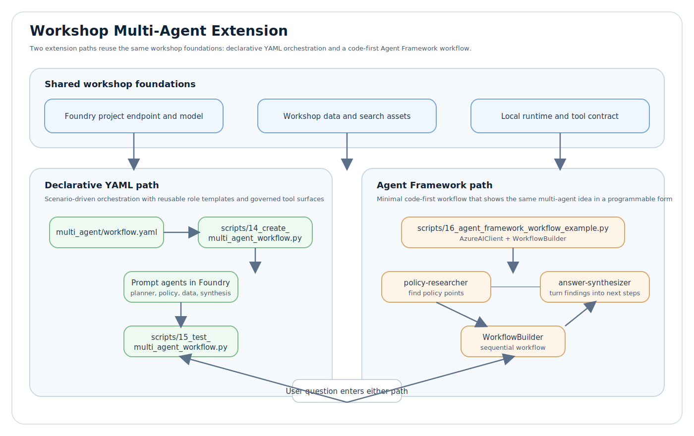

# Workshop Multi-Agent Extension

This folder adds a declarative multi-agent path next to the existing single-agent workshop flow.

It is intentionally separate from the main pipeline:

- the main workshop keeps one orchestrator agent plus local SQL and document tools
- this extension turns the same data and search assets into a four-step workflow
- each scenario reuses the current workshop environment, generated data, and search index

## What gets added

- `workflow.yaml`: declarative scenario and agent design
- `scripts/14_create_multi_agent_workflow.py`: creates scenario-specific prompt agents in Foundry
- `scripts/15_test_multi_agent_workflow.py`: runs the planner → policy → data → synthesis workflow
- `scripts/16_agent_framework_workflow_example.py`: minimal code-first workflow using Microsoft Agent Framework

## Architecture

The extension now has two parallel learning paths:

- a declarative YAML path for scenario-driven multi-agent orchestration
- a code-first Agent Framework path for a minimal programmable workflow

Both paths reuse the same workshop foundations.



File mapping for the diagram:

- Workflow YAML = `multi_agent/workflow.yaml`
- Create workflow script = `scripts/14_create_multi_agent_workflow.py`
- Test workflow script = `scripts/15_test_multi_agent_workflow.py`
- Agent Framework example script = `scripts/16_agent_framework_workflow_example.py`

Read the diagram left to right as two ways to extend the same workshop:

- the YAML path emphasizes reusable scenarios, role templates, and governed tool surfaces
- the Agent Framework path emphasizes the smallest possible code sample for a sequential multi-agent workflow

## Agent roles

1. `planner`
2. `policy_specialist`
3. `data_specialist`
4. `synthesizer`

This is a true multi-agent pattern, but it still uses the current workshop's local tool execution model.

## Why this matches the existing workshop

- Foundry prompt agents are already used in `scripts/07_create_foundry_agent.py`
- local tool execution is already implemented in `scripts/08_test_foundry_agent.py`
- the extension only changes the orchestration shape, not the underlying data/search foundations

## Usage

Create all scenario agents:

```bash
python scripts/14_create_multi_agent_workflow.py
```

Run one scenario with its default sample question:

```bash
python scripts/15_test_multi_agent_workflow.py --scenario policy_gap_analysis
```

Run one scenario with a custom question:

```bash
python scripts/15_test_multi_agent_workflow.py \
  --scenario exception_triage \
  --question "We saw an unusual spike in escalations. What policy applies and what does the data suggest?"
```

## Output model

The workflow produces four visible stages:

1. planner brief
2. policy findings
3. data findings
4. final synthesized answer

That makes it easy to demo how a customer could move from a single-agent PoC to a more governed multi-agent design.
