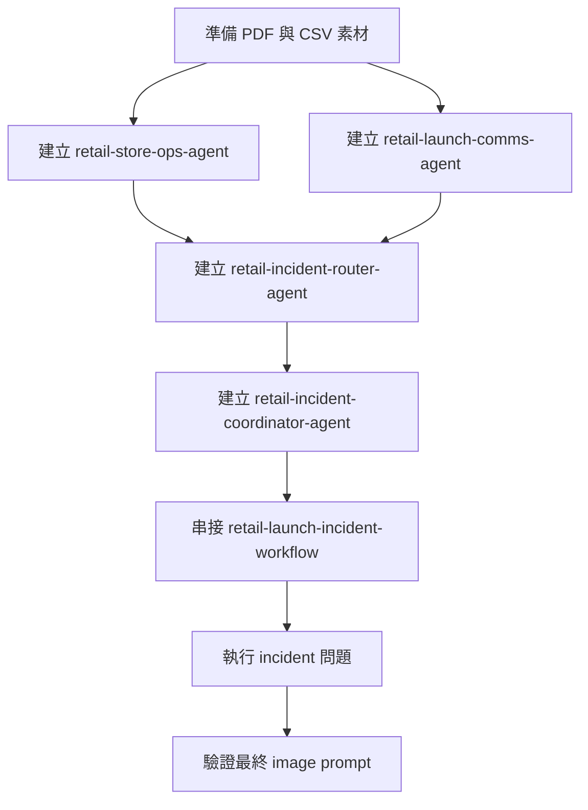

# 零售手動 demo

這一頁整理一個可直接搭配既有素材展示的零售 incident 情境，適合在 workshop 主流程之外，補一段 Foundry portal 手動操作示範。

!!! info "適用時機"
    如果你要在 workshop 既有腳本之外，再補一段 portal 手動操作展示，這個情境比從零設計新案例更快。

## Demo 目標

這場 demo 要回答的問題是：

當零售新品上市遇到疑似標示錯誤時，Foundry 能不能協助團隊快速整理：

1. 門市立即應變動作
2. 店員與對客溝通說法
3. 臨時店內告示方向
4. 一版可直接拿去測試的 image prompt

## 展示流程圖



| Agent | 職責 |
|------|------|
| `retail-store-ops-agent` | 根據營運知識文件回答門市應變、停售、升級與第一線話術。 |
| `retail-launch-comms-agent` | 把 incident guidance 轉成對客說法、告示文案、社群回覆與海報方向。 |
| `retail-incident-router-agent` | 不直接解題，只把原始 incident request 整理成 specialist agents 可處理的 handoff brief。 |
| `retail-incident-coordinator-agent` | 整合 router、營運、溝通三方輸出，產出區經理可直接採用的 recovery package。 |

## 情境摘要

- Contoso Retail 推出新品 `BlueLeaf Sparkling Oat Latte`
- 上市當天，三家門市回報 topping sachet 疑似把 almond syrup 標錯成一般 oat topping
- 區經理需要快速決定是否暫停銷售、如何統一店員說法，以及如何提供門市告示與海報方向

這個案例特別適合展示三件事：

1. 用知識文件讓 specialist agents 回答更穩定
2. 用多 agent 分工拆開營運與溝通責任
3. 用 workflow 把多個 agent 的輸出整合成區經理可直接採用的 recovery package

## 展示順序

建議用下面順序進行：

1. 準備文件與表格素材
2. 建立兩個 specialist agents
3. 補上 router 與 coordinator agent
4. 在 workflow 中串接四個 agent
5. 用 workflow 的最終結果驗證 image prompt

## 使用原則

1. 學員與講者操作這個零售 demo 時，請直接以本頁為主。
2. 後續如果要更新 agent 指令、workflow 節點順序、示範 prompt 或講解口條，也請集中修改本頁，避免內容漂移。

## 你在本頁會拿到的內容

本頁已直接收錄以下內容：

1. 完整情境與展示順序
2. 文件與表格素材使用方式
3. 四個 agents 的逐字 instruction 與測試 agent 問題
4. 可直接貼入的 workflow YAML
5. image model 可用的示範 prompt

如果你要交叉比對 repo 內其他素材，請看下列來源：

| 需求 | 來源檔案 |
|------|----------|
| Foundry low-code workflow 草稿 | `tmp/retail-launch-incident-foundry-low-code-workflow.yaml` |
| 零售情境素材 | `data/retail_launch_incident/` |

## Step 1：準備素材

先選一條示範路徑即可。

| 路徑 | 什麼時候用 | 你要做什麼 |
|------|------|------|
| 自動 | 你想先把 demo 環境備好，不在課堂上逐步建立 knowledge | 跑 script，把 PDF 與 CSV 先送進 Blob Storage、Azure AI Search、Foundry Knowledge |
| 手動 | 你想在 portal 現場示範 knowledge 與 agent 掛載 | 自己建立 knowledge，手動分配文件，另外處理共用表格資料 |

### 方式 1：自動

適合情境：

1. 你想快速把 demo 環境準備好。
2. 你不想在課堂上逐步示範每個 knowledge 建立動作。
3. 你要讓文件與表格都先進到可重複使用的共用資料層。

操作步驟：

1. 確認 `data/retail_launch_incident/documents/` 與 `data/retail_launch_incident/tables/` 內的素材都已備齊。
2. 執行 `prepare_search_and_blob_assets.py`，把 PDF 與 CSV 送進 Blob Storage 與 Azure AI Search。
3. 執行維護者入口 `scripts/06b_upload_to_foundry_knowledge.py`，讓 Search index 對應到 Foundry Knowledge。
4. 回到 portal，把 knowledge 掛到後面要建立的 agents。

### 方式 2：手動

適合情境：

1. 你要在現場完整示範 portal 內如何建立 knowledge 與 agent。
2. 你想讓學員看到文件要如何分配到不同 specialist agents。
3. 你想保留更多人工操作空間，而不是直接用預先準備好的資料層。

操作步驟：

1. 手動建立 `retail-store-ops-kb` 與 `retail-launch-comms-kb`。
2. 依照文件類型，把營運文件掛到 `retail-store-ops-agent`，把對客溝通文件掛到 `retail-launch-comms-agent`。
3. 另外決定表格資料要放在哪個共用 Search / Foundry knowledge 層，不要只掛在單一 specialist agent 下。
4. 建完 knowledge 之後，再往下建立四個 agents 與 workflow。

### 文件素材

來源資料夾：`data/retail_launch_incident/documents/`

如果你走自動方式，直接使用既有腳本，把 PDF 寫入 Blob Storage、Azure AI Search 與 Foundry Knowledge：

```bash
python data/retail_launch_incident/prepare_search_and_blob_assets.py
python scripts/06b_upload_to_foundry_knowledge.py
```

如果你不是在做這種手動示範，而只是要把 Foundry IQ 路徑準備好，主線仍建議先用 `python scripts/admin_prepare_foundry_iq_demo.py`。

這個流程會自動完成三件事：

1. 把 PDF 原檔上傳到 Blob Storage
2. 把 PDF 內容切 chunk 後寫進 Azure AI Search
3. 用 Search index 建立 Foundry IQ knowledge base

會被處理的 PDF：

1. `ops-store-incident-playbook.pdf`
2. `ops-shift-lead-response-guide.pdf`
3. `comms-launch-campaign-brief.pdf`
4. `comms-customer-message-guidelines.pdf`

如果你走手動方式，文件可依下面方式分配。

### 手動上傳對照表

如果你要改走 portal 裡的手動 knowledge / agent 示範路徑，可先照下面分配：

| 檔案 | 手動上傳到哪個 agent / knowledge |
|------|------------------------------|
| `ops-store-incident-playbook.pdf` | `retail-store-ops-agent` / `retail-store-ops-kb` |
| `ops-shift-lead-response-guide.pdf` | `retail-store-ops-agent` / `retail-store-ops-kb` |
| `comms-launch-campaign-brief.pdf` | `retail-launch-comms-agent` / `retail-launch-comms-kb` |
| `comms-customer-message-guidelines.pdf` | `retail-launch-comms-agent` / `retail-launch-comms-kb` |

對應原則很簡單：

1. 營運應變類文件給 `retail-store-ops-agent`
2. 對客溝通類文件給 `retail-launch-comms-agent`

### 表格素材

來源資料夾：`data/retail_launch_incident/tables/`

如果你走自動方式，上面的 script 會把這些 CSV 轉成可檢索的 Search 文件。

會用到的表格包括：

1. `launch_incidents.csv`
2. `store_response_actions.csv`

如果你要走手動 portal 展示，建議仍把這些表格先匯入共用的 Search 或 Foundry knowledge 層，而不是只掛在單一 specialist agent 下面。

比較正確的理解是：

1. 它們屬於共用的 Search / Foundry knowledge 資料層
2. 不屬於 `retail-store-ops-agent` 或 `retail-launch-comms-agent` 其中一個人的專屬 knowledge
3. 如果走目前 repo 的建議流程，仍然應該用 script 先寫進 Azure AI Search，再供後續 Foundry IQ 或 workflow 使用

完成這一步後，你至少應該確認兩件事：

1. PDF 已依營運文件與溝通文件分流完成。
2. 表格資料已進到共用檢索層，而不是只掛在單一 specialist agent 下面。


## Step 2：建立兩個 specialist agents

前面這一步是把資料備齊；接下來在 `Build / Agents` 建兩個 specialist agents，分別負責營運應變與對客溝通。

### `retail-store-ops-agent`

用途：回答門市第一線營運應變、前 15 分鐘與前 60 分鐘動作、升級條件與店員一致話術。

??? example "Store Operations instruction"

    ```text
    You are the Store Operations Coach for Contoso Retail.

    Your job is to help district managers and store managers handle launch-day product incidents using only the approved operating guidance in your connected knowledge base.

    Operating rules:
    - Use the connected knowledge as the source of truth.
    - Prioritize immediate operational actions, escalation, and frontline staff consistency.
    - If the knowledge does not confirm a fact, say that it is not confirmed.
    - Do not invent medical, legal, or supplier details.
    - Do not turn a temporary quality check into a confirmed recall unless the knowledge explicitly says so.

    When you answer, always use this structure:
    1. Incident classification
    2. First 15 minutes
    3. First 60 minutes
    4. Staff talking points
    5. Escalation or reopen conditions
    ```

建議掛載 knowledge：

- `retail-store-ops-kb`

測試 agent：

```text
今天上午 BlueLeaf Sparkling Oat Latte 上市後，三家門市回報與 topping sachet 標示有關的顧客投訴。請說明區經理與門市經理在前 15 分鐘與前 60 分鐘各自應做什麼。
```

做完這個測試後，你應該看到：

1. 回答有明確區分前 15 分鐘與前 60 分鐘。
2. 措辭以 quality check 與暫停銷售為主，而不是直接判定 recall。
3. 有升級條件與門市話術，不只有一般說明。

### `retail-launch-comms-agent`

用途：產出對客說法、短告示文案、社群回覆與門市海報方向。

??? example "Launch Communications instruction"

    ```text
    You are the Launch Communications Coach for Contoso Retail.

    Your job is to turn launch-day incident guidance into customer-safe, brand-consistent communication using only the approved guidance in your connected knowledge base.

    Operating rules:
    - Use the connected knowledge as the source of truth.
    - Keep the tone calm, premium, responsible, and human.
    - Avoid dramatic, legal, or medical language unless explicitly supported by the knowledge.
    - Prefer "quality check" and "temporarily unavailable" over stronger language.
    - Include actionable next steps for customers and store staff.

    When you answer, always use this structure:
    1. Customer-facing summary
    2. Counter script
    3. Poster copy
    4. Social reply
    5. Creative direction for image generation
    ```

建議掛載 knowledge：

- `retail-launch-comms-kb`

測試 agent：

```text
BlueLeaf Sparkling Oat Latte 因品質檢查，暫時在三家門市停售。請提供一段安全的對客櫃台說法、一版短告示文案、一則社群回覆，以及門市海報的創意方向。
```

做完這個測試後，你應該看到：

1. 對客說法穩定，沒有過度戲劇化或法律化語氣。
2. 有櫃台話術、短告示、社群回覆與視覺方向四種輸出。
3. 措辭與前面的營運處置一致，特別是 quality check 與 temporarily unavailable。

## Step 3：補上 router 與 coordinator

前面兩個 agent 各自回答自己的領域。接下來，我們補上兩個角色，讓整個流程可以串起來。一個負責把問題整理成 handoff brief，另一個負責把結果整合成最後交付內容。

### `retail-incident-router-agent`

用途：不直接解題，只把使用者原始請求整理成 specialist agents 可處理的 handoff brief。

Create agent: `retail-incident-router-agent`

??? example "Router instruction"

    ```text
    You are the Incident Router for a retail launch-day issue.

    Your job is not to solve the incident directly. Your job is to create a clean handoff brief for specialist agents.

    You must identify:
    - what happened,
    - what operations evidence is needed,
    - what customer communication evidence is needed,
    - what final deliverables should be produced.

    Do not invent policies. Do not write customer-facing copy. Do not answer as if you are the final decision-maker.

    Always use this structure:
    1. Situation summary
    2. Operations questions to answer
    3. Communications questions to answer
    4. Required final deliverables
    ```

測試時請貼上的文字：

```text
今天 BlueLeaf Sparkling Oat Latte 上市後，市中心三家門市回報顧客投訴，指出部分 topping sachet 疑似把杏仁糖漿標錯成一般 oat topping。

請不要直接給最終處置方案，而是先整理成一份 handoff brief，提供給 operations specialist 與 communications specialist 使用。

這份 brief 必須清楚區分：
- 事件摘要
- 營運面需要回答的問題
- 對客溝通面需要回答的問題
- 最後要交付給區經理的成果項目
```

它應該明確拆出：

1. Situation summary
2. Operations questions to answer
3. Communications questions to answer
4. Required final deliverables

做完這個測試後，你應該看到 router 只整理 handoff brief，不會直接替區經理做最後決策。

### `retail-incident-coordinator-agent`

用途：整合 router、store operations、launch communications 三方輸出，形成區經理可直接採用的 recovery package。

Create agent: `retail-incident-coordinator-agent`

??? example "Coordinator instruction"

    ```text
    You are the Incident Coordinator for Contoso Retail.

    Your job is to combine the outputs from the Incident Router, Store Operations Coach, and Launch Communications Coach into one district-manager-ready recovery package.

    Operating rules:
    - Synthesize, do not invent.
    - Keep operational actions and communication guidance aligned.
    - Highlight anything that remains unconfirmed.
    - End with one production-ready creative prompt:
        - one image-generation prompt for an in-store poster

    Always use this structure:
    1. Executive summary
    2. Immediate store actions
    3. Customer communication package
    4. Risks or open questions
    5. Image-generation prompt
    6. Implementation notes for the poster
    ```

最後交付內容應至少包含：

1. Executive summary
2. Immediate store actions
3. Customer communication package
4. Risks or open questions
5. Image-generation prompt
6. Implementation notes for the poster

測試時請貼上的文字：

```text
Original user request:
今天 BlueLeaf Sparkling Oat Latte 上市後，市中心三家門市回報顧客投訴，指出部分 topping sachet 疑似把杏仁糖漿標錯成一般 oat topping。請產出一份可供區經理直接採用的 recovery package，內容需包含：立即門市動作、店員話術、對客安全說法、臨時店內告示方向，以及一版門市海報的視覺方向。

Router brief:
1. Situation summary
- Launch-day incident involving possible topping sachet labeling mismatch across three city-center stores.
- Customer complaints have already been reported at the counter.
- District manager needs immediate operations guidance and customer communication guidance.
2. Operations questions to answer
- Should stores temporarily pause sales of the affected drink?
- What should store managers do in the first 15 and 60 minutes?
- What evidence should be collected before escalation?
3. Communications questions to answer
- How should frontline staff explain the temporary pause safely?
- What short poster copy and social reply should be used?
- What visual direction should be used for in-store signage?
4. Required final deliverables
- Immediate store actions
- Staff talking points
- Customer-facing summary
- Poster copy
- Social reply
- Image prompt
- Poster implementation notes

Store Operations output:
1. Incident classification
- Treat as a quality-check incident requiring temporary sales pause at affected stores until SKU / sachet labeling is confirmed.
2. First 15 minutes
- Pause sales of the affected drink at reported stores.
- Isolate remaining sachets tied to the affected launch stock.
- Notify district manager and capture store-level incident facts.
3. First 60 minutes
- Confirm whether the issue is isolated or broader.
- Align shift leads on one staff script.
- Reopen only when approved guidance confirms the product can return to sale.
4. Staff talking points
- The item is temporarily unavailable while a quality check is completed.
- Please offer an alternative beverage and apologize for the inconvenience.
5. Escalation or reopen conditions
- Escalate if additional stores report the same issue.
- Reopen only after approved confirmation from operations leadership.

Launch Communications output:
1. Customer-facing summary
- BlueLeaf Sparkling Oat Latte is temporarily unavailable while we complete a quality check.
2. Counter script
- We're temporarily pausing this item while we verify product quality. I'd be happy to help you choose today's closest alternative.
3. Poster copy
- BlueLeaf Product Update
- BlueLeaf Sparkling Oat Latte is temporarily unavailable during a quality check.
- Please ask our store team about today's alternative offer.
4. Social reply
- Thanks for checking with us. This item is temporarily unavailable at select stores while we complete a quality check. Our store teams can recommend an alternative in the meantime.
5. Creative direction for image generation
- Calm, premium, reassuring cafe look with teal, cream, and soft copper accents.

Combine everything into one district-manager-ready recovery package.
```

!!! tip "關鍵原則"
    Coordinator 要做的是 synthesize，不是自行發明政策或補不存在的事實。

做完這一步後，你應該看到最終輸出把營運處置與對客溝通整合成同一份 recovery package，而不是三份分散答案。

## Step 4：串 workflow

!!! note "Workflow 示範原則"
    這裡提供的是最小可講解版本。若你在 repo 內已有測過的 workflow 草稿，優先沿用目前可存檔、可執行的版本，不要在 demo 前再額外加複雜節點。

現在我們把前面的 agent 串成一條 workflow。這一步的重點是，讓學員看到每個角色都很清楚，而且最後能組成一份完整答案。

### 這時候建立的流程順序

主線只要講清楚這四步：

1. Router
2. Store Operations
3. Launch Communications
4. Coordinator

??? example "最小 workflow YAML"

    ```text
    name: retail-launch-incident-workflow
    description: Sequential Foundry workflow for the retail launch incident recovery scenario

    kind: Workflow
    trigger:
        kind: OnConversationStart
        id: retail_launch_incident
        actions:
            - kind: InvokeAzureAgent
                id: invoke_router
                displayName: Route incident
                conversationId: =System.ConversationId
                agent:
                    name: retail-incident-router-agent

            - kind: InvokeAzureAgent
                id: invoke_store_ops
                displayName: Build store operations response
                conversationId: =System.ConversationId
                agent:
                    name: retail-store-ops-agent

            - kind: InvokeAzureAgent
                id: invoke_launch_comms
                displayName: Build customer communications response
                conversationId: =System.ConversationId
                agent:
                    name: retail-launch-comms-agent

            - kind: InvokeAzureAgent
                id: invoke_coordinator
                displayName: Synthesize district manager package
                conversationId: =System.ConversationId
                agent:
                    name: retail-incident-coordinator-agent
                output:
                    autoSend: true
    ```

如果你要在 Foundry low-code workflow editor 裡示範，可以用這個最小順序：

1. Router
2. Store Operations
3. Launch Communications
4. Coordinator

這個順序的重點，不是展示複雜分支，而是讓觀眾清楚看到：

- 先把 incident request 轉成 handoff brief
- 再分別取得營運與溝通答案
- 最後整合成單一 recovery package

做完這一步後，你應該可以在 workflow 畫面清楚說明每個節點的責任，而不需要額外展示複雜條件分支。

### 啟動 workflow 時貼入

```text
今天 BlueLeaf Sparkling Oat Latte 上市後，市中心三家門市回報顧客投訴，指出部分 topping sachet 疑似把杏仁糖漿標錯成一般 oat topping。請產出一份可供區經理直接採用的 recovery package，內容需包含：立即門市動作、店員話術、對客安全說法、臨時店內告示方向，以及一版門市海報的視覺方向。
```

## Step 5：驗證最終輸出

最後請把 coordinator 產出的 image prompt 拿去測 image model，確認它是否同時符合三個要求：

1. 語氣穩定且對客安全
2. 視覺方向符合 premium retail launch
3. 海報重點和前面 agent 給出的營運與溝通指引一致

建議不要只看 prompt 本身，也要回頭比對：

- 是否與 quality check 的措辭一致
- 是否避免過度戲劇化或醫療、法律語言
- 是否和門市現場暫停銷售的說法一致

如果這三件事都對得上，這個零售 manual demo 就可以收斂成一條很清楚的教學主線。

## 檢查點

!!! success "零售手動 demo 已就緒"
    你應該能夠完成以下展示：

    - [x] 用知識文件支撐 specialist agent 回答
    - [x] 用 router 與 coordinator 展示多 agent 分工
    - [x] 產出一致的 store actions 與 customer communication package
    - [x] 產出可直接測試的 image-generation prompt

---

[← 建置與測試](03-demo.md) | [深入解析 →](../03-understand/index.md)
