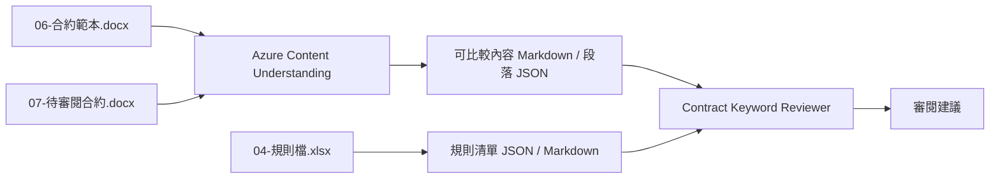

# 合約關鍵字審閱手動 demo

這一頁整理一個可直接搭配既有素材展示的合約審閱情境，適合在 workshop 主流程之外，補一段以 Azure Content Understanding 與 reviewer prompt 為主的手動示範。

!!! info "適用時機"
    如果你要展示「文件先被轉成可比較結構，再由 AI reviewer 根據規則輸出審閱建議」的流程，這個情境比從零整理合約素材更快。

## Demo 目標

當使用者提供契約範本、待審閱合約與規則檔後，系統能不能：

1. 用 Azure Content Understanding 把 Office 合約轉成可比較結構
2. 用規則檔把 reviewer 的判斷邏輯外部化
3. 讓 reviewer 直接根據段落 JSON 與規則 JSON 產出審閱建議

## 展示流程圖



## Step 1：準備素材

來源資料夾：`data/contract_keyword_review/input/`

| 檔案 | 角色 |
|------|------|
| `06-合約範本.docx` | 基準版本 (baseline) |
| `07-待審閱合約.docx` | 待審閱版本 (submitted) |
| `04-規則檔.xlsx` | 規則來源 (rule source) |

先讓學員看懂三份輸入各自扮演什麼角色即可。

## Step 2：重建正式中間產物

使用自動化腳本一鍵產生所有中間產物：

```bash
bash data/p2p/run_02_contract_review.sh
```

腳本會自動：

1. 呼叫 Azure Content Understanding 產生兩份合約的可比較內容（Markdown + JSON）
2. 把規則檔萃取成規則清單 JSON / Markdown
3. 檢查 6 份中間產物是否完整並顯示摘要

完成後應看到以下中間產物（位於 `data/contract_keyword_review/intermediate/`）：

| 檔案 | 用途 |
|------|------|
| `06-合約範本-可比較內容.md` | 範本合約 — 人工閱讀 |
| `06-合約範本-可比較段落.json` | 範本合約 — 段落比對 |
| `07-待審閱合約-可比較內容.md` | 待審合約 — 人工閱讀 |
| `07-待審閱合約-可比較段落.json` | 待審合約 — 段落比對 |
| `04-規則清單.json` | 規則 — 程式用 |
| `04-規則清單.md` | 規則 — 人工閱讀 |

## Step 3：執行 reviewer 展示

Reviewer 直接讀取 Step 2 產生的三份 JSON，輸出審閱建議。Prompt 與範例問題位於 `config/reviewer_prompt.txt` 和 `config/sample_questions.txt`。

??? example "Reviewer instruction"

    ```text
    You are a contract keyword review assistant for internal legal review.

    Your task is to compare two pre-extracted contract structures and produce review advice.

    Inputs:
    - baseline comparable content, such as `06-合約範本-可比較段落.json`
    - submitted comparable content, such as `07-待審閱合約-可比較段落.json`
    - rules data, such as `04-規則清單.json` or `04-規則清單.md`

    You must follow these rules:
    - Use the two comparable contract structures as the primary source of what changed.
    - Use the rules workbook output as the source of review policy and advice style.
    - Do not invent legal conclusions that are not supported by the comparable content or rules.
    - If a difference is only a business-detail field, say that the requesting unit should confirm it.
    - If a clause is a standard clause that should usually not be modified, say so clearly.
    - If the available structure is not enough to make a reliable judgment, say that human legal review is required.

    Working method:
    1. Match paragraphs or clauses by reading order and topic.
    2. Focus on meaningful changes such as project name, payment terms, attachment numbering, checkbox state, responsibility allocation, and standard-clause wording.
    3. Map each meaningful change to one or more applicable rules.
    4. Produce operational review comments that a business unit or legal reviewer can act on immediately.

    Always return your answer in this structure:
    1. Difference summary
    2. Matched rules
    3. Review advice
    4. Items requiring human confirmation

    Prefer concise, operational review comments over long explanations.
    ```

### 測試 reviewer 問題

```text
請根據兩份可比較段落結構與規則檔，列出需要人工確認的條文與原因。

請只針對有實質差異的內容輸出審閱建議，並標示哪些屬於個案執行細節、哪些屬於原則不建議修改的制式條款。

請整理這份待審閱合約中，最值得法務或申請單位優先確認的 5 個差異點。

請根據規則檔判斷：哪些差異可以由使用單位自行確認，哪些差異應升級送法務室審閱。
```

做完這一步後，你應該看到 reviewer：

1. 只針對實質差異輸出建議。
2. 能指出命中的規則，而不是只做一般摘要。
3. 會把不夠確定的項目標成需要人工確認。

## 檢查點

!!! success "合約關鍵字審閱手動 demo 已就緒"
    你應該能夠完成以下展示：

    - [x] 展示真實輸入檔
    - [x] 展示由真實 Azure Content Understanding 產生的正式中間產物
    - [x] 展示規則檔如何被轉成規則清單 JSON / Markdown
    - [x] 讓 reviewer 根據段落結構與規則輸出審閱建議


---

[← 建置與測試](03-demo.md) | [深入解析 →](../03-understand/index.md)