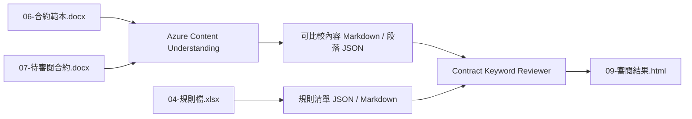

# 合約關鍵字審閱手動 demo

這一頁整理一個可直接搭配既有素材展示的合約審閱情境，適合在 workshop 主流程之外，補一段以 Azure Content Understanding 與 reviewer prompt 為主的手動示範。

!!! info "適用時機"
    如果你要展示「文件先被轉成可比較結構，再由 AI reviewer 根據規則輸出審閱建議」的流程，這個情境比從零整理合約素材更快。

## Demo 目標

這場 demo 要回答的問題是：

當使用者提供契約範本、待審閱合約與規則檔後，系統能不能先把內容整理成 reviewer 可直接消費的正式中間產物，再輸出可操作的審閱建議。

## 展示流程圖



## 情境摘要

- 一份是契約範本 `06-合約範本.docx`
- 一份是待審閱版本 `07-待審閱合約.docx`
- 另外再搭配一份規則來源 `04-規則檔.xlsx`

這個案例特別適合展示三件事：

1. 先用 Azure Content Understanding 把 Office 合約轉成可比較結構
2. 用規則檔把 reviewer 的判斷邏輯外部化，而不是寫死在程式裡
3. 讓 reviewer 直接根據段落 JSON 與規則 JSON 產出審閱建議

展示時建議聚焦在四類最容易被理解的審閱點：

1. 專案名稱與基本欄位是否填對
2. 付款條件與匯款手續費負擔是否符合預設原則
3. 廉潔條款是否仍維持制式版本
4. 資訊安全條款是否應保留或需另向資安單位確認

## 展示順序

建議用下面順序進行：

1. 展示真實輸入檔
2. 重建或確認 Azure Content Understanding 中間產物
3. 展示 reviewer 實際消費的 JSON / Markdown 素材
4. 開啟最終審閱結果 HTML，對照 AI 建議與原始差異

## 使用原則

1. 學員與講者操作這個合約 demo 時，請直接以本頁為主。
2. 後續如果要更新規則檔、重建指令、reviewer prompt 或示範口條，也請集中修改本頁，避免內容漂移。

## 你在本頁會拿到的內容

本頁已直接收錄以下內容：

1. 完整情境與展示順序
2. 真實輸入、正式中間產物與最終輸出的位置
3. 最小必要腳本與建議指令
4. reviewer 展示時應該實際讀取的檔案

如果你要交叉比對 repo 內其他素材，請看下列來源：

| 需求 | 來源檔案 |
|------|----------|
| 合約 demo 素材與腳本 | `data/contract_keyword_review/` |
| reviewer prompt 與 sample questions | `data/contract_keyword_review/config/` |

## Step 1：準備素材

來源資料夾：`data/contract_keyword_review/input/`

這一版 demo 使用的正式輸入包括：

1. `06-合約範本.docx`
2. `07-待審閱合約.docx`
3. `04-規則檔.xlsx`

對應原則很簡單：

1. `06-合約範本.docx` 是基準版本
2. `07-待審閱合約.docx` 是待審閱版本
3. `04-規則檔.xlsx` 是 reviewer 使用的規則來源

`04-規則檔.xlsx` 的 `規則` 工作表目前提供 reviewer policy table，主要告訴系統：

1. 哪些條款屬於哪一類規則
2. 哪些欄位或關鍵字需要特別命中
3. 哪些內容原則可改、不可改，或必須人工確認
4. 命中後應輸出什麼提醒或建議

## Step 2：重建正式中間產物

來源資料夾：`data/contract_keyword_review/intermediate/`

目前主流程只保留一支最小必要腳本：

1. `generate_content_artifacts.py`

### `generate_content_artifacts.py`

用途：

1. 使用真實 Azure Content Understanding 產生兩份合約的可比較內容
2. 把規則檔萃取成規則清單 JSON / Markdown

目前正式主流程固定使用 data upload 呼叫真實 Azure Content Understanding；如果 CU 或環境未就緒，腳本會直接失敗，不再退回本機 fallback。

建議重建指令：

```bash
.venv/bin/python data/contract_keyword_review/generate_content_artifacts.py \
    --cu-analyzer-id prebuilt-layout
```

### 這一步完成後應看到的正式中間產物

合約可比較內容：

1. `06-合約範本-可比較內容.md`
2. `06-合約範本-可比較段落.json`
3. `07-待審閱合約-可比較內容.md`
4. `07-待審閱合約-可比較段落.json`

規則清單：

1. `04-規則清單.json`
2. `04-規則清單.md`

這些檔案的用途如下：

1. Markdown 版本適合展示與人工快速閱讀
2. JSON 版本適合 reviewer 直接做段落比對與條文定位
3. 每段都帶有固定編號，方便對照審閱意見

### 差異參考頁

1. `ref-08-差異比較.html`

這份 HTML 只保留作為 reference，不再是主流程的必要中間產物。展示主線仍以可比較段落結構與最終審閱結果為主。

## Step 3：執行 reviewer 展示

前面這一步是把正式中間產物備齊；接下來，就可以直接示範 reviewer 如何根據段落結構與規則清單輸出審閱建議。

最小 reviewer 流程建議直接讀取：

1. `06-合約範本-可比較段落.json`
2. `07-待審閱合約-可比較段落.json`
3. `04-規則清單.json`

然後輸出審閱建議，不必再額外依賴 Blob URL 路徑或其他診斷腳本。

可直接沿用：

1. `config/reviewer_prompt.txt`
2. `config/sample_questions.txt`

### reviewer instruction

使用下面這段 instruction：

```text
You are a contract keyword review assistant for internal legal review.

Your task is to compare two pre-extracted contract structures and produce review advice.

Inputs:
- baseline comparable content, such as `06-合約範本-可比較段落.json`
- submitted comparable content, such as `07-待審閱合約-可比較段落.json`
- rules data, such as `04-規則清單.json` or `04-規則清單.md`

You must follow these rules:
- Use the two comparable contract structures as the primary source of what changed.
- Use the rules workbook output as the source of review policy and advice style.
- Do not invent legal conclusions that are not supported by the comparable content or rules.
- If a difference is only a business-detail field, say that the requesting unit should confirm it.
- If a clause is a standard clause that should usually not be modified, say so clearly.
- If the available structure is not enough to make a reliable judgment, say that human legal review is required.

Working method:
1. Match paragraphs or clauses by reading order and topic.
2. Focus on meaningful changes such as project name, payment terms, attachment numbering, checkbox state, responsibility allocation, and standard-clause wording.
3. Map each meaningful change to one or more applicable rules.
4. Produce operational review comments that a business unit or legal reviewer can act on immediately.

Always return your answer in this structure:
1. Difference summary
2. Matched rules
3. Review advice
4. Items requiring human confirmation

Prefer concise, operational review comments over long explanations.
```

### 測試 reviewer 問題

```text
請根據兩份可比較段落結構與規則檔，列出需要人工確認的條文與原因。

請只針對有實質差異的內容輸出審閱建議，並標示哪些屬於個案執行細節、哪些屬於原則不建議修改的制式條款。

請整理這份待審閱合約中，最值得法務或申請單位優先確認的 5 個差異點。

請根據規則檔判斷：哪些差異可以由使用單位自行確認，哪些差異應升級送法務室審閱。
```

## Step 4：展示最終結果

來源資料夾：`data/contract_keyword_review/output/`

正式展示輸出為：

1. `09-審閱結果.html`

這份結果頁的角色是把：

1. 原始差異
2. 命中的規則
3. AI reviewer 給出的審閱建議

放在同一個可展示的畫面中，方便直接做 workshop 示範。

建議不要只看結論，也要回頭比對：

1. 建議是否真的對應到段落差異
2. 命中的規則是否來自 `04-規則清單.json`
3. 人工確認事項是否被明確標示，而不是被 AI 直接武斷決定

## 檢查點

!!! success "合約關鍵字審閱手動 demo 已就緒"
    你應該能夠完成以下展示：

    - [x] 展示真實輸入檔
    - [x] 展示由真實 Azure Content Understanding 產生的正式中間產物
    - [x] 展示規則檔如何被轉成規則清單 JSON / Markdown
    - [x] 讓 reviewer 根據段落結構與規則輸出審閱建議
    - [x] 用 `09-審閱結果.html` 做最後對照

## 來源對照

本資料夾內容來自：`ref/AI合約審閱/`

這一版只保留展示頁、正式素材與最小必要腳本，方便後續再往全文審閱或合約自動生成擴充。

---

[← 建置與測試](03-demo.md) | [深入解析 →](../03-understand/index.md)