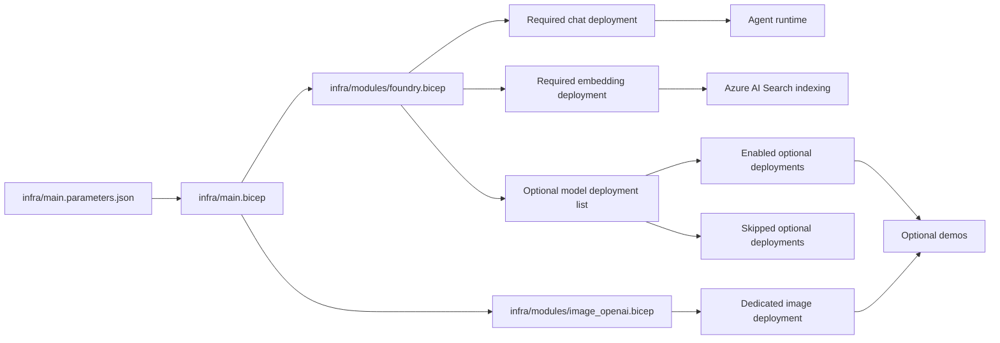

# Foundry 模型：部署策略

## 本頁存在的原因

本工作坊依賴一小組模型部署，但控制平面設計現在支援的功能已超過最低限度。這在客戶提出以下問題時非常重要：

- 哪個模型驅動代理程式的對話？
- 哪個模型驅動文件檢索的向量嵌入？
- 如何在不影響主要工作坊路徑的情況下新增選用模型？

## 必要與選用模型

| 模型角色 | 工作坊需要它的原因 | 典型部署 | 主要路徑是否必要 |
|----------|-------------------|----------|-----------------|
| **聊天模型** | 驅動代理程式的推理與工具選擇 | `gpt-4o-mini` 或同等聊天部署 | 是 |
| **向量嵌入模型** | 為 Azure AI Search 索引建立與檢索產生向量 | 目前範本預設為 `text-embedding-ada-002`；也可改成其他支援的 embedding 部署 | 是 |
| **影像模型** | 用於生成視覺產出物的選用示範 | `gpt-image-1.5` | 否 |
| **其他特殊模型** | 未來示範或客戶專屬擴充 | Bicep 中的選用部署項目 | 否 |

## 目前的工作坊策略

基礎架構現在將模型部署分為兩組：

1. 主要工作坊路徑的**必要部署**
2. 可依環境明確啟用的**選用部署**

其中 image generation 已進一步獨立成專用的 Azure OpenAI resource。這樣做的原因是 image-capable model 往往受區域、配額與資源型態限制，將它和主要聊天路徑拆開會更穩定。

這讓預設部署保持穩定，同時仍為額外示範保留空間。

## 部署流程



## 為何「盡力而為」是明確的

對於選用模型，工作坊**不**依賴平台在供應商部署失敗後靜默繼續的行為。相反地，Bicep 模組要求您明確選擇是否啟用選用部署，而 image generation 則直接使用專用 resource 來隔離風險。

這表示：

- 如果某個選用模型在您的區域或訂閱中不可用，請將其保持停用。
- 必要的聊天 + 向量嵌入路徑仍可順利部署。
- 輸出會摘要說明哪些選用模型已啟用、哪些已跳過。

## 選用模型格式範例

選用部署清單的設計格式如下：

```json
{
  "name": "image-generation",
  "modelName": "gpt-image-1",
  "modelFormat": "OpenAI",
  "modelVersion": "latest",
  "skuName": "GlobalStandard",
  "capacity": 1,
  "enabled": true
}
```

如果 `enabled` 為 `false`，該部署會記錄為已跳過而非嘗試部署。

## 執行階段如何使用各模型

| 執行階段步驟 | 模型相依性 |
|-------------|-----------|
| 代理程式建立與回應生成 | 聊天模型 |
| 工具選擇與合成 | 聊天模型 |
| 文件攝取與向量搜尋 | 向量嵌入模型 |
| 選用的影像生成示範 | 影像模型 |

## 客戶對話要點

| 問題 | 實務回答 |
|------|---------|
| 「為什麼需要多個模型？」 | 「因為檢索和對話是不同的任務。一個部署專為推理最佳化，另一個專為向量嵌入最佳化。」 |
| 「之後可以新增更多模型嗎？」 | 「可以。選用部署已參數化，因此您可以新增示範而不需變更核心工作坊路徑。」 |
| 「如果某個選用模型不可用怎麼辦？」 | 「我們會刻意跳過它，讓主要工作坊保持正常運作，而非讓基礎部署變得脆弱。」 |

## 常見問題

### 客戶需要看到每個模型部署嗎？

不需要。在大多數對話中，您只需要解釋聊天模型和向量嵌入模型之間的區別。選用部署僅在討論擴充情境（例如影像生成）時才有意義。

### 為什麼不用一個大型模型處理所有事情？

因為任務本質不同。對話品質取決於聊天部署，而檢索品質取決於向量嵌入。將它們分開可讓架構更清晰，通常也能降低成本和部署風險。

### 本頁最簡潔的對話要點是什麼？

「工作坊需要一個模型負責推理，另一個模型負責將文件向量化。其他一切都是選用的，且刻意隔離。」

## 這對工作坊的意義

工作坊的承諾保持精簡且可靠：

- 主要路徑：聊天 + 向量嵌入
- 選用路徑：影像生成與未來的特殊示範
- 營運準則：明確啟用或跳過，絕不使用隱藏的後備行為

---

[← 概觀](index.md) | [Foundry IQ：文件 →](01-foundry-iq.md)