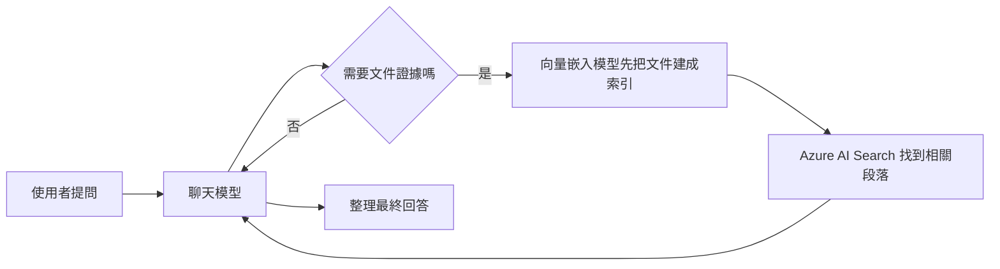

# Foundry 模型：部署策略

## 概要

這個工作坊至少需要兩種模型：

- 一個聊天模型，負責理解問題、決定要不要呼叫工具、整理最後答案
- 一個向量嵌入模型，負責把文件轉成向量，讓 Azure AI Search 可以做語意檢索

如果你只想先完成主流程，只要理解這兩個角色就夠了。其他模型都屬於選配示範。

## 這頁要學什麼

看完這頁，你應該知道：

- 為什麼工作坊不是只用一個模型
- 每種模型在流程中的工作是什麼
- 哪些模型是必要的，哪些只是選配

## 這個工作坊會用到哪些模型

| 模型角色 | 做什麼 | 是否必要 |
|----------|--------|----------|
| 聊天模型 | 理解問題、選擇工具、產生答案 | 是 |
| 向量嵌入模型 | 把文件轉成向量，供 Azure AI Search 建索引與搜尋 | 是 |
| 影像模型 | 支援影像生成示範 | 否 |
| 其他特殊模型 | 未來延伸情境或額外 demo | 否 |

## 為什麼要分成兩種必要模型

因為這兩件事本質上不同：

- 對話推理需要聊天模型
- 文件相似度搜尋需要嵌入模型

把它們拆開，會比「一個模型做全部事情」更穩定，也比較容易調整成本和部署策略。

## 在流程中的位置

## 工作坊目前的部署策略

這份 workshop 內容把模型分成兩類：

1. 主流程一定要有的模型
2. 額外 demo 才會用到的模型

影像生成示範甚至使用獨立的 resource。這樣做的好處是，如果某個選配模型在你的區域不能用，也不會拖累主要教學流程。

## 你在學習時應該怎麼理解它

最簡單的記法是：

- 聊天模型負責「想」
- 嵌入模型負責「找」

只要這兩個角色正常，工作坊的核心體驗就能成立。

## 常見問題

### 一定要看到所有模型部署嗎？

不一定。對學員來說，先理解聊天模型和嵌入模型即可。其他模型屬於延伸能力。

### 如果選配模型部署失敗怎麼辦？

主要流程仍然可以繼續。這也是工作坊把必要模型和選配模型分開的原因。

### 為什麼不用一個超大的模型全部處理？

因為文件檢索和對話回應是兩種不同工作。拆開通常更清楚，也更容易維護。

## 官方延伸閱讀

- [Deploy Microsoft Foundry Models in the Foundry portal](https://learn.microsoft.com/azure/foundry/foundry-models/how-to/deploy-foundry-models)
- [Create and deploy an Azure OpenAI in Azure AI Foundry Models resource](https://learn.microsoft.com/azure/ai-foundry/openai/how-to/create-resource#deploy-a-model)
- [Deployment types for Azure AI Foundry Models](https://learn.microsoft.com/azure/ai-foundry/openai/how-to/deployment-types)

---

[← 概觀](index.md) | [Foundry IQ：文件 →](01-foundry-iq.md)