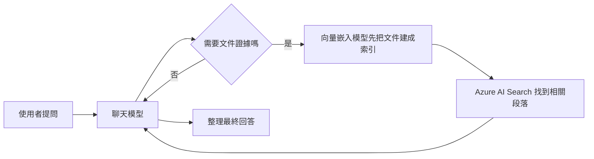

# Foundry 模型：部署策略

## 概要

這一頁的重點，不是把 Foundry portal 裡所有模型都看一遍，而是先搞清楚三件事：

1. Foundry Models 是什麼
2. 在 Foundry 裡「部署模型」到底代表什麼
3. 這個 workshop 真正依賴哪些模型，哪些只是選配

從官網角度看，Microsoft Foundry Models 是用來**探索、比較、部署**模型的統一入口；從這個 workshop 的角度看，真正要先記住的只有兩個必要角色：

- 一個聊天模型，負責理解問題、決定要不要呼叫工具、整理最後答案
- 一個向量嵌入模型，負責把文件轉成向量，讓 Azure AI Search 可以做語意檢索

如果這兩個角色正常，主流程就能成立。其他模型都屬於選配示範。

## 這頁要學什麼

看完這頁，你應該知道：

- Foundry Models 官網最重要的幾個概念
- 為什麼這個 workshop 不是只用一個模型
- `model`、`deployment`、`deployment type` 分別在講什麼
- 哪些模型是主流程必要條件，哪些只是延伸 demo

## 先記住五件事

1. **Foundry Models 是模型目錄加部署入口，不是單一模型。**
2. **你在程式裡實際呼叫的，通常是 deployment name，不只是模型家族名稱。**
3. **不是每個模型都支援每種 deployment type，也不是每個區域都能部署。**
4. **主流程需要 chat model 和 embedding model；image model 是選配。**
5. **region 與 quota 是最常見的部署限制。**

## 官網重點：Foundry Models 到底是什麼

根據 Microsoft 官方文件，Foundry Models 是 Foundry 裡用來探索、比較、部署模型的入口。它把模型大致分成兩類：

| 類別 | 官網重點 | 對 workshop 的意義 |
|------|----------|--------------------|
| **Models sold directly by Azure** | Microsoft 提供支援、整合度高、適合企業 SLA 與 Azure 生態系 | 這個 workshop 主線主要站在這一側思考 |
| **Models from partners and community** | 由外部模型提供者或社群維護，能力更廣，但支援與條款依提供者而異 | 可以是延伸選項，但不是這份 workshop 主線教學的核心 |

第一次看時，你不需要背所有 provider。你只要知道：

- 主流程偏向使用 Azure 生態內比較穩定、整合度高的模型部署
- partner/community 模型是 Foundry 的擴充能力，不是這份 workshop 的起點

## 官網重點：什麼叫做部署模型

在 Foundry 裡，模型不是「看得到就能直接用」。你必須先建立 **deployment**，之後程式或 playground 才能透過那個 deployment 做 inference。

這件事有兩個重要含意：

1. 你在 portal 裡選的是模型
2. 你在執行時真正打到的是 deployment

對 Azure OpenAI / Foundry 這類路徑來說，deployment name 是很重要的邊界。官網也特別提醒：實際 API 呼叫時，要用 deployment name 來路由到對應部署。

最實用的理解方式是：

- **model**：你選的模型能力，例如聊天、嵌入、影像
- **deployment**：你在自己資源裡建立的可呼叫實例
- **deployment type**：這個實例用什麼計價、吞吐與資料處理方式提供服務

## 這個工作坊會用到哪些模型

| 模型角色 | 做什麼 | 是否必要 |
|----------|--------|----------|
| 聊天模型 | 理解問題、選擇工具、產生答案 | 是 |
| 向量嵌入模型 | 把文件轉成向量，供 Azure AI Search 建索引與搜尋 | 是 |
| 影像模型 | 支援影像生成示範 | 否 |
| 其他特殊模型 | 未來延伸情境或額外 demo | 否 |

就這個 repo 目前的預設部署而言，主線重點是：

- chat model：`gpt-5.4-mini`
- embedding model：`text-embedding-3-large`
- optional image model：`gpt-image-1.5`

也就是說，這份 workshop 並不是在展示「模型越多越好」，而是在展示：

- 用 chat model 做推理與工具協調
- 用 embedding model 做文件檢索基礎
- 用選配模型承接額外 demo，而不干擾主線

## 為什麼要分成兩種必要模型

因為這兩件事本質上不同：

- 對話推理需要聊天模型
- 文件相似度搜尋需要嵌入模型

把它們拆開，會比「一個模型做全部事情」更穩定，也比較容易調整成本和部署策略。

這也是官網和實務設計常見的分工：

- 推理模型負責生成與決策
- embedding 模型負責向量化與相似度搜尋

## 在流程中的位置

## 官網重點：deployment type 在決定什麼

官方文件把 deployment type 的差異收斂成三個核心面向：

1. **資料在哪裡處理**
2. **怎麼計價**
3. **吞吐與延遲特性**

對 Azure Direct / Azure OpenAI 類模型，你最常看到的是這些 type：

| 類型 | 官網重點 | 什麼時候要在意 |
|------|----------|------------------|
| `GlobalStandard` | pay-per-token，全球路由，通常有較高預設配額 | 多數工作坊與一般 PoC 的常見起點 |
| `Standard` | 單一區域處理，pay-per-token | 當你更在意區域或資料處理位置 |
| `Provisioned` 系列 | 保留容量，吞吐較可預期 | 高流量、需要穩定延遲時 |
| `Batch` 系列 | 非即時、大量工作、成本較低 | 非同步大批次處理 |

不是每個模型都支援所有 deployment type。這是官網反覆強調的重點之一。

## 工作坊目前的部署策略

這份 workshop 內容把模型分成兩類：

1. 主流程一定要有的模型
2. 額外 demo 才會用到的模型

再往下看 repo 的實作，可以把策略說得更具體：

- chat 與 embedding 部署在同一個 Foundry account 底下
- 預設部署型態以 `GlobalStandard` 為起點
- image generation 屬於選配部署
- 其他 optional model deployments 可以獨立開關

這樣做有幾個實際好處：

- 主線依賴面維持最小
- 如果某個選配模型在特定區域不可用，不會拖垮整個 workshop
- 你可以先把 chat + embedding 跑通，再逐步加 demo 能力

## 你在學習時應該怎麼理解它

最簡單的記法是：

- 聊天模型負責「想」
- 嵌入模型負責「找」
- deployment type 負責「怎麼供應」

只要這兩個角色正常，工作坊的核心體驗就能成立。

## 在這個 workshop 裡，哪些官網細節最值得真的記住

如果你是第一次碰 Foundry Models，最值得記住的是下面四件事：

### 1. deployment name 不是裝飾品

deployment 建立後，playground 與程式都會透過 deployment 來呼叫模型。命名混亂時，後面排錯會很痛苦。

### 2. region availability 會直接影響你能不能部署

即使模型本身存在，也可能：

- 你選的區域不支援
- 你選的 deployment type 不支援
- 該區域目前沒有足夠容量

### 3. quota 是最常見的現實限制

官方文件特別強調，模型部署與推論會消耗區域與模型對應的 quota。這也是為什麼部署失敗時，第一個常看的是 region 和 quota，而不是先懷疑程式。

### 4. Marketplace 訂閱主要是 partner/community 模型的議題

對 Azure Direct 模型，例如這份 workshop 主線依賴的 Azure OpenAI 類路徑，通常不用走 Marketplace 訂閱；但如果你改用某些 partner/community 模型，這就可能變成必要前提。

## 常見問題

### 一定要看到所有模型部署嗎？

不一定。對學員來說，先理解聊天模型和嵌入模型即可。其他模型屬於延伸能力。

### 如果選配模型部署失敗怎麼辦？

主要流程仍然可以繼續。這也是工作坊把必要模型和選配模型分開的原因。

### 什麼情況會讓主流程真的卡住？

最常見的是這幾種：

- chat model 沒成功部署
- embedding model 沒成功部署
- 所選區域不支援該模型或 deployment type
- quota 不足

### 為什麼不用一個超大的模型全部處理？

因為文件檢索和對話回應是兩種不同工作。拆開通常更清楚，也更容易維護。

### 這個 workshop 需要理解 managed compute 和 serverless 嗎？

先不用。那是 Foundry Models 官網的重要平台概念，但對這份 workshop 的第一階段理解來說，你先把「chat + embedding + optional image」和「deployment type / region / quota」弄清楚就夠了。

## 官方延伸閱讀

- [Microsoft Foundry Models overview](https://learn.microsoft.com/azure/foundry/concepts/foundry-models-overview)
- [Deploy Microsoft Foundry Models in the Foundry portal](https://learn.microsoft.com/azure/foundry/foundry-models/how-to/deploy-foundry-models)
- [Create and deploy an Azure OpenAI in Azure AI Foundry Models resource](https://learn.microsoft.com/azure/ai-foundry/openai/how-to/create-resource#deploy-a-model)
- [Deployment types for Azure AI Foundry Models](https://learn.microsoft.com/azure/ai-foundry/openai/how-to/deployment-types)

---

[← 概觀](index.md) | [Foundry IQ：文件 →](01-foundry-iq.md)