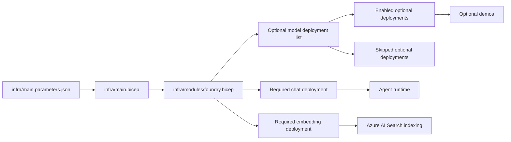

# Foundry Model: Deployment Strategy

## Why this page exists

This workshop depends on a small set of model deployments, but the control-plane design now supports more than the absolute minimum. That matters when customers ask questions like:

- Which model powers the agent conversation?
- Which model powers embeddings for document retrieval?
- How do we add optional models without breaking the main workshop path?

## Required vs optional models

| Model role | Why the workshop needs it | Typical deployment | Required for main path |
|------------|---------------------------|--------------------|------------------------|
| **Chat model** | Drives the agent's reasoning and tool selection | `gpt-4o-mini` or equivalent chat deployment | Yes |
| **Embedding model** | Creates vectors for Azure AI Search indexing and retrieval | `text-embedding-3-large` or equivalent embedding deployment | Yes |
| **Image model** | Optional demo for generated visual artifacts | `gpt-image-1` | No |
| **Extra specialty models** | Future demos or customer-specific extensions | Optional deployment entries in Bicep | No |

## Current workshop strategy

The infrastructure now separates model deployments into two groups:

1. **Required deployments** for the main workshop path
2. **Optional deployments** that can be explicitly enabled per environment

This keeps the default deployment reliable while still making room for extra demos.

## Deployment flow



## Why "best effort" is explicit

For optional models, the workshop does **not** rely on the platform silently continuing after a failed provider deployment. Instead, the Bicep module expects you to choose whether an optional deployment is enabled.

That means:

- If an optional model is not available in your region or subscription, leave it disabled.
- The required chat + embedding path still deploys cleanly.
- Outputs summarize which optional models were enabled and which were skipped.

## Example optional model shape

The optional deployment list is designed for entries like this:

```json
{
  "deploymentName": "image-generation",
  "modelName": "gpt-image-1",
  "modelVersion": "latest",
  "skuName": "GlobalStandard",
  "capacity": 1,
  "enabled": true
}
```

If `enabled` is `false`, the deployment is recorded as skipped instead of attempted.

## How the runtime uses each model

| Runtime step | Model dependency |
|--------------|------------------|
| Agent creation and response generation | Chat model |
| Tool selection and synthesis | Chat model |
| Document ingestion and vector search | Embedding model |
| Optional generated image demo | Image model |

## Customer talking points

| Question | Practical answer |
|----------|------------------|
| "Why more than one model?" | "Because retrieval and conversation have different jobs. One deployment is optimized for reasoning, another for embeddings." |
| "Can we add more models later?" | "Yes. Optional deployments are parameterized so you can add demos without changing the core workshop path." |
| "What if an optional model isn't available?" | "We skip it intentionally and keep the main workshop working instead of making the base deployment fragile." |

## FAQ

### Do customers need to see every model deployment?

No. In most conversations, you only need to explain the separation between the chat model and the embedding model. Optional deployments only matter when you are discussing extension scenarios such as image generation.

### Why not use one large model for everything?

Because the jobs are different. Conversation quality depends on a chat deployment, while retrieval quality depends on embeddings. Splitting them keeps the architecture clearer and usually keeps cost and deployment risk lower.

### What is the simplest talking point for this page?

"The workshop needs one model to reason and one model to vectorize documents. Everything else is optional and intentionally isolated."

## What this means for the workshop

The workshop promise stays narrow and reliable:

- Main path: chat + embeddings
- Optional path: image generation and future specialty demos
- Operational rule: explicit enable or skip, never hidden fallback behavior

---

[← Overview](index.md) | [Foundry IQ: Documents →](01-foundry-iq.md)