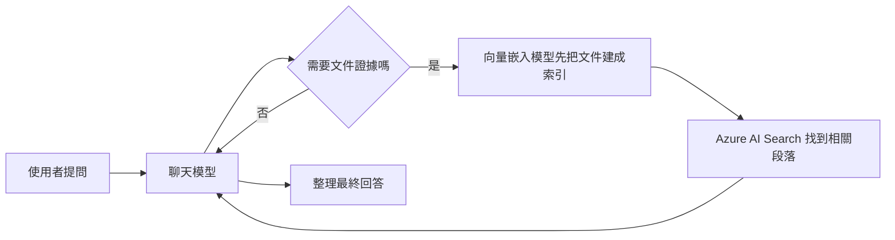

# Foundry 模型：部署策略

這一頁幫你搞清楚三件事：Foundry Models 是什麼、部署模型代表什麼、這個 workshop 真正依賴哪些模型。

## 先記住五件事

1. **Foundry Models 是模型目錄加部署入口**，不是單一模型。
2. **程式裡呼叫的是 deployment name**，不只是模型家族名稱。
3. **不是每個模型都支援每種 deployment type**，也不是每個區域都能部署。
4. **主流程只需要 chat model 和 embedding model**；image model 是選配。
5. **region 與 quota 是最常見的部署限制**。

## 三個核心概念

| 概念 | 白話 | 官方文件 |
|------|------|----------|
| **model** | 你選的模型能力（聊天、嵌入、影像） | [Foundry Models overview](https://learn.microsoft.com/azure/foundry/concepts/foundry-models-overview) |
| **deployment** | 你在自己資源裡建立的可呼叫實例 | [Deploy models](https://learn.microsoft.com/azure/foundry/foundry-models/how-to/deploy-foundry-models) |
| **deployment type** | 這個實例的計價、吞吐與資料處理方式 | [Deployment types](https://learn.microsoft.com/azure/ai-foundry/openai/how-to/deployment-types) |

## 這個工作坊用到哪些模型

| 模型角色 | 預設部署 | 是否必要 |
|----------|----------|----------|
| 聊天模型（負責「想」） | `gpt-5.4-mini` | 是 |
| 向量嵌入模型（負責「找」） | `text-embedding-3-large` | 是 |
| 影像模型 | `gpt-image-1.5` | 否 |

只要聊天和嵌入兩個角色正常，主流程就能成立。

!!! note "azd up 會額外嘗試的選配模型"
    `azd up` 會用 best-effort 方式額外建立一組 default OpenAI deployments，供手動實驗或模型比較使用。即使部分因區域或 quota 無法建立，也不影響主線。完整清單請見 [部署基礎架構](../01-deploy/01-deploy-azure.md)。

## 在流程中的位置

## Deployment type 速查

| 類型 | 重點 | 什麼時候在意 |
|------|------|--------------|
| `GlobalStandard` | pay-per-token，全球路由 | 多數 PoC 的起點 |
| `Standard` | 單一區域，pay-per-token | 在意資料處理位置時 |
| `Provisioned` | 保留容量，吞吐可預期 | 高流量、穩定延遲 |
| `Batch` | 非即時、大量、成本低 | 非同步大批次 |

本 workshop 預設使用 `GlobalStandard`。不是每個模型都支援所有 type。

## 部署卡住時先查這四件事

| 問題 | 說明 |
|------|------|
| deployment name 命名混亂 | playground 與程式都靠 deployment name 路由，命名要清楚 |
| region 不支援 | 即使模型存在，你選的區域或 type 也可能不支援 |
| quota 不足 | 部署失敗時，先查 region 和 quota，不是先懷疑程式 |
| Marketplace 訂閱 | 僅 partner/community 模型需要；Azure Direct 路徑通常不用 |

## 常見問題

**選配模型部署失敗怎麼辦？** 主流程仍可繼續。這也是把必要和選配模型分開的原因。

**為什麼不用一個模型全部處理？** 文件檢索和對話回應是兩種不同工作，拆開更穩定、更容易維護。

**需要理解 managed compute 和 serverless 嗎？** 先不用。先把「chat + embedding」和「deployment type / region / quota」弄清楚就夠了。

## 官方延伸閱讀

- [Microsoft Foundry Models overview](https://learn.microsoft.com/azure/foundry/concepts/foundry-models-overview)
- [Deploy models in the Foundry portal](https://learn.microsoft.com/azure/foundry/foundry-models/how-to/deploy-foundry-models)
- [Create and deploy an Azure OpenAI resource](https://learn.microsoft.com/azure/ai-foundry/openai/how-to/create-resource#deploy-a-model)
- [Deployment types](https://learn.microsoft.com/azure/ai-foundry/openai/how-to/deployment-types)

---

[← 深入解析](index.md) | [Foundry IQ：文件智慧 →](01-foundry-iq.md)