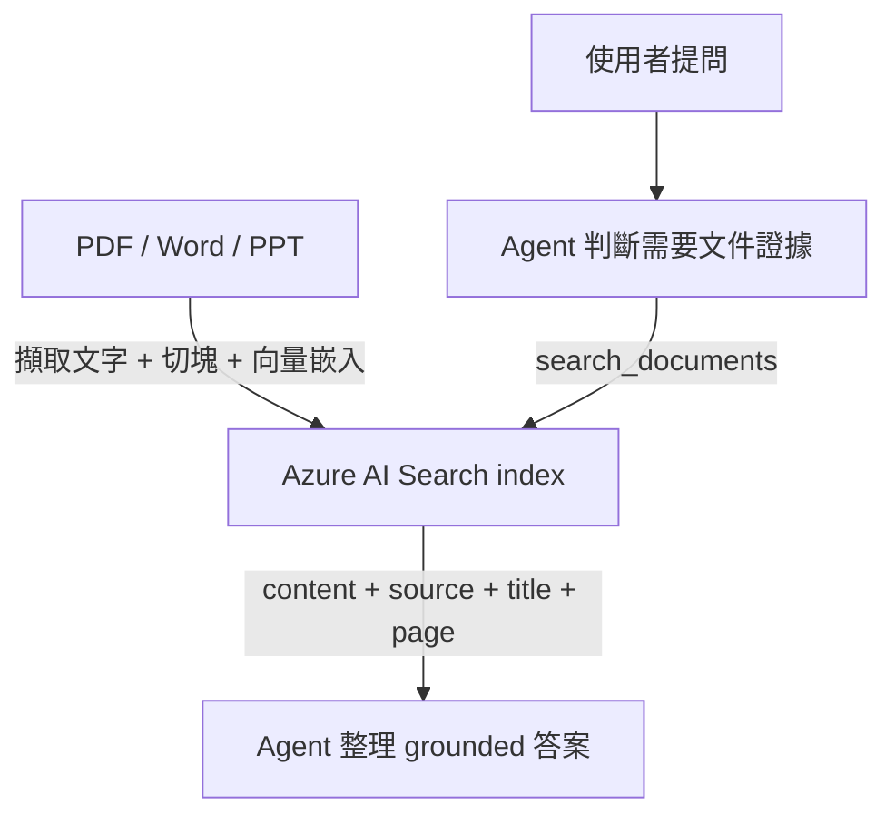

# Foundry IQ：文件智慧

這一頁講的是「文件怎麼變成可以被 agent 查詢的知識」。

核心概念：不是把 PDF 直接塞給模型，而是先建立一層**可檢索、可引用的 knowledge layer**，再讓 agent 用這層知識回答問題。

## 四個核心重點

| 重點 | 白話 |
|------|------|
| **Grounding** | 先拿回和問題相關的企業內容，再據此回答 |
| **Citations** | 回答要能指出來源、標題、頁碼 |
| **Retrieval layer** | 文件先進入可搜尋的知識層，不是每次都塞進 prompt |
| **Search quality** | 好不好用看 chunking、vector search、hybrid search、semantic ranking |

## 這個 workshop 怎麼實作

| 官網概念 | workshop 對應 |
|---------|---------------|
| Foundry IQ knowledge layer | Azure AI Search |
| Agent 檢索工具 | `search_documents` |
| 執行面 | 本機 runtime 直接呼叫 Search 並回傳來源 metadata |

這種做法比較透明，適合教學：你可以直接看到回傳的內容片段與 metadata，容易除錯和驗證。

## 文件路徑怎麼運作



## 文件處理管線

```
PDFs/Word/PPT → Text Extraction → Chunking → Embedding → Vector Index
```

- **分塊**：把大文件切成可檢索片段
- **向量嵌入**：`text-embedding-3-large`（3072 維度）
- **索引**：Azure AI Search index，含內容、標題、來源、頁碼與向量欄位

## 什麼會影響文件問答品質

| 影響因素 | 為什麼重要 |
|----------|------------|
| **內容切塊** | chunk 太大混雜主題，太小失去上下文 |
| **檢索策略** | keyword、vector、hybrid、semantic ranking 影響召回品質 |
| **metadata 設計** | 沒有 title/source/page，citation 就很弱 |
| **內容範圍** | 索引裡沒有對應內容，模型也補不出正確答案 |

!!! tip "Foundry IQ 和 classic RAG 的關係"
    官方把文件型 grounding 分成兩條路：**Foundry IQ / agentic retrieval**（更高階、對 agent 友善）和 **classic RAG**（應用自己編排檢索）。這個 workshop 比較接近後者，由我們的腳本決定切塊、上傳、搜尋方式，教學上更透明。

## 本頁重點

1. 文件不是直接貼給模型，而是先進入可搜尋的知識層
2. agent 需要時才呼叫文件工具，不是每題都先搜尋
3. 文件答案保留來源與頁碼，容易人工驗證
4. 回答品質很大一部分來自 retrieval quality，不是只靠模型

## 官方延伸閱讀

- [RAG in Azure AI Search](https://learn.microsoft.com/azure/search/retrieval-augmented-generation-overview)
- [Vector search in Azure AI Search](https://learn.microsoft.com/azure/search/vector-search-overview)
- [Quickstart: Vector search](https://learn.microsoft.com/azure/search/search-get-started-vector)
- [Connect an Azure AI Search index to Foundry agents](https://learn.microsoft.com/azure/foundry/agents/how-to/tools/ai-search)

---

[← 深入解析](index.md) | [Fabric IQ：資料 →](02-fabric-iq.md)
