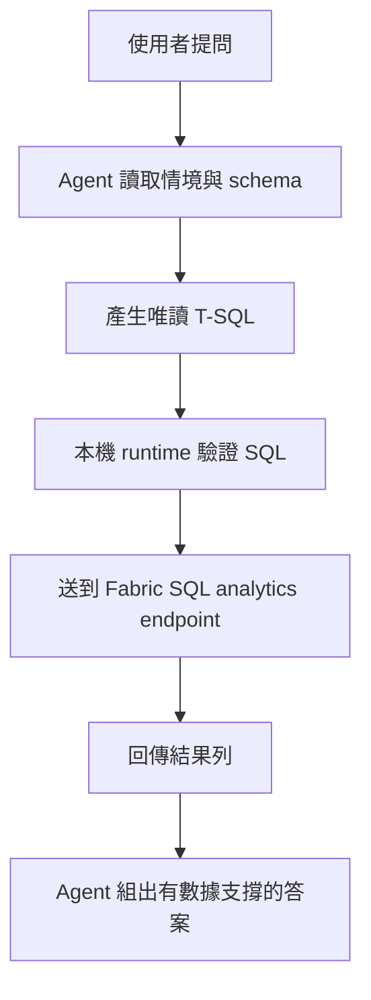

# Fabric IQ：資料智慧

這一頁講的是「自然語言問題怎麼變成資料查詢」。

核心概念：Agent 不是直接對資料檔案做即興處理，而是利用 Fabric Lakehouse 的**唯讀 SQL analytics endpoint**，把自然語言問題安全地轉成 read-only T-SQL。

## 五個核心重點

| 重點 | 白話 |
|------|------|
| **Lakehouse** | Fabric 裡同時服務資料工程與分析的資料底座 |
| **SQL analytics endpoint** | 每個 lakehouse 自動帶出的唯讀 T-SQL 查詢面，不需額外建立 |
| **Delta tables** | 只有 Delta tables 會出現在 SQL 查詢面 |
| **NL→SQL** | Agent 理解情境與資料表結構後，產生唯讀 SQL |
| **Guardrails** | 只允許 `SELECT`/`WITH`，禁止 DDL 與寫入 |

## 這個 workshop 怎麼實作

| 官網概念 | workshop 對應 |
|---------|---------------|
| Lakehouse Delta tables | `pipelines/fabric/create_items.py` + `pipelines/fabric/load_lakehouse_data.py` |
| SQL analytics endpoint | `participant_validate_docs_data.py` 背後使用 `pipelines/agents/test_workshop_agent.py` 取得 endpoint 並執行唯讀 SQL |
| Schema grounding | `ontology_config.json` + `schema_prompt.txt` 提供表結構與 join 關係 |
| SQL guardrails | Agent instructions 限制只允許唯讀查詢 |

## NL→SQL 路徑



Agent 不是「猜資料庫怎麼長」。`ontology_config.json` 提供三種 agent 最需要的資訊：有哪些表、可用哪些欄位、哪些 join path 合理。

## 什麼影響 NL→SQL 品質

| 影響因素 | 為什麼重要 |
|----------|------------|
| **Schema 品質** | 欄位名稱不清楚，模型 SQL 就容易寫錯 |
| **Join 關係** | 沒有明確 join 指引，容易產生 cartesian product |
| **Guardrails** | 沒有限制寫入，風險就會放大 |
| **資料範圍** | 表裡沒有的欄位或資料，模型也查不出來 |

## 結合文件與資料的力量

| 問題類型 | 來源 | 範例 |
|---------|------|------|
| **政策/流程** | Foundry IQ（文件） | 「故障通知政策是什麼？」 |
| **指標/數字** | Fabric IQ（資料） | 「平均解決時間是多少？」 |
| **綜合** | 兩者 | 「我們是否達到 SLA 目標？」 |

### 綜合範例

```
User: "Are we meeting our ticket resolution SLA?"

Agent:
1. 先查文件 → SLA 目標：Critical 4hr, High 8hr, Medium 24hr
2. 再查資料 → 實際：Critical 3.2hr, High 7.1hr, Medium 18.5hr
3. 比較後回答：「全部達標。」
```

這是 Fabric IQ 最值得看的觀念：文件提供規則與門檻，資料提供實際數字，agent 把兩者接起來。

!!! tip "Lakehouse vs Warehouse"
    Lakehouse 適合 Spark、資料工程、混合型資料；Warehouse 適合 SQL-first、BI、維度建模。SQL analytics endpoint 讓你用 T-SQL 查 lakehouse 裡的 Delta tables，不需要先複製成另一份倉儲資料。

## 本頁重點

1. 使用者不需要自己寫 SQL，agent 在受控範圍內代為生成唯讀查詢
2. Schema 與 join 關係先備好，agent 才能穩定產出正確 SQL
3. SQL analytics endpoint 是唯讀的，和 workshop guardrails 一致
4. 真正有價值的不是「SQL 自動生成」，而是文件 + 資料的結合

## 官方延伸閱讀

- [What is the SQL analytics endpoint for a lakehouse?](https://learn.microsoft.com/fabric/data-engineering/lakehouse-sql-analytics-endpoint)
- [What is a lakehouse in Microsoft Fabric?](https://learn.microsoft.com/fabric/data-engineering/lakehouse-overview)
- [Better together: the lakehouse and warehouse](https://learn.microsoft.com/fabric/data-warehouse/get-started-lakehouse-sql-analytics-endpoint)

---

[← Foundry IQ：文件](01-foundry-iq.md) | [清理 →](../04-cleanup/index.md)
