# Foundry 代理程式：執行階段編排

## 概要

這個工作坊不是每次提問時都臨時拼一段 prompt。它會先在 Microsoft Foundry 裡建立一個 agent 定義，再由測試腳本把這個 agent 叫出來執行。

你可以把它想成：

- Foundry 負責保存 agent 的設定
- 本機 runtime 負責執行工具與回傳結果

## 這頁要學什麼

看完這頁，你應該知道：

- agent 定義裡面包含哪些東西
- agent 為什麼知道自己可以呼叫哪些工具
- 本機測試與後續發佈之間有什麼差別

## 代理程式定義

主要的建立流程位於 `scripts/07_create_foundry_agent.py` 中，使用三個核心輸入建構 `PromptAgentDefinition`：

| 欄位 | 來源 | 重要性 |
|------|------|--------|
| `model` | `AZURE_CHAT_MODEL` 或 `MODEL_DEPLOYMENT` | 選擇負責推理提示詞和工具輸出的聊天部署 |
| `instructions` | `build_agent_instructions(...)` | 告訴代理程式何時使用 SQL、搜尋或兩者 |
| `tools` | `foundry_tool_contract.py` | 定義可呼叫的函式工具及嚴格的 JSON 結構描述 |

換句話說，Foundry 專案把 agent 保存成一個可重複使用的物件，而不是只存在本機程式裡的一段文字。

## 指令的組成方式

工作坊從情境設定中構建指令，而非硬編碼單一的靜態系統提示詞。

組成步驟中使用的輸入：

| 輸入來源 | 範例內容 |
|---------|---------|
| `ontology_config.json` | 情境名稱、描述、資料表清單、關係 |
| `schema_prompt.txt` | 為 Microsoft Fabric 資料表生成的結構描述指引 |
| `foundry_only` 旗標 | 在僅搜尋和 SQL + 搜尋行為之間切換 |

最終的指令區塊包含：

1. 情境脈絡
2. 工具描述與邊界
3. 唯讀存取的 SQL 規則
4. 多步驟問題的回應迴圈指引

這也是為什麼 agent 的行為會跟目前工作坊情境一致，而不是只會回答固定範例。

## 工具選擇模式

代理程式有兩種支援的運作模式。

| 模式 | 啟用的工具 | 使用時機 |
|------|-----------|---------|
| **完整模式** | `execute_sql` + `search_documents` | 搭配 Microsoft Fabric + Azure AI Search 的主要工作坊路徑 |
| **僅 Foundry 模式** | 僅 `search_documents` | Microsoft Fabric 不可用時的輕量路徑 |

選擇發生在代理程式建立之前：

- `build_search_documents_tool()` 始終包含
- `build_execute_sql_tool(...)` 僅在未設定 `--foundry-only` 時才新增

這表示 prompt 和工具清單會一起被設計好。若是 search-only 模式，agent 並不是「知道有 SQL 但不要用」，而是根本沒有 SQL 工具可用。

## 建立、取得與測試流程

目前的執行階段路徑如下：

```mermaid
flowchart LR
    A[07_create_foundry_agent.py] --> B[載入環境與情境設定]
    B --> C[建立指令與工具清單]
    C --> D[AIProjectClient]
    D --> E[若已存在同名 agent 先刪除]
    E --> F[建立 PromptAgentDefinition]
    F --> G[將 agent_id 存到 agent_ids.json]
    G --> H[08_test_foundry_agent.py]
    H --> I[依 id 取得 agent]
    I --> J[建立對話]
    J --> K[建立回應]
    K --> L[在本機處理函式呼叫]
    L --> M[送回 function_call_output]
    M --> N[回傳最終答案]
```

測試腳本不會重建一個新的 agent，而是讀取已經存好的 agent 定義，再用本機程式驅動整個問答流程。

## 為什麼執行階段在本機執行工具

代理程式定義包含工具結構描述，但工作坊仍然在 `scripts/08_test_foundry_agent.py` 中執行實際的工具邏輯。

這種分離讓示範易於檢視：

- Foundry 決定**要呼叫哪個函式**
- 本機執行階段決定**函式如何被執行**
- 原始輸出作為 `function_call_output` 傳回給模型

所以在 demo 時，你可以真的看到送出的 SQL 或搜尋查詢，而不是只看到最終答案。

## 追蹤行為

追蹤是選擇性加入的，透過 `scripts/foundry_trace.py` 路由。

支援的環境旗標：

| 變數 | 用途 |
|------|------|
| `ENABLE_FOUNDRY_TRACING` | 追蹤的主開關 |
| `ENABLE_FOUNDRY_CONTENT_TRACING` | 允許 GenAI 內容記錄 |
| `ENABLE_TRACE_CONTEXT_PROPAGATION` | 在 SDK 儀器化中啟用追蹤脈絡傳遞 |
| `APPLICATIONINSIGHTS_CONNECTION_STRING` | 明確的遙測目的地 |
| `OTEL_SERVICE_NAME` | 服務命名的選用覆寫 |

目前的設計規則：

- 追蹤預設為關閉
- 缺少遙測配線只會產生警告
- 代理程式建立和聊天在沒有 Application Insights 的情況下仍應正常運作

這代表可觀測性是加分項，不是卡住主流程的必要條件。

## 發佈路徑及其獨立的原因

發佈在 `scripts/09_publish_foundry_agent.py` 中被刻意處理為一個有防護的後續步驟，而非主要建置管線的一部分。

該輔助程式做三件事：

1. 解析目前的專案和目標代理程式
2. 在可能的情況下檢查 Azure CLI 和 Bot Service 的就緒狀態
3. 列印手動 UI 發佈步驟和 RBAC 提醒

工作坊將發佈獨立出來是因為發佈會改變營運邊界：

- 會建立新的代理程式應用程式身分
- 下游的 RBAC 可能需要重新指派
- Teams 和 Microsoft 365 Copilot 封裝會增加額外的治理步驟

所以工作坊先把「agent 能不能正常工作」確認好，再進入發佈這個第二階段。

## 客戶對話要點

| 問題 | 實務回答 |
|------|---------|
| 「代理程式存在哪裡？」 | 「定義存在 Foundry 專案中。本機腳本只是建立它，之後再擷取它來測試。」 |
| 「工具邏輯在 Foundry 裡面嗎？」 | 「工具合約已在 Foundry 中註冊，但本工作坊在本機執行階段中執行工具函式，讓行為保持透明。」 |
| 「為什麼不立即發佈？」 | 「因為發佈會引入新的應用程式身分和 RBAC 範圍。我們讓工作坊保持簡單，先驗證代理程式，再將發佈作為獨立步驟。」 |

## 常見問題

### 這是自訂應用程式還是 Foundry 管理的代理程式？

兩者皆是。代理程式定義儲存並管理在 Foundry 中，而目前的工作坊執行階段是一個透明的本機應用程式，負責建立回應、執行工具並傳回工具輸出。

### 為什麼工作坊在測試時要再次擷取代理程式？

因為測試腳本要證明已儲存的專案定義是可重複使用的。它不只是在測試本機提示詞字串。它是在測試 Foundry 專案中建立的代理程式物件。

### 本頁最簡潔的對話要點是什麼？

「Foundry 擁有代理程式定義。工作坊執行階段擁有本機工具執行迴圈。」

## 官方延伸閱讀

- [Microsoft Foundry quickstart](https://learn.microsoft.com/azure/foundry/quickstarts/get-started-code)
- [Build with agents, conversations, and responses](https://learn.microsoft.com/azure/foundry/agents/concepts/runtime-components)
- [Develop an AI agent with Azure AI Foundry Agent Service](https://learn.microsoft.com/training/modules/develop-ai-agent-azure/)

---

[← Foundry IQ：文件](01-foundry-iq.md) | [Foundry 工具：函式合約 →](03-foundry-tool.md)