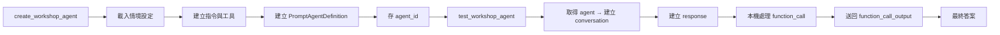

# Foundry 代理程式：執行階段編排

這一頁講的是 Foundry Agent Service 的三個核心元件，以及這個 workshop 怎麼用它們運作。

核心概念：Agent 不是一段臨時 prompt，而是存在 Foundry project 裡的**持久化定義**（model + instructions + tools）。本機 runtime 負責執行工具邏輯，Foundry 負責保存定義與多輪對話。

## 三個核心元件

| 元件 | 做什麼 | workshop 對應 |
|------|--------|---------------|
| **Agent** | 定義 model、instructions、tools 的持久化物件 | `admin_prepare_docs_data_demo.py` 背後會呼叫 `pipelines/agents/create_workshop_agent.py` 建立 |
| **Conversation** | 保存多輪互動歷史與工具呼叫記錄 | `participant_validate_docs_data.py` 背後使用 `pipelines/agents/test_workshop_agent.py` 建立 `conversation.id` |
| **Response** | 每次執行的輸出，可能含訊息或 tool calls | `openai_client.responses.create(...)` 的結果 |

## Agent 定義的三個輸入

| 欄位 | 來源 | 用途 |
|------|------|------|
| `model` | `AZURE_CHAT_MODEL` | 負責推理的聊天部署 |
| `instructions` | `build_agent_instructions(...)` | 告訴 agent 何時用 SQL、搜尋或兩者 |
| `tools` | `foundry_tool_contract.py` | 可呼叫的函式工具及嚴格 JSON schema |

指令不是硬編碼的，而是從情境設定（`ontology_config.json`、`schema_prompt.txt`）動態組成，所以 agent 行為會跟目前的 workshop 情境一致。

## 工具選擇模式

| 模式 | 啟用的工具 | 使用時機 |
|------|-----------|---------|
| **完整模式** | `execute_sql` + `search_documents` | 資料查詢與文件檢索都可用 |
| **僅 Foundry 模式** | 僅 `search_documents` | 資料查詢工具未啟用時 |

search-only 模式下，agent 根本沒有 SQL 工具可用（不是「知道有但不用」）。

## 建立與測試流程

重點觀察：測試的是存在 Foundry project 裡的 agent 物件，不是一段臨時 prompt。

## Response loop 怎麼運作

response 不只是最後一段文字，它可能包含 function call。本機 loop 的流程：

1. agent 產生 response → 冒出 `function_call`
2. 本機 runtime 執行工具（SQL 或 Search）
3. 結果包成 `function_call_output` 送回
4. agent 產生下一個 response → 直到沒有更多 tool calls
5. 組出完整答案

這個設計讓你在 demo 時可以直接看到送出的 SQL 或搜尋查詢。

??? note "追蹤行為（選用）"
    追蹤透過 `scripts/shared/foundry_trace.py` 啟用，預設**關閉**。

    | 環境變數 | 用途 |
    |---------|------|
    | `ENABLE_FOUNDRY_TRACING` | 主開關 |
    | `ENABLE_FOUNDRY_CONTENT_TRACING` | 允許 GenAI 內容記錄 |
    | `APPLICATIONINSIGHTS_CONNECTION_STRING` | 遙測目的地 |

    缺少遙測只會產生警告，不會阻擋主流程。

??? note "發佈路徑"
    `09_publish_foundry_agent.py` 是獨立的後續步驟。它會檢查 Azure CLI / Bot Service 就緒狀態，並列印手動 UI 發佈步驟與 RBAC 提醒。發佈涉及新的應用程式身分、RBAC 重新指派、Teams/M365 封裝等治理步驟，所以刻意和主流程分開。

## 本頁重點

1. Agent 是持久化定義（model + instructions + tools），不是一次性 prompt
2. Conversation 保存多輪歷史，Response 可能含 tool calls
3. 工具合約在 Foundry 註冊，但工具本身由本機 runtime 執行
4. 發佈是下一階段，不是主 workshop 必做步驟

## 常見問題

**這是自訂 app 還是 Foundry 管理的 agent？**
兩者皆是。定義存在 Foundry，本機 app 負責執行工具與回傳輸出。

**為什麼測試時要再次擷取 agent？**
測試腳本要證明存好的 agent 定義可重複使用，不只是本機 prompt 字串。

## 官方延伸閱讀

- [Microsoft Foundry quickstart](https://learn.microsoft.com/azure/foundry/quickstarts/get-started-code)
- [Build with agents, conversations, and responses](https://learn.microsoft.com/azure/foundry/agents/concepts/runtime-components)
- [What are hosted agents?](https://learn.microsoft.com/azure/foundry/agents/concepts/hosted-agents)
- [Develop an AI agent with Azure AI Foundry Agent Service](https://learn.microsoft.com/training/modules/develop-ai-agent-azure/)

---

[← Foundry IQ：文件智慧](01-foundry-iq.md) | [Foundry 工具：函式合約 →](03-foundry-tool.md)