# Foundry 代理程式：執行階段編排

## 概要

這一頁最重要的，不是把 SDK 物件名稱全部背起來，而是先抓住 Foundry Agent Service 官網的核心模型：

- **agent**：定義這個代理程式要用哪個 model、哪些 instructions、哪些 tools
- **conversation**：保存多輪互動歷史
- **response**：每一次執行後產生的輸出，裡面可能包含訊息、工具呼叫、工具輸出

這個工作坊不是每次提問時都臨時拼一段 prompt。它會先在 Microsoft Foundry 裡建立一個 agent 定義，再由測試腳本把這個 agent 叫出來執行。

你可以把它想成：

- Foundry 負責保存 agent 的定義與多輪對話邊界
- 本機 runtime 負責執行這個 workshop 自己定義的函式工具邏輯

如果你前面已經把主流程跑過一次，讀這頁時最值得先抓住的重點是：**Foundry Agent Service 提供的是 agent runtime 的骨架；這個 workshop 則刻意把 function tool 的實作保留在本機，方便你看清楚整個回應迴圈。**

## 這頁要學什麼

看完這頁，你應該知道：

- 官網所說的 agent、conversation、response 分別在做什麼
- agent 定義裡面包含哪些東西
- agent 為什麼知道自己可以呼叫哪些工具
- 這個 workshop 為什麼讓工具在本機 runtime 執行
- 本機測試與後續發佈之間有什麼差別

## 先記住五件事

1. **Agent 是持久化的定義，不是一次性的 prompt。**
2. **Conversation 是多輪歷史容器，不只是單次聊天字串。**
3. **Response 是每輪執行的輸出，可能包含 tool call。**
4. **Tool schema 可以註冊在 agent 上，但實際工具不一定要在 Foundry 端執行。**
5. **這個 workshop 的重點是透明可驗證，所以保留本機 function execution loop。**

## 官網重點：Foundry Agent Service 的三個核心元件

根據官方文件，Foundry Agent Service 以三個 runtime components 組成多輪互動：

| 元件 | 官網重點 | 在這個 workshop 的對應 |
|------|----------|------------------------|
| **Agent** | 定義 model、instructions、tools 的持久化物件 | `07_create_foundry_agent.py` 建立的 prompt agent |
| **Conversation** | 保存歷史，讓後續回合可沿用上下文 | `08_test_foundry_agent.py` 建立的 `conversation.id` |
| **Response** | 每次執行後產生的輸出；可能包含訊息、tool calls、tool outputs | `openai_client.responses.create(...)` 的結果 |

官方文件把這個模式講得很清楚：

1. 先建立 agent
2. 視需要建立 conversation
3. 產生 response
4. 檢查 response 狀態與輸出
5. 把結果帶進下一輪

這也是這份 workshop 實際在做的事情。

## 代理程式定義

主要的建立流程位於 `scripts/07_create_foundry_agent.py` 中，使用三個核心輸入建構 `PromptAgentDefinition`：

| 欄位 | 來源 | 重要性 |
|------|------|--------|
| `model` | `AZURE_CHAT_MODEL` 或 `MODEL_DEPLOYMENT` | 選擇負責推理提示詞和工具輸出的聊天部署 |
| `instructions` | `build_agent_instructions(...)` | 告訴代理程式何時使用 SQL、搜尋或兩者 |
| `tools` | `foundry_tool_contract.py` | 定義可呼叫的函式工具及嚴格的 JSON 結構描述 |

從官網角度看，agent 是一個**持久化 orchestration definition**。它把 model、instructions、tools 和其他控制項放在一起，讓後續互動不需要每次重送整包設定。

換句話說，Foundry 專案把 agent 保存成一個可重複使用的物件，而不是只存在本機程式裡的一段文字。

第一次看這一頁時，你只要先記住三個輸入：模型、instructions、tools。其他細節都是圍繞這三件事展開。

## 指令的組成方式

工作坊從情境設定中構建指令，而非硬編碼單一的靜態系統提示詞。

組成步驟中使用的輸入：

| 輸入來源 | 範例內容 |
|---------|---------|
| `ontology_config.json` | 情境名稱、描述、資料表清單、關係 |
| `schema_prompt.txt` | 為 Microsoft Fabric 資料表生成的結構描述指引 |
| `foundry_only` 旗標 | 在僅搜尋和 SQL + 搜尋行為之間切換 |

最終的指令區塊包含：

1. 情境脈絡
2. 工具描述與邊界
3. 唯讀存取的 SQL 規則
4. 多步驟問題的回應迴圈指引

這也是為什麼 agent 的行為會跟目前工作坊情境一致，而不是只會回答固定範例。

## 官網重點：為什麼 conversation 很重要

官方文件強調，conversation 是一個可持久化、可重用的歷史容器。它裡面不只會存聊天訊息，也可能包含：

- user / assistant message items
- tool call items
- tool output items
- 其他 response output items

這件事對這個 workshop 很關鍵，因為它說明了為什麼 `08_test_foundry_agent.py` 不只是單純把每一輪輸入送進模型，而是先建立 conversation，再把後續 response 都掛在同一條歷史上。

最實用的理解方式是：

- 沒有 conversation，也可以做多輪，但你得自己搬上下文
- 有 conversation，Foundry 會幫你保存一條清楚的互動脈絡

## 工具選擇模式

代理程式有兩種支援的運作模式。

| 模式 | 啟用的工具 | 使用時機 |
|------|-----------|---------|
| **完整模式** | `execute_sql` + `search_documents` | 搭配 Microsoft Fabric + Azure AI Search 的主要工作坊路徑 |
| **僅 Foundry 模式** | 僅 `search_documents` | Microsoft Fabric 不可用時的輕量路徑 |

選擇發生在代理程式建立之前：

- `build_search_documents_tool()` 始終包含
- `build_execute_sql_tool(...)` 僅在未設定 `--foundry-only` 時才新增

這表示 prompt 和工具清單會一起被設計好。若是 search-only 模式，agent 並不是「知道有 SQL 但不要用」，而是根本沒有 SQL 工具可用。

## 官網重點：tool 是 agent 能力邊界的一部分

官方文件把 tools 定義為 agent 超出純文字生成能力的延伸機制。當 tool 被附加到 agent 上後，agent 可以在 response generation 過程中決定是否呼叫它。

對這個 workshop 來說，這個觀念要再補一句才完整：

- **Foundry 端知道有哪些工具、參數長什麼樣子**
- **本機 runtime 實際執行工具程式碼**

也就是說，這份 workshop 把「工具決策」和「工具執行」刻意拆開。這不是因為 Foundry 做不到，而是因為這樣最適合教學與除錯。

## 建立、取得與測試流程

目前的執行階段路徑如下：

```mermaid
flowchart LR
    A[07_create_foundry_agent.py] --> B[載入環境與情境設定]
    B --> C[建立指令與工具清單]
    C --> D[AIProjectClient]
    D --> E[若已存在同名 agent 先刪除]
    E --> F[建立 PromptAgentDefinition]
    F --> G[將 agent_id 存到 agent_ids.json]
    G --> H[08_test_foundry_agent.py]
    H --> I[依 id 取得 agent]
    I --> J[建立對話]
    J --> K[建立回應]
    K --> L[在本機處理函式呼叫]
    L --> M[送回 function_call_output]
    M --> N[回傳最終答案]
```

測試腳本不會重建一個新的 agent，而是讀取已經存好的 agent 定義，再用本機程式驅動整個問答流程。

對學員來說，這段流程最重要的觀察點是：你測試的不是一段臨時 prompt，而是已經存進 Foundry project 的 agent 物件。

## 官網重點：response 不只是最後一段文字

官方文件把 response 視為一次 agent 執行的完整輸出。這很重要，因為 response 可能同時包含：

- 最終文字回答
- function call
- tool output
- 後續可以帶入下一輪的 items

這也正是這個 workshop 的本機 loop 為什麼要掃描 `response.output`：

- 找出 `function_call`
- 本機執行該工具
- 把結果包成 `function_call_output`
- 再送回下一次 `responses.create(...)`

所以這裡真正的執行模型是：

1. agent 先產生 response
2. response 裡冒出 tool calls
3. 本機 runtime 執行工具
4. 工具結果回到下一個 response
5. 最後才組出完整答案

## 為什麼執行階段在本機執行工具

代理程式定義包含工具結構描述，但工作坊仍然在 `scripts/08_test_foundry_agent.py` 中執行實際的工具邏輯。

這種分離讓示範易於檢視：

- Foundry 決定**要呼叫哪個函式**
- 本機執行階段決定**函式如何被執行**
- 原始輸出作為 `function_call_output` 傳回給模型

所以在 demo 時，你可以真的看到送出的 SQL 或搜尋查詢，而不是只看到最終答案。

這個設計同時呼應了官網對 runtime data 的提醒：conversation 與 response 可能包含使用者內容與工具輸出，因此它們應該被視為應用程式資料來看待。這也是為什麼在工具權限與資料流向上，要維持最小權限與可追蹤性。

## 追蹤行為

追蹤是選擇性加入的，透過 `scripts/foundry_trace.py` 路由。

支援的環境旗標：

| 變數 | 用途 |
|------|------|
| `ENABLE_FOUNDRY_TRACING` | 追蹤的主開關 |
| `ENABLE_FOUNDRY_CONTENT_TRACING` | 允許 GenAI 內容記錄 |
| `ENABLE_TRACE_CONTEXT_PROPAGATION` | 在 SDK 儀器化中啟用追蹤脈絡傳遞 |
| `APPLICATIONINSIGHTS_CONNECTION_STRING` | 明確的遙測目的地 |
| `OTEL_SERVICE_NAME` | 服務命名的選用覆寫 |

目前的設計規則：

- 追蹤預設為關閉
- 缺少遙測配線只會產生警告
- 代理程式建立和聊天在沒有 Application Insights 的情況下仍應正常運作

這代表可觀測性是加分項，不是卡住主流程的必要條件。

## 官網重點：streaming 與 background 是進階 runtime 模式

官方文件也把 streaming 與 background response 視為標準 runtime 模式的一部分：

- **streaming**：適合逐步顯示輸出
- **background**：適合長時間執行工作

這個 workshop 主線目前採用的是比較容易理解的同步 response loop，而不是先把 streaming/background 當成第一層教學重點。這是刻意的取捨，不是能力缺失。

## 發佈路徑為什麼另外獨立

發佈在 `scripts/09_publish_foundry_agent.py` 中被刻意處理為一個有防護的後續步驟，而非主要建置管線的一部分。

該輔助程式做三件事：

1. 解析目前的專案和目標代理程式
2. 在可能的情況下檢查 Azure CLI 和 Bot Service 的就緒狀態
3. 列印手動 UI 發佈步驟和 RBAC 提醒

工作坊將發佈獨立出來，是因為這一步會把事情從「驗證 agent 能不能工作」推進到「準備給其他入口或產品封裝使用」：

- 會建立新的代理程式應用程式身分
- 下游的 RBAC 可能需要重新指派
- Teams 和 Microsoft 365 Copilot 封裝會增加額外的治理步驟

所以工作坊先把「agent 能不能正常工作」確認好，再進入發佈這個第二階段。

## 先記住這三件事

1. Foundry 保存的是 agent 定義，不是所有工具執行邏輯
2. conversation 和 response 是多輪互動真正運作起來的核心骨架
3. 工具合約在 Foundry 註冊，但工具本身仍在本機 runtime 執行
4. 發佈是下一階段，不是主 workshop 必做步驟

## 常見問題

### 這是自訂應用程式還是 Foundry 管理的代理程式？

兩者皆是。代理程式定義儲存並管理在 Foundry 中，而目前的工作坊執行階段是一個透明的本機應用程式，負責建立回應、執行工具並傳回工具輸出。

### 為什麼這頁一直分 agent、conversation、response？

因為這是官網對 Foundry Agent Service 最核心的理解方式。只把 agent 當成「一段 prompt」會漏掉多輪狀態與工具回傳這兩個最重要的 runtime 概念。

### 為什麼工作坊在測試時要再次擷取代理程式？

因為測試腳本要證明已儲存的專案定義是可重複使用的。它不只是在測試本機提示詞字串。它是在測試 Foundry 專案中建立的代理程式物件。

### 如果只記一句話，要記什麼？

「Foundry 保存 agent 定義與多輪互動骨架；這個 workshop 的本機 runtime 代為執行工具並把結果送回 response loop。」

## 官方延伸閱讀

- [Microsoft Foundry quickstart](https://learn.microsoft.com/azure/foundry/quickstarts/get-started-code)
- [Build with agents, conversations, and responses](https://learn.microsoft.com/azure/foundry/agents/concepts/runtime-components)
- [What are hosted agents?](https://learn.microsoft.com/azure/foundry/agents/concepts/hosted-agents)
- [Develop an AI agent with Azure AI Foundry Agent Service](https://learn.microsoft.com/training/modules/develop-ai-agent-azure/)

---

[← Foundry IQ：文件](01-foundry-iq.md) | [Foundry 工具：函式合約 →](03-foundry-tool.md)