# Foundry Agent: Runtime Orchestration

## What this page explains

The workshop does not use a generic chat completion plus ad-hoc glue code. It creates a named prompt agent in Azure AI Foundry and then reuses that definition during runtime testing.

That design matters because customers usually ask three different questions:

- Where is the agent definition stored?
- How does the agent know which tools it can call?
- What changes when we move from local testing to publish?

## The agent definition

The main creation flow lives in `scripts/07_create_foundry_agent.py` and builds a `PromptAgentDefinition` with three core inputs:

| Field | Where it comes from | Why it matters |
|-------|---------------------|----------------|
| `model` | `AZURE_CHAT_MODEL` or `MODEL_DEPLOYMENT` | Chooses the chat deployment that reasons over the prompt and tool outputs |
| `instructions` | `build_agent_instructions(...)` | Tells the agent when to use SQL, search, or both |
| `tools` | `foundry_tool_contract.py` | Defines the callable function tools and strict JSON schema |

In other words, the Foundry project stores the agent as a reusable runtime object, not just as a local Python prompt string.

## How instructions are composed

The workshop builds instructions from scenario configuration instead of hard-coding a single static system prompt.

Inputs used in the composition step:

| Input source | Example content |
|--------------|-----------------|
| `ontology_config.json` | scenario name, description, table list, relationships |
| `schema_prompt.txt` | generated schema guidance for Fabric tables |
| `foundry_only` flag | toggles between search-only and SQL + search behavior |

The final instruction block includes:

1. scenario context
2. tool descriptions and boundaries
3. SQL rules for read-only access
4. response-loop guidance for multi-step questions

This is why the agent can stay aligned with the actual generated dataset instead of relying on a fixed example prompt.

## Tool selection modes

The agent has two supported operating modes.

| Mode | Enabled tools | When used |
|------|---------------|-----------|
| **Full mode** | `execute_sql` + `search_documents` | Main workshop path with Fabric + Search |
| **Foundry-only mode** | `search_documents` only | Lightweight path when Fabric is unavailable |

The selection happens before agent creation:

- `build_search_documents_tool()` is always included
- `build_execute_sql_tool(...)` is only added when `--foundry-only` is not set

That means the prompt and the tool list stay consistent. The search-only agent is not merely told to ignore SQL. It is created without the SQL function at all.

## Create, get, and test flow

The current runtime path looks like this:

```mermaid
flowchart LR
    A[07_create_foundry_agent.py] --> B[Load env and scenario config]
    B --> C[Build instructions and tool list]
    C --> D[AIProjectClient]
    D --> E[Delete existing named agent if present]
    E --> F[Create PromptAgentDefinition]
    F --> G[Save agent_id to agent_ids.json]
    G --> H[08_test_foundry_agent.py]
    H --> I[Get agent by id]
    I --> J[Create conversation]
    J --> K[Create response]
    K --> L[Handle function calls locally]
    L --> M[Submit function_call_output]
    M --> N[Return final answer]
```

The testing script does not redefine the agent. It fetches the stored agent definition from the project, reads the latest model, instructions, and tool metadata, and then drives the conversation loop locally.

## Why the runtime executes tools locally

The agent definition contains tool schemas, but the workshop still executes the actual tool logic in `scripts/08_test_foundry_agent.py`.

That split keeps the demo easy to inspect:

- Foundry decides **which function to call**
- the local runtime decides **how the function is executed**
- the raw output is returned to the model as `function_call_output`

This is also why the workshop can show the exact SQL query and search payload during demos.

## Trace behavior

Tracing is opt-in and routed through `scripts/foundry_trace.py`.

Supported environment flags:

| Variable | Purpose |
|----------|---------|
| `ENABLE_FOUNDRY_TRACING` | master switch for tracing |
| `ENABLE_FOUNDRY_CONTENT_TRACING` | allows GenAI content recording |
| `ENABLE_TRACE_CONTEXT_PROPAGATION` | turns on trace-context propagation in the SDK instrumentor |
| `APPLICATIONINSIGHTS_CONNECTION_STRING` | explicit telemetry destination |
| `OTEL_SERVICE_NAME` | optional override for service naming |

Current design rules:

- tracing is off by default
- missing telemetry wiring only produces a warning
- agent creation and chat should still work without Application Insights

That matches the workshop goal: observability is valuable, but it cannot become a blocker for the main demo path.

## Publish path and why it is separate

Publishing is intentionally handled as a guarded follow-up step in `scripts/09_publish_foundry_agent.py`, not as part of the main build pipeline.

The helper does three things:

1. resolves the current project and target agent
2. checks Azure CLI and Bot Service readiness when possible
3. prints the manual UI publish steps and RBAC reminders

The workshop keeps publish separate because publish changes the operational boundary:

- a new Agent Application identity is created
- downstream RBAC may need to be reassigned
- Teams and Microsoft 365 Copilot packaging adds extra governance steps

So the workshop proves the agent first inside Foundry, then treats publishing as a controlled second stage.

## Customer talking points

| Question | Practical answer |
|----------|------------------|
| "Where does the agent live?" | "The definition lives in the Foundry project. The local script just creates it and later fetches it for testing." |
| "Is the tool logic inside Foundry?" | "The tool contract is registered in Foundry, but this workshop executes the tool functions in the local runtime so the behavior stays transparent." |
| "Why not publish immediately?" | "Because publish introduces a new app identity and RBAC surface. We keep the workshop simple by validating the agent first, then publishing as a separate step." |

## FAQ

### Is this a custom app or a Foundry-managed agent?

It is both. The agent definition is stored and managed in Foundry, while the current workshop runtime is a transparent local app that creates responses, executes tools, and returns tool outputs.

### Why does the workshop fetch the agent again during testing?

Because the test script is proving that the stored project definition is reusable. It is not just exercising a local prompt string. It is exercising the agent object that was created in the Foundry project.

### What is the shortest talking point for this page?

"Foundry owns the agent definition. The workshop runtime owns the local tool execution loop."

## Operational takeaway

The Foundry agent is the orchestration boundary for the workshop:

- model deployment handles reasoning
- instructions describe the scenario and tool rules
- tool schemas constrain what can be called
- the local runtime executes the tools and feeds results back
- publish is possible, but deliberately treated as a later environment step

---

[← Foundry IQ: Documents](01-foundry-iq.md) | [Foundry Tool: Function Contract →](03-foundry-tool.md)