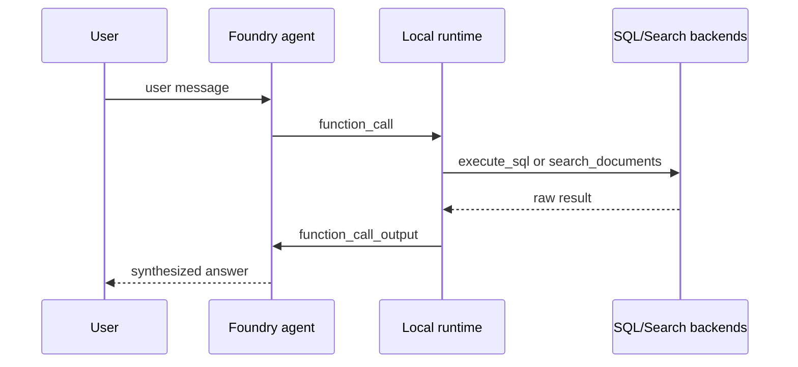

# Foundry Tool: Function Contract

## What this page explains

The workshop does not expose arbitrary Python functions to the model. It uses a small, explicit function-tool contract so the agent can reason over business data and documents without drifting into unsafe or unclear behavior.

The contract lives in `scripts/foundry_tool_contract.py` and acts as the single source of truth for:

- tool schema
- tool responsibility boundaries
- prompt instruction block
- local response loop summary

## Main tools in the workshop

The current main path has two function tools.

| Tool | Primary use | Avoid using it for |
|------|-------------|--------------------|
| `execute_sql` | counts, aggregations, joins, rankings, and specific record lookup in Fabric tables | policies, procedures, or any write operation |
| `search_documents` | policies, procedures, FAQs, and other document content in Azure AI Search | calculations or broad structured-data scans |

In Foundry-only mode, only `search_documents` is registered.

## Why a canonical tool contract matters

Without a shared contract, three things drift quickly:

1. the schema sent to the model
2. the instruction text that explains when to call each tool
3. the runtime code that expects certain arguments

This workshop avoids that drift by centralizing the definitions in one module and importing them from both the create script and the test script.

## Tool schema design

### `search_documents`

The search tool uses a strict JSON schema with two parameters:

| Parameter | Type | Meaning |
|-----------|------|---------|
| `query` | string | natural-language retrieval query |
| `top` | integer | optional result count, clamped to `1..10` |

It returns cited passages with source, title, and page metadata.

### `execute_sql`

The SQL tool uses a strict JSON schema with one parameter:

| Parameter | Type | Meaning |
|-----------|------|---------|
| `sql_query` | string | read-only T-SQL query against the Fabric Lakehouse SQL endpoint |

The SQL runtime applies additional enforcement:

- only `SELECT` and `WITH` queries are allowed
- write and DDL terms are rejected
- results are formatted as a markdown table with row count

That means the schema stays simple while the runtime still enforces guardrails.

## Tool selection logic

The prompt instruction block generated by `build_tool_instruction_block(...)` gives the model explicit routing rules:

- numbers and aggregations go to `execute_sql`
- policies and narrative guidance go to `search_documents`
- combined questions may require both tools in sequence

This matters for customer-facing demos because it makes the orchestration understandable. The tool choice is not magic. It is encoded in the prompt contract and visible in the code.

## Execution loop in practice

The local runtime in `scripts/08_test_foundry_agent.py` follows the same loop described in the contract.

The important detail is that the model can ask for multiple function calls before it answers. The loop continues until there are no more tool calls in the response output.

## Response-loop contract

The workshop currently describes the runtime loop like this:

1. inspect the user question and decide whether structured data, documents, or both are required
2. emit function calls using only the schema-defined parameters
3. execute each function locally and send the raw output back as `function_call_output`
4. synthesize the final answer and explain any missing source or limitation

This is simple enough for workshop participants to understand, while still matching how the Responses API interaction actually behaves.

## Optional tools are layered, not merged

The optional capability demos are intentionally outside the main tool loop.

| Script | Capability | Why it stays separate |
|--------|------------|-----------------------|
| `09_demo_content_understanding.py` | Content Understanding | different extraction workflow than the core SQL/Search path |
| `10_demo_browser_automation.py` | Browser Automation | preview capability with stronger trust and environment requirements |
| `11_demo_web_search.py` | Web Search | public web grounding, separate from enterprise document retrieval |
| `12_demo_pii_redaction.py` | PII redaction | Azure Language workflow rather than Foundry function-tool orchestration |
| `13_demo_image_generation.py` | Image generation | separate model family and output shape |

That layering is deliberate.

- the main workshop remains easy to deploy and explain
- optional demos can evolve independently
- unavailable preview features can `SKIP:` cleanly without breaking the base path

## Why not register every optional capability as a tool now

Because each optional capability adds a different operational cost:

- more connections or model deployments
- more preview-feature risk
- more security review
- more explanation burden during the demo

The current workshop therefore treats the canonical tool contract as the stable core and uses standalone demo scripts for advanced extensions.

## Customer talking points

| Question | Practical answer |
|----------|------------------|
| "How many tools does the agent really need?" | "For the main demo, just two: one for structured data and one for documents." |
| "How do you stop unsafe SQL?" | "The tool is read-only by design, and the local runtime rejects write and DDL patterns before execution." |
| "Can we add more tools later?" | "Yes, but we add them as layered extensions so the main workshop contract stays stable and easy to govern." |

## FAQ

### Why not call Azure AI Search or Fabric directly from the model?

Because the workshop wants an auditable contract. The model can only request named functions with strict parameters, and the local runtime stays responsible for actual execution and validation.

### Why keep optional capabilities outside the main tool list?

Because each extension has a different risk profile, dependency surface, and demo story. Keeping them separate preserves a stable core contract and lets unsupported features skip cleanly.

### What is the shortest talking point for this page?

"Two core tools, one strict contract, and explicit runtime guardrails."

## Operational takeaway

The Foundry tool layer is intentionally narrow:

- one canonical contract module
- two stable tools for the main path
- strict schema plus runtime guardrails
- optional capabilities demonstrated separately until they justify promotion into the core contract

---

[← Foundry Agent: Runtime Orchestration](02-foundry-agent.md) | [Fabric IQ: Data →](02-fabric-iq.md)