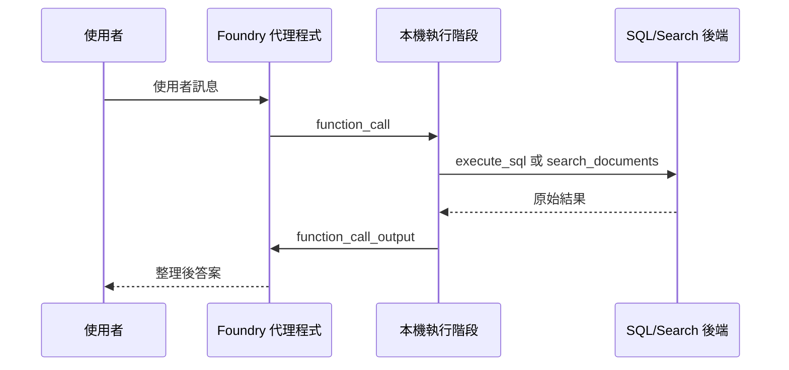

# Foundry 工具：函式合約

## 概要

如果用 Microsoft 官方文件的語言來說，Foundry tool 的重點不是「讓模型直接執行程式碼」，而是先宣告一份**工具合約**，讓 agent 只能要求特定名稱、特定參數、特定用途的工具。

這個工作坊不會把所有 Python 函式都直接開給模型用。它只提供少數、用途明確的工具，並且用固定的 JSON schema 限制輸入格式。

這樣做的好處是：

- agent 比較不容易亂用工具
- 行為更容易追蹤
- SQL 和文件搜尋的邊界更清楚

也就是說，這頁真正要講的是：

1. 官網所說的 Foundry tool / function calling 到底是什麼
2. 這個 workshop 如何把那個概念落成兩個可控的工具

## 這頁要學什麼

看完這頁，你應該知道：

- 官網為什麼把 tool 視為「合約」而不是任意函式
- 工作坊有哪些核心工具
- 每個工具適合做什麼，不適合做什麼
- 為什麼工具合約要集中定義在同一個模組

## 先抓住官網的四個核心重點

Microsoft 官方文件裡，Foundry tools / function calling 最重要的其實只有四件事：

| 重點 | 用白話怎麼理解 |
|------|----------------|
| **Tool is a contract** | agent 只能要求你事先宣告好的工具名稱、描述、參數 |
| **App executes, not model** | 真正執行工具的是你的應用程式或執行階段，不是模型自己直接連資料庫或跑程式 |
| **Loop can repeat** | agent 可以先呼叫工具、拿結果、再決定是否要繼續呼叫下一個工具 |
| **Strict schema matters** | 描述、參數、是否允許額外欄位，都會直接影響 agent 的可控性與穩定性 |

## 官網語境下，Foundry tool 是什麼

在官方架構中，agent 本身定義了三種核心東西：

1. 用哪個模型
2. 用什麼 instructions
3. 可以使用哪些 tools

其中 tool 可以是兩大類：

- **自訂 function tools**：你自己宣告 name、description、parameters，然後由你的 app 執行
- **平台提供的 Foundry tools**：例如 Browser Automation 之類的受管工具

對 workshop 來說，主路徑最重要的是第一類，也就是自訂 function tools。

## 工作坊中的主要工具

目前的主要路徑有兩個函式工具。

| 工具 | 主要用途 | 應避免用於 |
|------|---------|-----------|
| `execute_sql` | 計數、彙總、聯結、排名，以及在 Microsoft Fabric 資料表中進行特定記錄查詢 | 政策、程序，或任何寫入操作 |
| `search_documents` | Azure AI Search 中的政策、程序、常見問題及其他文件內容 | 計算或大範圍結構化資料掃描 |

在僅 Foundry 模式下，只會註冊 `search_documents`。

這正好對應官方的 function calling 模式：

- 工具有固定名稱
- 工具有固定用途描述
- 工具只能接受 schema 允許的參數
- 工具結果再由 agent 拿來繼續推理

## 為什麼標準工具合約很重要

如果沒有共用的工具合約，以下三件事會快速偏離：

1. 傳送給模型的結構描述
2. 說明何時呼叫各工具的指令文字
3. 預期特定引數的執行階段程式碼

本工作坊透過將定義集中在一個模組中，並從建立腳本和測試腳本中匯入它們來避免這種偏離。

這其實和官方文件的核心精神一致：

- tool 不是「順手把一個函式丟給模型」
- tool 是 agent、runtime、實際後端之間共同遵守的介面

在這個 repo 中，這份介面集中定義在 `scripts/foundry_tool_contract.py`。

## 這頁在 workshop 裡對應什麼

如果把官網概念對回這個 repo，可以這樣看：

| 官網概念 | workshop 對應 |
|---------|---------------|
| Agent definition | `scripts/07_create_foundry_agent.py` 建立 agent 與註冊工具 |
| Function tool schema | `scripts/foundry_tool_contract.py` |
| Runtime tool loop | `scripts/08_test_foundry_agent.py` |
| Tool output return | `function_call_output` 回送給 response loop |

所以這頁不是單純在講 Python helper，而是在講這個 workshop 的「工具控制面」。

## 工具結構描述設計

### `search_documents`

搜尋工具使用嚴格的 JSON 結構描述，目前只包含一個參數：

| 參數 | 類型 | 意義 |
|------|------|------|
| `query` | 字串 | 自然語言檢索查詢 |

它會傳回包含來源、標題和頁面中繼資料的引用段落。

對照官網，這裡真正重要的不是參數少，而是：

1. schema 很小，agent 不容易亂猜欄位
2. `additionalProperties: false` 可以避免輸入飄移
3. `strict=True` 讓 contract 更接近「只能照這個格式呼叫」

### `execute_sql`

SQL 工具使用嚴格的 JSON 結構描述，包含一個參數：

| 參數 | 類型 | 意義 |
|------|------|------|
| `sql_query` | 字串 | 針對 Fabric Lakehouse SQL 端點的唯讀 T-SQL 查詢 |

SQL 執行階段會套用額外的強制措施：

- 僅允許 `SELECT` 和 `WITH` 查詢
- 拒絕寫入和 DDL 術語
- 結果格式化為包含列數的 Markdown 表格

這表示結構描述保持簡潔，同時執行階段仍然強制執行防護措施。

這也對應官方 function calling 的一個重要實務：

- schema 只定義「可以怎麼呼叫」
- runtime 仍然要自己做「可以執行到什麼程度」的防護

所以真正的安全邊界，不只在 agent 定義，也在本機執行器。

## 官網最重要的一句話：tool 由 app 執行，不是由模型執行

這點很重要，因為很多人第一次看 function calling 時會誤以為模型直接連到了資料庫或搜尋服務。

官方流程其實是：

1. agent 看到問題
2. agent 產生 `function_call`
3. 你的 app 或 runtime 收到這個 call
4. 你的 app 真正執行工具
5. 你的 app 把結果用 `function_call_output` 回送
6. agent 再根據結果完成回答

所以，模型本身沒有直接取得任意系統權限。它只是提出一個受合約限制的工具請求。

## 工具選擇邏輯

由 `build_tool_instruction_block(...)` 生成的提示詞指令區塊為模型提供了明確的路由規則：

- 數字和彙總交給 `execute_sql`
- 政策和敘述性指引交給 `search_documents`
- 綜合性問題可能需要依序使用兩個工具

這代表工具選擇不是黑盒子，而是有規則可循的。

這一點也很符合官方 runtime components 的設計：response 不是只產生一段文字，它也可能先產生 tool calls，然後在取得結果後再繼續推進。

## 實務中的執行迴圈

`scripts/08_test_foundry_agent.py` 中的本機執行階段遵循工具合約中描述的相同迴圈。

重要的細節是，模型可以在回答之前要求多次函式呼叫。迴圈會持續進行，直到回應輸出中沒有更多工具呼叫為止。

這正是官方 runtime components 文件反覆強調的 response loop：

- agent 定義提供模型、instructions、tools
- conversation 決定是否保留多輪上下文
- response 可能產生文字，也可能先產生 tool calls

換句話說，tool calling 不是例外流程，而是 response generation 的一部分。

## 回應迴圈合約

工作坊目前如此描述執行階段迴圈：

1. 檢查使用者問題，決定需要的是結構化資料、文件，還是兩者皆需
2. 僅使用結構描述定義的參數發出函式呼叫
3. 在本機執行每個函式，並將原始輸出作為 `function_call_output` 送回
4. 合成最終答案並說明任何缺失的來源或限制

這對工作坊參與者來說足夠簡單易懂，同時仍符合 Responses API 互動的實際行為。

如果你要把這個 workshop 往產品化方向推，還要多記一個官網細節：

- **function-calling run 有時效限制**，工具輸出必須在有效時間內送回

這也是為什麼工具邏輯應該保持明確、可預期、可快速完成。

## 選用工具採分層設計，非合併

選用功能示範刻意放在主要工具迴圈之外。

| 腳本 | 功能 | 為何保持獨立 |
|------|------|------------|
| `09_demo_content_understanding.py` | Content Understanding | 與核心 SQL/Search 路徑不同的擷取工作流程 |
| `10_demo_browser_automation.py` | 瀏覽器自動化 | 預覽功能，有更嚴格的信任和環境要求 |
| `11_demo_web_search.py` | 網路搜尋 | 公開網路參照，與企業文件檢索分開 |
| `12_demo_pii_redaction.py` | PII 遮蔽 | Azure Language 工作流程，而非 Foundry 函式工具編排 |
| `13_demo_image_generation.py` | 影像生成 | 獨立的模型系列和輸出格式 |

這裡可以補一個官網觀點：Foundry tool 並不只有自訂 function calling。官方也提供平台型工具或與其他 Foundry service 的整合能力，但它們的信任邊界、部署條件、風險模型都不一樣。

目前這些腳本的狀態是：

- `09_demo_content_understanding.py` 已能直接運作，前提是部署後已設定 Content Understanding defaults
- `10_demo_browser_automation.py` 與 `11_demo_web_search.py` 已對齊目前 `azure-ai-projects` SDK 類型名稱
- `12_demo_pii_redaction.py` 已支援 Microsoft Entra ID，不再強制要求獨立 Language key
- `13_demo_image_generation.py` 已支援 Microsoft Entra ID，但仍受限於目標區域是否有可部署的 image model

這種分層是刻意的。

- 主要工作坊仍然易於部署和說明
- 選用示範可以獨立演進
- 不可用的預覽功能可以乾淨地執行 `SKIP:`，而不會中斷基礎路徑

## 官網怎麼看 Browser Automation 這類工具

Browser Automation 是官方提供的 Foundry tool，但官方文件對它的語氣非常保守，重點有兩個：

1. **它是高風險工具**
2. **它應該跑在隔離、低權限的環境**

原因很直接：

- agent 可能因為判斷錯誤而執行你不想做的操作
- 網頁本身也可能含有誤導性或惡意內容
- 一旦瀏覽器環境帶有高權限帳號，風險就會放大

所以這個 workshop 把 `10_demo_browser_automation.py` 保持在主工具合約之外，是合理而且更接近官方安全立場的做法。

## 官網怎麼看 Content Understanding 這類工具

Content Understanding 比較不像 `execute_sql` 這種即時查詢工具，它更接近一個**把非結構化或多模態內容轉成結構化輸出**的處理能力。

官方文件特別強調它的幾個價值：

- 將文件、圖片、音訊、影片轉成可用輸出
- 提供 schema-aligned extraction
- 可帶 confidence 與 grounding
- 適合接在 search / RAG / automation 流程前面

因此在這個 workshop 裡，它比較像擴充 ingestion 或 preprocessing 能力，而不是主回答迴圈裡最基本的 function tool。

## 為什麼不現在就將每個選用功能註冊為工具

因為每個選用功能都會增加不同的營運成本：

- 更多的連線或模型部署
- 更多的預覽功能風險
- 更多的安全審查
- 示範期間更多的解說負擔

因此，目前的工作坊將標準工具合約視為穩定核心，並使用獨立的示範腳本作為進階擴充。

這不只是教學取捨，也符合官方工具設計的實務原則：

- 核心 agent 應先維持小而穩定的工具面
- 高風險、高依賴、預覽中的能力應分層管理
- 新工具不應只是「能加就加」，而要考慮治理、權限與可觀測性

如果你想把 workshop 往後延伸成 multi-agent 體驗，這個工具層仍然是共用基礎。新增的角色通常不是各自發明新工具，而是共同使用既有的 `execute_sql` 和 `search_documents`，只是在不同步驟中分工推理。這也是 [多代理程式延伸：情境工作流](05-multi-agent-extension.md) 採用的做法。

## 先記住這三件事

1. 主 workshop 核心其實只依賴兩個工具：一個查資料，一個查文件
2. SQL 工具從合約到執行都被限制在唯讀範圍
3. 延伸功能可以再加，但不需要一開始就塞進主流程

## 常見問題

### 為什麼不直接從模型呼叫 Azure AI Search 或 Microsoft Fabric？

因為工作坊需要一個可稽核的合約。模型只能請求具有嚴格參數的具名函式，而本機執行階段負責實際的執行和驗證。

這也符合官方 function calling 的基本模式：agent 先提出工具請求，由你的 app 接手執行，再把結果送回。

### 為什麼有些工具可以在 Foundry portal 執行，卻不適合直接在 portal 裡維護？

官方文件明確指出：對 function tools 來說，portal 可以用來執行帶工具的 agent，但不適合用來新增、刪除或更新 function definition。這些定義仍應由 SDK 或 REST API 管理。

所以在這個 workshop 中，把工具合約放在程式碼裡，反而比較符合官方建議的治理方式。

### 為什麼要將選用功能放在主要工具清單之外？

因為每個擴充都有不同的風險特性、相依性範圍和示範故事。將它們分開可以保留穩定的核心合約，並讓不支援的功能可以乾淨地跳過。

### 如果只記一句話，要記什麼？

「Foundry tool 的本質是受控合約，不是任意函式執行；這個 workshop 則把它收斂成兩個核心工具和一個可稽核的 runtime loop。」

## 官方延伸閱讀

- [Build with agents, conversations, and responses](https://learn.microsoft.com/azure/foundry/agents/concepts/runtime-components)
- [Azure AI Agents function calling](https://learn.microsoft.com/azure/foundry/agents/how-to/tools/function-calling)
- [Automate browser tasks with the Browser Automation tool](https://learn.microsoft.com/azure/foundry/agents/how-to/tools/browser-automation)
- [What is Azure Content Understanding in Foundry Tools?](https://learn.microsoft.com/azure/ai-services/content-understanding/overview)

---

[← Foundry 代理程式：執行階段編排](02-foundry-agent.md) | [Fabric IQ：資料 →](02-fabric-iq.md)