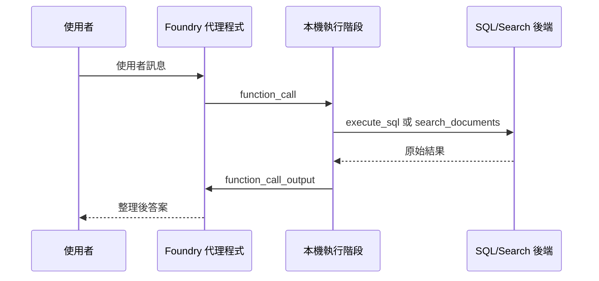

# Foundry 工具：函式合約

## 概要

這個工作坊不會把所有 Python 函式都直接開給模型用。它只提供少數、用途明確的工具，並且用固定的 JSON schema 限制輸入格式。

這樣做的好處是：

- agent 比較不容易亂用工具
- 行為更容易追蹤
- SQL 和文件搜尋的邊界更清楚

## 這頁要學什麼

看完這頁，你應該知道：

- 工作坊有哪些核心工具
- 每個工具適合做什麼，不適合做什麼
- 為什麼工具合約要集中定義在同一個模組

## 工作坊中的主要工具

目前的主要路徑有兩個函式工具。

| 工具 | 主要用途 | 應避免用於 |
|------|---------|-----------|
| `execute_sql` | 計數、彙總、聯結、排名，以及在 Microsoft Fabric 資料表中進行特定記錄查詢 | 政策、程序，或任何寫入操作 |
| `search_documents` | Azure AI Search 中的政策、程序、常見問題及其他文件內容 | 計算或大範圍結構化資料掃描 |

在僅 Foundry 模式下，只會註冊 `search_documents`。

## 為什麼標準工具合約很重要

如果沒有共用的工具合約，以下三件事會快速偏離：

1. 傳送給模型的結構描述
2. 說明何時呼叫各工具的指令文字
3. 預期特定引數的執行階段程式碼

本工作坊透過將定義集中在一個模組中，並從建立腳本和測試腳本中匯入它們來避免這種偏離。

## 工具結構描述設計

### `search_documents`

搜尋工具使用嚴格的 JSON 結構描述，目前只包含一個參數：

| 參數 | 類型 | 意義 |
|------|------|------|
| `query` | 字串 | 自然語言檢索查詢 |

它會傳回包含來源、標題和頁面中繼資料的引用段落。

### `execute_sql`

SQL 工具使用嚴格的 JSON 結構描述，包含一個參數：

| 參數 | 類型 | 意義 |
|------|------|------|
| `sql_query` | 字串 | 針對 Fabric Lakehouse SQL 端點的唯讀 T-SQL 查詢 |

SQL 執行階段會套用額外的強制措施：

- 僅允許 `SELECT` 和 `WITH` 查詢
- 拒絕寫入和 DDL 術語
- 結果格式化為包含列數的 Markdown 表格

這表示結構描述保持簡潔，同時執行階段仍然強制執行防護措施。

## 工具選擇邏輯

由 `build_tool_instruction_block(...)` 生成的提示詞指令區塊為模型提供了明確的路由規則：

- 數字和彙總交給 `execute_sql`
- 政策和敘述性指引交給 `search_documents`
- 綜合性問題可能需要依序使用兩個工具

這代表工具選擇不是黑盒子，而是有規則可循的。

## 實務中的執行迴圈

`scripts/08_test_foundry_agent.py` 中的本機執行階段遵循工具合約中描述的相同迴圈。

重要的細節是，模型可以在回答之前要求多次函式呼叫。迴圈會持續進行，直到回應輸出中沒有更多工具呼叫為止。

## 回應迴圈合約

工作坊目前如此描述執行階段迴圈：

1. 檢查使用者問題，決定需要的是結構化資料、文件，還是兩者皆需
2. 僅使用結構描述定義的參數發出函式呼叫
3. 在本機執行每個函式，並將原始輸出作為 `function_call_output` 送回
4. 合成最終答案並說明任何缺失的來源或限制

這對工作坊參與者來說足夠簡單易懂，同時仍符合 Responses API 互動的實際行為。

## 選用工具採分層設計，非合併

選用功能示範刻意放在主要工具迴圈之外。

| 腳本 | 功能 | 為何保持獨立 |
|------|------|------------|
| `09_demo_content_understanding.py` | Content Understanding | 與核心 SQL/Search 路徑不同的擷取工作流程 |
| `10_demo_browser_automation.py` | 瀏覽器自動化 | 預覽功能，有更嚴格的信任和環境要求 |
| `11_demo_web_search.py` | 網路搜尋 | 公開網路參照，與企業文件檢索分開 |
| `12_demo_pii_redaction.py` | PII 遮蔽 | Azure Language 工作流程，而非 Foundry 函式工具編排 |
| `13_demo_image_generation.py` | 影像生成 | 獨立的模型系列和輸出格式 |

目前這些腳本的狀態是：

- `09_demo_content_understanding.py` 已能直接運作，前提是部署後已設定 Content Understanding defaults
- `10_demo_browser_automation.py` 與 `11_demo_web_search.py` 已對齊目前 `azure-ai-projects` SDK 類型名稱
- `12_demo_pii_redaction.py` 已支援 Microsoft Entra ID，不再強制要求獨立 Language key
- `13_demo_image_generation.py` 已支援 Microsoft Entra ID，但仍受限於目標區域是否有可部署的 image model

這種分層是刻意的。

- 主要工作坊仍然易於部署和說明
- 選用示範可以獨立演進
- 不可用的預覽功能可以乾淨地執行 `SKIP:`，而不會中斷基礎路徑

## 為什麼不現在就將每個選用功能註冊為工具

因為每個選用功能都會增加不同的營運成本：

- 更多的連線或模型部署
- 更多的預覽功能風險
- 更多的安全審查
- 示範期間更多的解說負擔

因此，目前的工作坊將標準工具合約視為穩定核心，並使用獨立的示範腳本作為進階擴充。

如果你想把 workshop 往後延伸成 multi-agent 體驗，這個工具層仍然是共用基礎。新增的角色通常不是各自發明新工具，而是共同使用既有的 `execute_sql` 和 `search_documents`，只是在不同步驟中分工推理。這也是 [多代理程式延伸：情境工作流](05-multi-agent-extension.md) 採用的做法。

## 先記住這三件事

1. 主 workshop 核心其實只依賴兩個工具：一個查資料，一個查文件
2. SQL 工具從合約到執行都被限制在唯讀範圍
3. 延伸功能可以再加，但不需要一開始就塞進主流程

## 常見問題

### 為什麼不直接從模型呼叫 Azure AI Search 或 Microsoft Fabric？

因為工作坊需要一個可稽核的合約。模型只能請求具有嚴格參數的具名函式，而本機執行階段負責實際的執行和驗證。

### 為什麼要將選用功能放在主要工具清單之外？

因為每個擴充都有不同的風險特性、相依性範圍和示範故事。將它們分開可以保留穩定的核心合約，並讓不支援的功能可以乾淨地跳過。

### 如果只記一句話，要記什麼？

「兩個核心工具、一份嚴格合約，加上明確的執行階段防護措施。」

## 官方延伸閱讀

- [Build with agents, conversations, and responses](https://learn.microsoft.com/azure/foundry/agents/concepts/runtime-components)
- [Azure AI Agents function calling](https://learn.microsoft.com/azure/foundry/agents/how-to/tools/function-calling)
- [Automate browser tasks with the Browser Automation tool](https://learn.microsoft.com/azure/foundry/agents/how-to/tools/browser-automation)
- [What is Azure Content Understanding in Foundry Tools?](https://learn.microsoft.com/azure/ai-services/content-understanding/overview)

---

[← Foundry 代理程式：執行階段編排](02-foundry-agent.md) | [Fabric IQ：資料 →](02-fabric-iq.md)