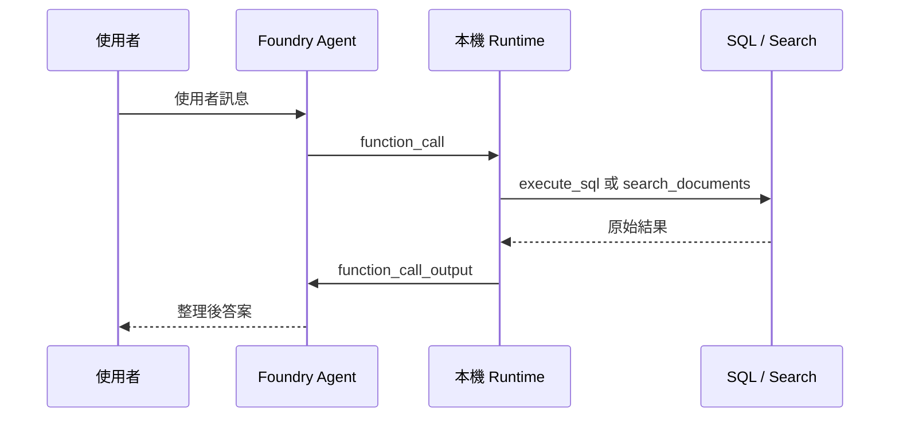

# Foundry 工具：函式合約

這一頁講的是 agent 怎麼知道自己可以用哪些工具、工具怎麼被限制、工具怎麼被執行。

核心概念：Foundry tool 不是「讓模型直接執行程式碼」，而是先宣告一份**工具合約**（name + description + strict JSON schema），agent 只能按合約提出工具請求，由你的 app 實際執行。

## 四個核心重點

| 重點 | 白話 |
|------|------|
| **Tool is a contract** | Agent 只能要求你事先宣告好的名稱、描述、參數 |
| **App executes, not model** | 真正執行工具的是你的 app/runtime，不是模型 |
| **Loop can repeat** | Agent 可以先呼叫工具、拿結果、再決定是否繼續呼叫 |
| **Strict schema matters** | `strict=True` + `additionalProperties: false` 可以避免輸入飄移 |

## 主要工具

| 工具 | 用途 | 不適合做 |
|------|------|---------|
| `execute_sql` | 計數、彙總、排名、特定記錄查詢（Fabric） | 政策、流程、任何寫入 |
| `search_documents` | 政策、流程、FAQ（Azure AI Search） | 計算、大範圍資料掃描 |

僅 Foundry 模式下只註冊 `search_documents`。工具合約集中定義在 `scripts/foundry_tool_contract.py`。

### Schema 設計

**`search_documents`**：一個參數 `query`（字串），回傳含 source/title/page metadata 的引用段落。

**`execute_sql`**：一個參數 `sql_query`（字串），runtime 額外強制：只允許 `SELECT`/`WITH`，拒絕寫入與 DDL，結果格式化為 Markdown 表格。

schema 定義「可以怎麼呼叫」，runtime 定義「可以執行到什麼程度」。兩層合在一起才是完整的安全邊界。

## 執行迴圈

模型可以在回答前要求多次 function call，迴圈持續到 response 中沒有更多 tool calls 為止。

## 工具選擇邏輯

Agent instructions 裡有明確的路由規則（由 `build_tool_instruction_block(...)` 生成）：

- 數字和彙總 → `execute_sql`
- 政策和敘述性指引 → `search_documents`
- 綜合性問題 → 可能依序使用兩個工具

## 選用示範工具

選用功能刻意放在主工具迴圈之外，各自獨立運作。

| 腳本 | 功能 | 為何獨立 |
|------|------|---------|
| `09_demo_content_understanding.py` | Content Understanding | 擷取工作流程，非即時查詢 |
| `10_demo_browser_automation.py` | 瀏覽器自動化 | 高風險預覽功能，需隔離環境 |
| `11_demo_web_search.py` | 網路搜尋 | 公開網路，與企業文件分開 |
| `12_demo_pii_redaction.py` | PII 遮蔽 | Azure Language 工作流程 |
| `13_demo_image_generation.py` | 影像生成 | 獨立模型與輸出格式 |

詳細操作說明見 [選用示範頁](../01-deploy/05c-script-optional-demos.md)。

!!! tip "為什麼不一開始就全部註冊"
    每個選用功能都有不同的連線、模型部署、預覽風險與安全審查需求。核心 agent 先維持小而穩定的工具面，高風險或高依賴的能力分層管理，符合官方工具設計的實務原則。

## 本頁重點

1. 主 workshop 只依賴兩個工具：一個查資料、一個查文件
2. 工具合約集中定義，schema → 建立 → 測試共用同一份
3. SQL 工具從合約到 runtime 都被限制在唯讀
4. 模型不會直接連資料庫，它只提出受合約限制的請求

## 常見問題

**為什麼不直接從模型呼叫 Search 或 Fabric？**
模型只能請求具名函式，本機 runtime 負責執行與驗證。這是 function calling 的基本模式。

**工具定義可以在 Foundry portal 維護嗎？**
Portal 可執行帶工具的 agent，但 function definition 的新增/刪除/更新應由 SDK 或 REST API 管理。

## 官方延伸閱讀

- [Build with agents, conversations, and responses](https://learn.microsoft.com/azure/foundry/agents/concepts/runtime-components)
- [Azure AI Agents function calling](https://learn.microsoft.com/azure/foundry/agents/how-to/tools/function-calling)
- [Browser Automation tool](https://learn.microsoft.com/azure/foundry/agents/how-to/tools/browser-automation)
- [Azure Content Understanding overview](https://learn.microsoft.com/azure/ai-services/content-understanding/overview)

---

[← Foundry 代理程式：執行階段編排](02-foundry-agent.md) | [Foundry Control Plane：資源拓撲 →](04-control-plane.md)