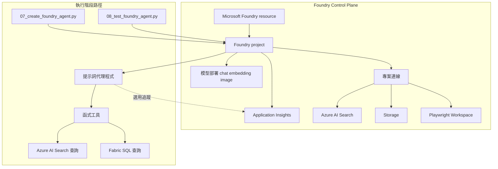

# Foundry Control Plane：資源拓撲

## 概要

你在工作坊裡看到的主流程很簡單，但它能順利跑起來，是因為背後已有一層 Azure 資源先把模型、專案、搜尋、儲存、權限與連線邊界準備好。這一層就是這裡說的 control plane。

如果把官網的說法濃縮成一句話，就是：

控制平面負責「把資源與邊界設好」，資料平面負責「真正執行模型、agent 與工具能力」。

學這一頁時，重點不是把所有資源名稱一次背起來，而是先知道幾件事：

- `Foundry resource` 和 `Foundry project` 差在哪裡
- 哪些事情屬於 control plane，哪些事情屬於 data plane
- 為什麼你前面跑 workshop 時，不需要直接碰每一個底層 Azure 資源

## 先抓官網真正想講的重點

如果只看 Microsoft Foundry 官方文件，這一頁最值得先記住的是下面這張表。

| 官網重點 | 用白話講是什麼 | 這份 workshop 怎麼對應 |
|----------|----------------|--------------------------|
| Control plane 和 data plane 是分開的 | 建資源、配權限、建 project、建模型部署，是 control plane；真正呼叫模型、建立 agent、測試 agent，是 data plane | 這一頁主要看 control plane，前面跑腳本比較偏 data plane |
| Foundry resource 是父層，project 是工作區邊界 | 一個 resource 底下可以有多個 project；project 是你實際建立 agent、連線與工作內容的邏輯邊界 | 本 workshop 最值得記住的是 project，不是每個底層資源名稱 |
| project 會共享父層部分設定，但保有自己的邏輯隔離 | 網路、安全、部署等會受父資源影響，但 project 仍是共用與隔離的單位 | 你操作的多數腳本都圍繞同一個 Foundry project endpoint |
| 連線是 control plane 的一部分 | Search、Storage、Browser Automation 這些相依性，通常先以連線形式掛進 project | 這份 workshop 有建立 project connection，但主路徑某些工具仍由本機 runtime 直接執行 |
| 官網推薦 Entra ID + RBAC | 生產環境要用 Microsoft Entra ID，不建議靠 API key 長期運作 | 本 workshop 主路徑也是以 Azure 登入與 RBAC 為主 |
| Foundry 支援自備資源 | 如果你要資料擁有權、CMK、網路隔離，可以帶自己的 Search、Storage、Cosmos DB | 這份 workshop 就是把 Search、Storage、遙測等支撐資源放在 project 周圍 |

如果你先記住這張表，這頁後面的圖和名詞就會容易很多。

## 這頁要學什麼

看完這頁，你應該知道：

- 工作坊背後有哪些主要 Azure 資源
- 這些資源和執行中的 agent 有什麼關係
- Foundry resource 與 Foundry project 各自扮演什麼角色
- 為什麼你在前面操作時不需要直接碰到所有底層資源
- 權限、連線與觀測性在這個架構裡各自落在哪裡

如果你是第一次讀這頁，只要先記住「Foundry project 是工作坊的中心邊界，模型、搜尋、儲存與追蹤都在它周圍支撐它」就夠了。

## 先用官網語言理解 control plane 與 data plane

Microsoft 官方把 Foundry 操作分成兩層：

- `control plane`：管理與配置資源
- `data plane`：真正使用模型與代理能力

放到這份 workshop，可以先這樣理解：

| 類型 | 在 Foundry 官網的意思 | 在本 workshop 的例子 |
|------|----------------------|----------------------|
| Control plane | 建立 Foundry resource、建立 project、模型部署、建立連線、設定網路與權限 | `azd` 佈署、Bicep 建資源、建立 Search / Storage / App Insights / Playwright Workspace |
| Data plane | 呼叫模型、建立 agent、測試 agent、做推論、追蹤與評估 | `07_create_foundry_agent.py`、`08_test_foundry_agent.py`、agent 對話與工具調用 |

這個分法很重要，因為它解釋了兩件事：

1. 為什麼「部署的人」和「跑 workshop 的人」不一定要是同一個身分
2. 為什麼你前面執行腳本時，看起來只碰到 project endpoint，但背後其實已經有很多 Azure 資源先就位

## Foundry resource 和 Foundry project 差在哪裡？

這是官網最值得先記住的結構。

| 層級 | 官網定位 | 你可以怎麼記 |
|------|----------|---------------|
| `Foundry resource` | Azure 裡的父層資源，承接共同設定、部署、網路與部分安全邊界 | 平台層 |
| `Foundry project` | 建立 agent、連線、評估、索引與工作內容的邏輯工作區 | 工作坊的中心邊界 |

官方也明講了幾件事：

- 一個 `Foundry resource` 底下可以有多個 `project`
- 多個 project 可以共享父層資源的一些能力
- project 同時也是共用與隔離的單位
- 你在 SDK、入口網站或腳本裡最常碰到的，通常是 project endpoint

所以對學員來說，最實用的記法不是先背 `resource` 名稱，而是先記住：

「你真正操作的中心，通常是 Foundry project。」

## 核心資源

| 資源 | 在本工作坊中的用途 |
|------|-------------------|
| **Microsoft Foundry resource** | 父層平台資源，承接 project、模型部署與共同設定 |
| **Foundry project** | 工作坊最值得先記住的中心邊界，agent、工具、連線與評估都圍繞它 |
| **模型部署** | 提供聊天推理、向量嵌入與 image generation 能力 |
| **專案連線** | 把 Search、Storage、Browser Automation 等相依性掛進 project |
| **Azure AI Search** | 幫 `search_documents` 儲存與找回文件片段 |
| **Storage** | 放置解決方案設定使用的資料與文件 |
| **Application Insights** | 選用的追蹤目的地，不是主流程必要條件 |
| **Playwright Workspace** | 只服務 Browser Automation demo 的瀏覽器工作區 |

## 把支撐資源和主流程放在同一張圖看

這張圖想表達的不是「所有東西都一定經過 Foundry 代跑」，而是：

- 支撐資源先由 control plane 準備好
- 主 workshop 的腳本主要圍繞 project endpoint 運作
- 但某些工具能力，仍然保留在本機 runtime 執行

## 為什麼 Foundry project 最值得先記住

Foundry project 是把工作坊串起來的邏輯邊界。對學員來說，先記住這一個點最有幫助，因為很多腳本最後都會回到這個專案端點。

它持續保存和管理：

- 代理程式定義
- 專案連線
- 部分模型與工具可用性
- 追蹤、評估、索引等工作空間內容

官網也強調：project 是工作區、共享與隔離的單位。

所以你在前面跑 workshop 時，看起來像是在操作幾支腳本；但從平台角度看，很多事其實都是透過同一個 Foundry project 被串起來的。

## 官網怎麼看「環境設定」

Foundry Agent Service 官方目前把環境大致分成三種：

- 基本設定
- 標準設定
- 標準設定 + BYO virtual network

把它翻成 workshop 語言，可以簡化成：

| 設定類型 | 官網重點 | 你可以怎麼理解 |
|----------|----------|----------------|
| 基本設定 | 快速開始，不必自己管理太多支撐資源 | 平台幫你管比較多 |
| 標準設定 | 用自己的 Storage、Search、Cosmos DB 等資源，取得更完整資料控制 | 比較像企業實作 |
| 標準設定 + 自備 VNet | 再往上加網路隔離與更嚴格邊界 | 比較像高要求環境 |

這份 workshop 的理解方式更接近「標準設定的心智模型」：

- Search 是自己的
- Storage 是自己的
- 遙測資源是自己的
- Browser Automation 的工作區也是額外獨立資源

只是主 workshop 的一些工具執行，為了教學透明度，仍保留在本機 runtime。

## 專案連線

連線代表 project 可以使用的相依性，避免把密碼或端點直接寫死在腳本裡。這是很典型的 control plane 概念。

讀這段時，最重要的是分清楚兩件事：

1. Foundry project 裡有哪些連線已經被準備好
2. 主 workshop 路徑實際是在哪裡執行工具

最相關的 connection / tool 類型如下：

| 連線類型 | 在官網裡的定位 | 這份 workshop 的狀態 |
|---------|------------------|------------------------|
| **Azure AI Search connection** | project 可使用的外部相依性 | 在 Foundry project 中已建立；但主路徑的 `search_documents` 目前仍由本機 runtime 直接呼叫 Azure AI Search |
| **Browser Automation connection** | project 與 Browser Automation 能力的連接點 | 連接 Foundry project 與已部署的 Playwright Workspace，供延伸 demo 使用 |
| **公開網路搜尋工具** | Foundry 內建工具 | 選用 demo 使用，不是主 workshop 必要依賴 |

這也是這份 workshop 很值得學的一點：

control plane 可以先把連線與依賴建好，但執行面不一定非得完全交給平台代跑。

## 可觀測性路徑

Foundry 官網把 observability 看成正式平台能力的一部分，但這不代表每一條 demo 路徑都必須開啟追蹤。

在這份 workshop 裡，追蹤是選用的。這對學員很重要，因為它代表少了遙測設定，不會讓主流程整個停住。

目前的工作坊做法是：

1. 預設**關閉**追蹤
2. 允許腳本透過環境旗標啟用追蹤
3. 僅在連線字串可用時使用 Application Insights
4. 當遙測不可用時，絕不阻擋主要工作坊路徑

這樣的取捨對教學是合理的：先把主路徑跑通，再把 observability 當進階能力打開。

## 權限要看到什麼程度就夠了

如果你現在是學員，只要知道「部署的人」和「操作 workshop 的人」不一定要是同一個身分就夠了。

這背後其實就是 Foundry 官網在講的 control plane / data plane 與 RBAC 分離。

如果你負責準備環境，才需要往下看不同操作需要哪些權限。

## 官網最推薦的身份與 RBAC 心智模型

官方現在很明確：

- 生產環境優先用 **Microsoft Entra ID**
- API key 只適合快速原型或孤立測試
- 最低權限應該靠 RBAC 來拆

而且 Foundry 把 control plane 的 `Actions` 與 data plane 的 `DataActions` 分開考慮。

對 workshop 讀者來說，可以簡化成下面這張表：

| 操作 | 通常落在哪一層 | 常見權限方向 |
|------|----------------|--------------|
| 部署基礎架構 | Control plane | 訂閱或資源群組的部署權限 |
| 建立 Foundry resource / project / 模型部署 | Control plane | 比較高的 Foundry 管理權限 |
| 建立專案連線 | Control plane | Foundry project 管理權限 + 可能需要對外部資源指派角色 |
| 建立與測試 agent | Data plane | Azure AI User 或可存取 project 的 Azure 登入 |
| 讀取遙測 | Data plane / 觀測面 | 對已連結 Application Insights 的讀取權限 |

官網在環境設定頁也提到常見角色方向：

- 建立帳戶和 project：`Azure AI Account Owner`
- 建立和編輯 agent：`Azure AI User`
- 指派必要資源 RBAC：`Role Based Access Control Administrator` 或足夠高的 Owner 權限

這表示部署的人和實際操作工作坊的人，不一定要是同一個 Azure 身分。

## 官網為什麼一直提 Bring Your Own Resources？

因為對企業來說，control plane 不只是「把東西建出來」，還包括：

- 資料要放在哪裡
- 是否要用自己的 Search / Storage / Cosmos DB
- 是否要用自己的 VNet
- 是否要滿足 CMK、資料擁有權與隔離要求

Foundry 官方文件明講：如果你要更細緻的資料控制，可以把自己的 Azure OpenAI、Storage、Cosmos DB、Azure AI Search 資源帶進來。

這正好也幫助理解這份 workshop：

雖然你在操作體驗上只常碰到 project endpoint，但背後的 Search、Storage、遙測、Browser Automation 工作區，其實就是支撐這個 project 的外部資源圈。

## 先記住這四件事

1. Foundry resource 是父層，Foundry project 是你最常操作的工作區邊界
2. 建資源、配權限、建連線，是 control plane；真正跑 agent 與模型，是 data plane
3. Azure AI Search、Storage、模型部署都在背後支撐主流程
4. 追蹤和部分延伸資源是加分項，不是主線必要條件

## 常見問題

### 為什麼這頁一直提 project 端點？

因為 Foundry project 端點是 agent 定義與部分平台能力的交接點。但本 workshop 的核心工具執行仍保留在本機 runtime，這樣比較透明，也更容易教學與除錯。

### Foundry Control Plane 和你操作到的體驗是同一件事嗎？

不是。Foundry Control Plane 是支援性的 Azure 資源層。你實際互動的是代理程式體驗，但它之所以能運作，是因為背後這層資源已經先把模型、project、連線、儲存體、搜尋和可觀測性準備好。

### 為什麼官網一直把 Entra ID 放在前面？

因為 Entra ID 才能提供條件式存取、受控識別、逐主體稽核與最低權限 RBAC。API key 比較適合快速評估，不適合長期的企業控制面設計。

### 如果只記一句話，要記什麼？

「你前面看到的簡單體驗，是因為背後已有一層 Azure control plane 先把 project、模型、連線與支撐資源準備好了。」

## 官方延伸閱讀

- Foundry control plane / auth / RBAC
  - [Authentication and authorization in Microsoft Foundry](https://learn.microsoft.com/azure/foundry/concepts/authentication-authorization-foundry)
  - [Microsoft Foundry RBAC](https://learn.microsoft.com/azure/foundry/concepts/rbac-foundry)
- Foundry project 與資源層級
  - [Create a project in Microsoft Foundry](https://learn.microsoft.com/azure/foundry/how-to/create-projects)
  - [Set up your agent environment](https://learn.microsoft.com/azure/foundry/agents/environment-setup)
- BYO resources / standard setup
  - [Use your own resources](https://learn.microsoft.com/azure/foundry/agents/how-to/use-your-own-resources)
  - [What is Microsoft Foundry Agent Service?](https://learn.microsoft.com/azure/foundry/agents/overview)

---

[← Fabric IQ：資料](02-fabric-iq.md) | [多代理程式延伸：情境工作流 →](05-multi-agent-extension.md)