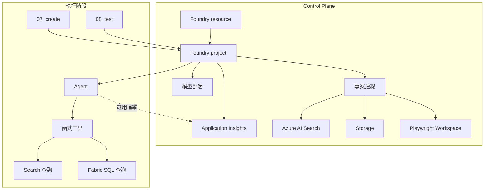

# Foundry Control Plane：資源拓撲

這一頁講的是 workshop 背後的 Azure 資源層。你前面看到的簡單體驗，是因為這一層已經先把模型、專案、搜尋、儲存、權限與連線準備好。

核心概念：**Control plane** 負責建資源與配權限；**Data plane** 負責呼叫模型與執行 agent。你操作的中心是 **Foundry project**。

## 最重要的結構

| 層級 | 定位 | 記法 |
|------|------|------|
| **Foundry resource** | Azure 父層資源，承接部署、網路與安全邊界 | 平台層 |
| **Foundry project** | 建立 agent、連線、評估、工作內容的邏輯工作區 | 你最常碰到的中心邊界 |

一個 resource 底下可以有多個 project。你在 SDK 或腳本裡碰到的通常是 project endpoint。

## Control plane vs Data plane

| 類型 | 做什麼 | workshop 範例 |
|------|--------|---------------|
| **Control plane** | 建立 resource/project、模型部署、建連線、設定網路與權限 | `azd` 佈署、Bicep |
| **Data plane** | 呼叫模型、建立 agent、測試 agent | `07_create`、`08_test` |

這解釋了為什麼「部署的人」和「跑 workshop 的人」不一定要是同一個身分。

## 核心資源

| 資源 | 用途 |
|------|------|
| **Foundry resource** | 父層平台資源 |
| **Foundry project** | Agent、工具、連線的中心邊界 |
| **模型部署** | 聊天推理、向量嵌入、image generation |
| **專案連線** | 把 Search、Storage、Browser Automation 等掛進 project |
| **Azure AI Search** | 文件檢索 |
| **Storage** | 資料與文件儲存 |
| **Application Insights** | 選用追蹤 |
| **Playwright Workspace** | 僅服務 Browser Automation demo |

## 資源拓撲圖

## 權限與身分

| 操作 | 層級 | 常見角色 |
|------|------|---------|
| 部署基礎架構 | Control plane | 訂閱/資源群組部署權限 |
| 建立 resource / project | Control plane | `Azure AI Account Owner` |
| 建立與測試 agent | Data plane | `Azure AI User` |
| 指派 RBAC | Control plane | `Role Based Access Control Administrator` |

官方推薦用 **Microsoft Entra ID** + RBAC，不建議靠 API key 長期運作。

??? note "環境設定類型"
    | 設定 | 重點 |
    |------|------|
    | **基本** | 快速開始，平台管理較多支撐資源 |
    | **標準** | 自備 Storage、Search、Cosmos DB，取得更完整資料控制 |
    | **標準 + 自備 VNet** | 再加網路隔離 |

    這份 workshop 比較接近「標準設定」心智模型：Search、Storage、遙測都是自己的資源。

??? note "Bring Your Own Resources"
    Foundry 支援自備 Azure OpenAI、Storage、Cosmos DB、Azure AI Search。適合需要資料擁有權、CMK、網路隔離的企業場景。這也是這份 workshop 背後 Search / Storage / 遙測都是獨立資源的原因。

??? note "可觀測性"
    追蹤預設關閉。允許環境旗標啟用，僅在 Application Insights 連線可用時使用。缺少遙測不會阻擋主流程。

## 本頁重點

1. Foundry resource 是父層，project 是你最常操作的工作區邊界
2. 建資源、配權限 = control plane；跑 agent = data plane
3. Search、Storage、模型部署都在背後支撐主流程
4. 追蹤和延伸資源是加分項，不是主線必要條件

## 官方延伸閱讀

- [Authentication and authorization in Microsoft Foundry](https://learn.microsoft.com/azure/foundry/concepts/authentication-authorization-foundry)
- [Microsoft Foundry RBAC](https://learn.microsoft.com/azure/foundry/concepts/rbac-foundry)
- [Create a project in Microsoft Foundry](https://learn.microsoft.com/azure/foundry/how-to/create-projects)
- [Set up your agent environment](https://learn.microsoft.com/azure/foundry/agents/environment-setup)
- [Use your own resources](https://learn.microsoft.com/azure/foundry/agents/how-to/use-your-own-resources)

---

[← Fabric IQ：資料](02-fabric-iq.md) | [多代理程式延伸：情境工作流 →](05-multi-agent-extension.md)