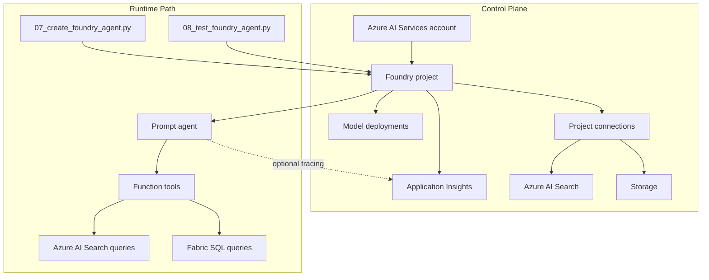

# 控制平面：資源拓撲

## 控制平面掌管的範圍

工作坊的執行階段之所以感覺簡單，是因為基礎架構在背後建立並串聯了更大規模的 Azure 資源。本頁說明這些控制平面資源，以及它們與執行階段路徑的關係。

## 核心資源

| 資源 | 在本工作坊中的用途 |
|------|-------------------|
| **Azure AI Services 帳戶** | Foundry 專案功能與模型部署的父帳戶 |
| **Foundry 專案** | 代理程式、工具、連線與可觀測性的工作區邊界 |
| **模型部署** | 工作坊使用的聊天、向量嵌入及選用模型端點 |
| **Azure AI Search** | `search_documents` 的文件索引建立與檢索 |
| **儲存體** | 解決方案設定使用的資料與文件儲存 |
| **Application Insights** | 選用代理程式遙測的追蹤目的地 |

## 控制平面與執行階段路徑

## 為什麼專案很重要

Foundry 專案是將工作坊串聯在一起的邏輯邊界。它為腳本提供一個端點來使用，同時平台持續追蹤：

- 代理程式定義
- 專案連線
- 模型可用性
- 追蹤設定

這就是為什麼大多數工作坊腳本只需要 Foundry 專案端點加上認證資訊。

## 專案連線

連線代表代理程式或專案可以使用的相依性，無需在腳本中硬編碼密碼。

在本工作坊中，最相關的連線模式為：

| 連線類型 | 重要性 |
|---------|--------|
| **Azure AI Search** | 支援文件參照與檢索 |
| **瀏覽器自動化連線** | 用於瀏覽器自動化預覽的選用 Playwright 工作區 |
| **Bing 參照連線** | 選用的即時公開網路參照 |

## 可觀測性路徑

追蹤是選用的，但當 Application Insights 連結至專案時，控制平面可以支援它。

目前的工作坊做法是：

1. 預設**關閉**追蹤
2. 允許腳本透過環境旗標啟用追蹤
3. 僅在連線字串可用時使用 Application Insights
4. 當遙測不可用時，絕不阻擋主要工作坊路徑

## RBAC 期望

| 操作 | 通常需要的權限 |
|------|---------------|
| 部署基礎架構 | 訂閱或資源群組的部署權限 |
| 建立專案資源和連線 | Foundry 專案管理權限 |
| 執行代理程式腳本 | 可存取 Foundry 專案的 Azure 登入 |
| 讀取遙測 | 對已連結 Application Insights 資源的存取權限 |

確切的角色指派取決於環境的治理方式，但設計假設很明確：部署權限和執行階段使用權限可能不是同一個身分。

## 客戶對話要點

| 問題 | 實務回答 |
|------|---------|
| 「代理程式實際上存在哪裡？」 | 「代理程式定義存在 Foundry 專案中，而模型部署存在 Azure AI Services 帳戶下。」 |
| 「什麼將代理程式連接到搜尋？」 | 「專案連線和工具設定。執行階段使用專案端點，而非將密碼嵌入程式碼中。」 |
| 「追蹤是否一直開啟？」 | 「不是。工作坊將遙測設為選用，因此缺少可觀測性設定永遠不會阻擋示範。」 |

## 常見問題

### 為什麼工作坊大量討論專案端點？

因為專案端點是執行階段的交接點。它讓腳本透過一個邏輯邊界存取代理程式、遙測配線和連線，而非在各處硬編碼服務專屬的認證資訊。

### 控制平面和使用者體驗是同一件事嗎？

不是。控制平面是支援性的 Azure 拓撲。使用者與代理程式體驗互動，但該體驗之所以能運作，是因為控制平面在背後佈建了模型、連線、儲存體、搜尋和可觀測性。

### 本頁最簡潔的對話要點是什麼？

「控制平面是讓簡單的執行階段示範成為可能的 Azure 鷹架。」

## 營運要點

控制平面賦予您可重複性：

- Bicep 定義資源
- 輸出公開重要的識別碼
- 腳本透過環境變數使用這些輸出
- 可以新增選用功能而無需重新設計主要執行階段

這也包含後續的 multi-agent 延伸。新增角色與 workflow 時，通常不需要重做整個 Azure 拓撲，而是重用既有的 Foundry project、模型部署、Search 索引、Fabric SQL 端點，以及身分驗證設定。真正新增的是 orchestration 層，而不是另一套控制平面。

---

[← Fabric IQ：資料](02-fabric-iq.md) | [Multi-Agent Extension：情境工作流 →](05-multi-agent-extension.md)