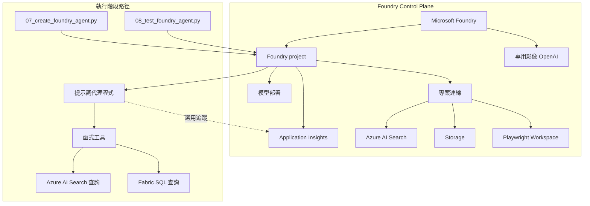

# Foundry Control Plane：資源拓撲

## 概要

你在工作坊裡看到的主流程很簡單，但它能順利跑起來，是因為背後已有一層 Azure 資源替你把模型、搜尋、儲存和專案邊界準備好。這一層就是這裡說的 control plane。

學這一頁時，重點不是把所有資源名稱一次背起來，而是先知道它們各自扮演什麼角色：

- 模型部署在哪裡
- Search 在哪裡
- 專案和連線放在哪裡
- 遙測與額外 demo 資源放在哪裡

## 這頁要學什麼

看完這頁，你應該知道：

- 工作坊背後有哪些主要 Azure 資源
- 這些資源和執行中的 agent 有什麼關係
- 為什麼你在前面操作時不需要直接碰到所有底層資源

如果你是第一次讀這頁，只要先記住「Foundry project 是工作坊的中心邊界，模型、搜尋、儲存與追蹤都在它周圍支撐它」就夠了。

## 核心資源

| 資源 | 在本工作坊中的用途 |
|------|-------------------|
| **Microsoft Foundry** | 放置 Foundry project 與模型部署的平台層 |
| **Foundry project** | 工作坊最值得先記住的中心邊界，agent、工具與連線都圍繞它 |
| **模型部署** | 提供聊天推理與向量嵌入能力 |
| **專用影像 OpenAI 資源** | 只服務 image generation demo，不影響主聊天路徑 |
| **Azure AI Search** | 幫 `search_documents` 儲存與找回文件片段 |
| **儲存體** | 放置解決方案設定使用的資料與文件 |
| **Application Insights** | 選用的追蹤目的地，不是主流程必要條件 |
| **Playwright Workspace** | 只服務 Browser Automation demo 的瀏覽器工作區 |

## 把支撐資源和主流程放在同一張圖看

## 為什麼 Foundry project 最值得先記住

Foundry project 是把工作坊串起來的邏輯邊界。對學員來說，先記住這一個點最有幫助，因為很多腳本最後都會回到這個專案端點。

它持續保存和管理：

- 代理程式定義
- 專案連線
- 模型可用性
- 追蹤設定

所以你在前面跑 workshop 時，看起來像是在操作幾支腳本；但從平台角度看，很多事其實都是透過同一個 Foundry project 被串起來的。

## 專案連線

連線代表專案可以使用的相依性，避免把密碼或端點直接寫死在腳本裡。

讀這段時，最重要的是分清楚兩件事：

1. Foundry project 裡有哪些連線已經被準備好
2. 主 workshop 路徑實際是在哪裡執行工具

最相關的 connection / tool 類型如下：

| 連線類型 | 重要性 |
|---------|--------|
| **Azure AI Search connection** | 在 Foundry project 中已建立；但主路徑的 `search_documents` 目前仍由本機 runtime 直接呼叫 Azure AI Search |
| **瀏覽器自動化連線** | 連接 Foundry project 與已部署的 Playwright Workspace，供延伸 demo 使用 |
| **公開網路搜尋工具** | 選用 demo 使用的 Foundry 內建 web search tool，不是主 workshop 必要依賴 |

## 可觀測性路徑

追蹤是選用的。這對學員很重要，因為它代表少了遙測設定，不會讓主流程整個停住。

目前的工作坊做法是：

1. 預設**關閉**追蹤
2. 允許腳本透過環境旗標啟用追蹤
3. 僅在連線字串可用時使用 Application Insights
4. 當遙測不可用時，絕不阻擋主要工作坊路徑

## 權限要看到什麼程度就夠了

如果你現在是學員，只要知道「部署的人」和「操作 workshop 的人」不一定要是同一個身分就夠了。

如果你負責準備環境，才需要往下看不同操作需要哪些權限。

## RBAC 期望

| 操作 | 通常需要的權限 |
|------|---------------|
| 部署基礎架構 | 訂閱或資源群組的部署權限 |
| 建立專案資源和連線 | Foundry project 管理權限 |
| 執行代理程式腳本 | 可存取 Foundry project 的 Azure 登入 |
| 讀取遙測 | 對已連結 Application Insights 資源的存取權限 |

這表示部署的人和實際操作工作坊的人，不一定要是同一個 Azure 身分。

## 先記住這三件事

1. Foundry project 是整個工作坊最重要的中心邊界
2. Azure AI Search、Storage、模型部署都在背後支撐主流程
3. 追蹤和部分延伸資源是加分項，不是主線必要條件

## 常見問題

### 為什麼這頁一直提 project 端點？

因為 Foundry project 端點是 agent 定義與部分平台能力的交接點。但本 workshop 的核心工具執行仍保留在本機 runtime，這樣比較透明，也更容易教學與除錯。

### Foundry Control Plane 和你操作到的體驗是同一件事嗎？

不是。Foundry Control Plane 是支援性的 Azure 資源層。你實際互動的是代理程式體驗，但它之所以能運作，是因為背後這層資源已經先把模型、連線、儲存體、搜尋和可觀測性準備好。

### 如果只記一句話，要記什麼？

「你前面看到的簡單體驗，是因為背後已有一層 Azure 資源先把事情準備好了。」

## 官方延伸閱讀

- [Authentication and authorization in Microsoft Foundry](https://learn.microsoft.com/azure/foundry/concepts/authentication-authorization-foundry)
- [How to configure Azure OpenAI in Azure AI Foundry Models with Microsoft Entra ID authentication](https://learn.microsoft.com/azure/ai-foundry/openai/how-to/managed-identity)
- [Configure keyless authentication with Microsoft Entra ID](https://learn.microsoft.com/azure/foundry/foundry-models/how-to/configure-entra-id)

---

[← Fabric IQ：資料](02-fabric-iq.md) | [多代理程式延伸：情境工作流 →](05-multi-agent-extension.md)