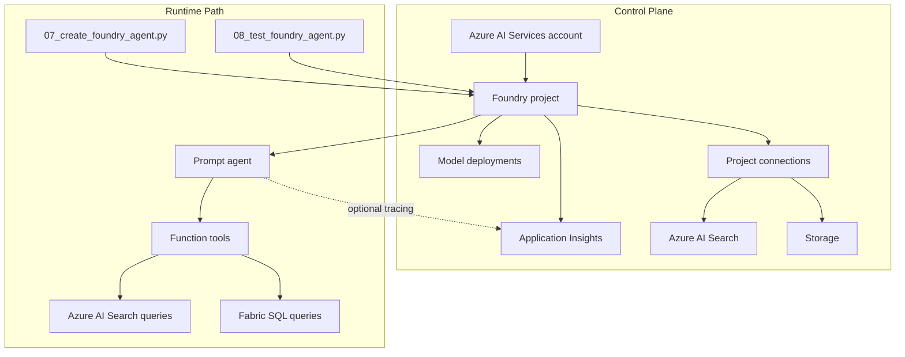

# Control Plane: Resource Topology

## What the control plane owns

The workshop runtime feels simple because the infrastructure creates and wires a larger set of Azure resources behind it. This page explains those control-plane resources and how they relate to the runtime path.

## Core resources

| Resource | Purpose in this workshop |
|----------|--------------------------|
| **Azure AI Services account** | Parent account for Foundry project capabilities and model deployments |
| **Foundry project** | Workspace boundary for agents, tools, connections, and observability |
| **Model deployments** | Chat, embedding, and optional model endpoints used by the workshop |
| **Azure AI Search** | Document indexing and retrieval for `search_documents` |
| **Storage** | Data and document storage used by the solution setup |
| **Application Insights** | Trace destination for optional agent telemetry |

## Control plane vs runtime path

## Why the project matters

The Foundry project is the logical boundary that ties the workshop together. It gives the scripts one endpoint to work with while the platform keeps track of:

- agent definitions
- project connections
- model availability
- tracing configuration

This is why most workshop scripts only need the Foundry project endpoint plus credentials.

## Project connections

Connections represent dependencies that the agent or project can use without hard-coding secrets into the scripts.

In this workshop, the most relevant connection patterns are:

| Connection type | Why it matters |
|-----------------|----------------|
| **Azure AI Search** | Backs document grounding and retrieval |
| **Browser Automation connection** | Optional Playwright workspace for browser automation preview |
| **Bing grounding connection** | Optional real-time public web grounding |

## Observability path

Tracing is optional, but the control plane can support it when Application Insights is linked to the project.

The current workshop approach is:

1. Keep tracing **off by default**
2. Allow scripts to enable it with environment flags
3. Use Application Insights only when the connection string is available
4. Never block the main workshop path when telemetry is unavailable

## RBAC expectations

| Operation | Typical permission needed |
|-----------|---------------------------|
| Deploy infrastructure | Subscription or resource group deployment permissions |
| Create project resources and connections | Foundry project management permissions |
| Run agent scripts | Azure sign-in that can access the Foundry project |
| Read telemetry | Access to the linked Application Insights resource |

The exact role assignment depends on how the environment is governed, but the design assumption is clear: deployment permissions and runtime usage permissions might not be the same identity.

## Customer talking points

| Question | Practical answer |
|----------|------------------|
| "Where does the agent actually live?" | "The agent definition lives in the Foundry project, and the model deployments live under the Azure AI Services account." |
| "What connects the agent to search?" | "Project connections and tool configuration. The runtime uses the project endpoint instead of embedding secrets into the code." |
| "Is tracing always on?" | "No. The workshop keeps telemetry optional so missing observability setup never blocks the demo." |

## Operational takeaway

The control plane gives you repeatability:

- Bicep defines the resources
- outputs expose the important identifiers
- scripts consume those outputs through environment variables
- optional capabilities can be added without redesigning the main runtime

---

[← Fabric IQ: Data](02-fabric-iq.md) | [Cleanup →](../04-cleanup/index.md)