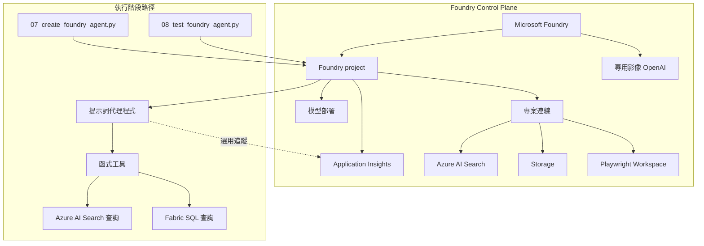

# Foundry Control Plane：資源拓撲

## 概要

你在工作坊裡看到的問答流程其實很簡單，但背後有一層 Azure 資源在支撐它。這一層就是這裡說的 control plane。

你可以把它理解成「後台基礎設施」：

- 模型部署在哪裡
- Search 在哪裡
- 專案和連線放在哪裡
- 遙測與額外 demo 資源放在哪裡

## 這頁要學什麼

看完這頁，你應該知道：

- 工作坊背後有哪些主要 Azure 資源
- 這些資源和執行中的 agent 有什麼關係
- 為什麼學員看到的主流程可以保持簡單

## 核心資源

| 資源 | 在本工作坊中的用途 |
|------|-------------------|
| **Microsoft Foundry** | Foundry project 功能與模型部署的父層平台 |
| **Foundry project** | 代理程式、工具、連線與可觀測性的工作區邊界 |
| **模型部署** | 工作坊使用的聊天、向量嵌入及選用模型端點 |
| **專用影像 OpenAI 資源** | 讓 image generation demo 可使用獨立區域與配額，而不影響主要聊天路徑 |
| **Azure AI Search** | `search_documents` 的文件索引建立與檢索 |
| **儲存體** | 解決方案設定使用的資料與文件儲存 |
| **Application Insights** | 選用代理程式遙測的追蹤目的地 |
| **Playwright Workspace** | Browser Automation demo 的瀏覽器執行工作區 |

## Foundry Control Plane 與執行階段路徑

## 為什麼 Foundry project 很重要

Foundry project 是將工作坊串聯在一起的邏輯邊界。它為腳本提供一個端點來使用，同時平台持續追蹤：

- 代理程式定義
- 專案連線
- 模型可用性
- 追蹤設定

所以大多數腳本只要知道 project 端點和認證，就能運作。

## 專案連線

連線代表代理程式或專案可以使用的相依性，無需在腳本中硬編碼密碼。

在本工作坊中，應把「已部署的 project connection」和「主路徑實際怎麼執行」分開理解。

最相關的 connection / tool 類型如下：

| 連線類型 | 重要性 |
|---------|--------|
| **Azure AI Search connection** | 已在 Foundry project 中建立，對治理與後續延伸有意義；但目前主路徑的 `search_documents` 仍由本機 runtime 直接呼叫 Azure AI Search |
| **瀏覽器自動化連線** | 連接 Foundry project 與已部署的 Playwright Workspace；workspace 可自動建立，但 token 與 connection 仍需手動完成 |
| **公開網路搜尋工具** | 選用 demo 直接使用 Foundry 的內建 web search tool，不是目前主路徑的 project connection 依賴 |

## 可觀測性路徑

追蹤是選用的，但當 Application Insights 連結至專案時，控制平面可以支援它。

目前的工作坊做法是：

1. 預設**關閉**追蹤
2. 允許腳本透過環境旗標啟用追蹤
3. 僅在連線字串可用時使用 Application Insights
4. 當遙測不可用時，絕不阻擋主要工作坊路徑

## RBAC 期望

| 操作 | 通常需要的權限 |
|------|---------------|
| 部署基礎架構 | 訂閱或資源群組的部署權限 |
| 建立專案資源和連線 | Foundry project 管理權限 |
| 執行代理程式腳本 | 可存取 Foundry project 的 Azure 登入 |
| 讀取遙測 | 對已連結 Application Insights 資源的存取權限 |

這表示部署的人和實際操作工作坊的人，不一定要是同一個 Azure 身分。

## 客戶對話要點

| 問題 | 實務回答 |
|------|---------|
| 「代理程式實際上存在哪裡？」 | 「代理程式定義存在 Foundry project 中，而模型部署存在 Microsoft Foundry 底下。」 |
| 「什麼將代理程式連接到搜尋？」 | 「目前要分兩層看：agent 定義來自 Foundry project，但主 workshop 的 `search_documents` 仍是由本機 runtime 直接呼叫 Azure AI Search。」 |
| 「追蹤是否一直開啟？」 | 「不是。工作坊將遙測設為選用，因此缺少可觀測性設定永遠不會阻擋示範。」 |

## 常見問題

### 為什麼工作坊大量討論專案端點？

因為 Foundry project 端點是 agent 定義與部分平台能力的交接點。但本 workshop 的核心工具執行仍保留在本機 runtime，這樣比較透明，也更容易教學與除錯。

### Foundry Control Plane 和使用者體驗是同一件事嗎？

不是。Foundry Control Plane 是支援性的 Azure 拓撲。你實際互動的是代理程式體驗，但它之所以能運作，是因為這層控制平面在背後佈建了模型、連線、儲存體、搜尋和可觀測性。

### 本頁最簡潔的對話要點是什麼？

「Foundry Control Plane 是讓簡單的執行階段示範成為可能的 Azure 鷹架。」

## 官方延伸閱讀

- [Authentication and authorization in Microsoft Foundry](https://learn.microsoft.com/azure/foundry/concepts/authentication-authorization-foundry)
- [How to configure Azure OpenAI in Azure AI Foundry Models with Microsoft Entra ID authentication](https://learn.microsoft.com/azure/ai-foundry/openai/how-to/managed-identity)
- [Configure keyless authentication with Microsoft Entra ID](https://learn.microsoft.com/azure/foundry/foundry-models/how-to/configure-entra-id)

---

[← Fabric IQ：資料](02-fabric-iq.md) | [多代理程式延伸：情境工作流 →](05-multi-agent-extension.md)