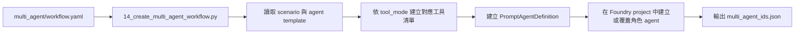
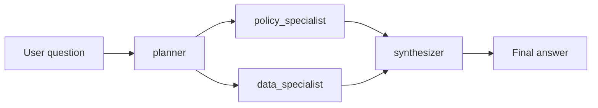

# 多代理程式延伸：情境工作流

## 概要

如果你已經跑完主 workshop，這一頁要幫你回答下一個自然問題：

「如果未來不想把所有能力都塞進同一個 agent，而是想拆成不同角色協作，要怎麼做？」

所以這一頁不是在講「取代主流程」，而是在講「學完單一 agent 之後，可以怎麼往前延伸」。

## 這頁要學什麼

看完這頁，你應該知道：

- 為什麼有人會把一個 agent 拆成多個角色
- 這份 workshop 材料現在提供了哪兩種延伸方式
- `multi_agent/workflow.yaml` 這條路徑如何重用既有工具
- 新增的 `scripts/16_agent_framework_workflow_example.py` 想示範什麼

如果你是第一次接觸 multi-agent，先把這頁當成「角色分工的入門頁」就好，不需要一開始就把所有檔案和框架差異全部吃下來。

## 先用學員角度理解這條延伸路徑

主 workshop 的重點，是讓你先看懂單一 agent 如何同時：

- 查文件
- 查資料
- 回答問題

多代理程式延伸則是往前一步，讓你看到另一種拆法：

- 把「規劃」交給一個角色
- 把「政策判讀」交給一個角色
- 把「資料分析」交給一個角色
- 最後再由一個角色整合答案

對學員來說，這頁最重要的不是背 API，而是理解一個設計判斷：

當需求開始變長、責任邊界開始分開、不同角色需要不同工具時，多角色工作流通常會比一直擴充單一 prompt 更好維護。

## 為什麼這條延伸路徑存在

主 workshop 已經回答了「一個 agent 如何同時查文件與查資料」。

這條延伸路徑要回答的是另一組更接近實務的問題：

- 如果不同角色要有不同工具權限，怎麼拆？
- 如果規劃、政策判讀、資料分析、最終彙整想分開處理，怎麼做？
- 如果未來要加更多情境，而不是一直往同一個 system prompt 疊功能，怎麼維持可維護性？

你可以把它理解成「同一套接地能力，換一種協作方式」。

## 目前 extension 的角色設計

這個 extension 目前把 workflow 拆成四個角色。

| 角色 | 主要責任 | 工具模式 |
|------|----------|----------|
| `planner` | 重述問題、定義需要哪些政策證據與資料證據 | `none` |
| `policy_specialist` | 從文件中找政策、流程、門檻與例外 | `search` |
| `data_specialist` | 對 Fabric SQL 做唯讀查詢並萃取關鍵數據 | `sql` |
| `synthesizer` | 組合前面三者輸出，產生最終回答 | `none` |

對學員來說，這個分工最值得觀察的地方是：

- 不是每個 agent 都拿同樣的工具
- 每個角色只拿自己真的需要的能力
- 最終答案不是來自單一步驟，而是來自前面幾個角色的分工結果

這也是多代理程式設計最常見的第一步。

## 你會看到兩種延伸方式

這份 workshop 材料現在提供兩條學習路徑，讓你可以用不同角度理解 multi-agent。

| 路徑 | 你會看到什麼 | 適合先學什麼 |
|------|---------------|----------------|
| 宣告式 workflow 路徑 | `multi_agent/workflow.yaml`、`scripts/14_create_multi_agent_workflow.py`、`scripts/15_test_multi_agent_workflow.py` | 完整版的 Fabric + Search 角色、步驟、scenario 怎麼拆開 |
| 宣告式 workflow（search-only） | `multi_agent/workflow.yaml`、`scripts/14b_create_multi_agent_search_only_workflow.py`、`scripts/15b_test_multi_agent_search_only_workflow.py` | 沒有 Fabric 時，先用文件路徑理解角色拆分 |
| Code-first workflow 路徑 | `scripts/16_agent_framework_workflow_example.py` | 用程式碼直接建立 agent 與 workflow 的最小做法 |

這兩條路徑都在教同一件事：把原本單一 agent 的能力，延伸成更清楚的角色協作。

## 宣告式設計長什麼樣子

`multi_agent/workflow.yaml` 是這條延伸路徑的中心。它同時定義：

1. agent templates
2. 每個角色的 instruction template
3. workflow steps
4. scenario catalog

對學員來說，這樣設計最大的好處是：新增情境時，不一定要先改底層執行程式。

你可以把它理解成兩層：

- Python 負責執行與接線
- YAML 負責描述角色、步驟與 scenario 差異

所以你在學這一段時，可以先把注意力放在「工作怎麼拆」，而不是先卡在低層 API 細節。

## 建立流程

建立 multi-agent set 的流程如下：

學員可以把這支建立腳本理解成「把 YAML 裡定義的角色，變成 Foundry project 裡真的可以執行的 agent」。

建立腳本會針對每個 scenario 建立一組角色 agent，並把 agent metadata 存回設定檔，供測試腳本後續讀取。

## 執行流程

`scripts/15_test_multi_agent_workflow.py` 會依照 YAML 中定義的 workflow steps，逐步執行整條鏈。

對應的可見輸出分成四段：

1. planner brief
2. policy findings
3. data findings
4. final synthesized answer

這對學員特別有幫助，因為你不只看到最終答案，還能直接看到不同責任是怎麼拆開的。

這也是這頁最值得看的地方：多代理程式的價值，不只是答案，而是中間責任分工變得可見。

## 新增的 Agent Framework 最小範例

這裡另外放了一支 `scripts/16_agent_framework_workflow_example.py`，目的不是取代 YAML workflow，而是補一個更小、更直接的學習入口。

這支腳本示範的是：

- 用 Microsoft Agent Framework 直接在程式碼中建立 agent
- 用 `WorkflowBuilder` 把兩個角色串成順序 workflow
- 用串流方式輸出最終結果
- 繼續使用 Foundry project endpoint 與模型部署

它目前只放了兩個角色：

| 角色 | 在範例中的用途 |
|------|----------------|
| `policy-researcher` | 先整理和問題最相關的政策重點 |
| `answer-synthesizer` | 把前一步內容整理成使用者可採取的下一步 |

如果你是第一次接觸 Agent Framework，這支腳本最適合拿來看三件事：

1. 多角色不一定要先從複雜 scenario catalog 開始
2. workflow 也可以完全用程式碼定義
3. 同樣的多角色概念，可以用不同框架承載

## 什麼時候看 YAML 路徑，什麼時候看 Agent Framework 範例？

| 如果你想學的是… | 先看哪個 |
|------------------|-----------|
| 情境如何擴充、角色如何宣告 | `multi_agent/workflow.yaml` 路徑 |
| 最小可跑的 code-first workflow 長什麼樣子 | `scripts/16_agent_framework_workflow_example.py` |
| 如何把多個角色串成更正式的教學延伸 | 兩個都看，先 YAML 再看 Agent Framework |

## 與主 workshop 的關係

這條延伸路徑不是重新發明一套新的底層能力。它直接重用主 workshop 已經存在的基礎：

| 延伸元件 | 重用的既有能力 |
|----------|----------------|
| `policy_specialist` | `search_documents` 與 Azure AI Search 接地能力 |
| `data_specialist` | `execute_sql` 與 Fabric Lakehouse SQL endpoint |
| `foundry_multi_agent_runtime.py` | 與主路徑相同的本機工具執行模型 |
| scenario context | `ontology_config.json`、`schema_prompt.txt`、`fabric_ids.json` |
| `16_agent_framework_workflow_example.py` | 用另一種 framework 示範相同的多角色延伸概念 |

也就是說，multi-agent 改變的是協作方式，不是資料來源本身。

## 為什麼仍然保留本機工具執行

即使角色數變多，這條延伸路徑仍然沿用目前 workshop 的設計原則：

- Foundry 負責保存 prompt agent definition
- 本機 runtime 負責執行實際工具
- 工具結果再以 `function_call_output` 回傳給模型

保留這個模式有三個好處：

1. 可以沿用既有的 SQL guardrail 與 search behavior
2. Demo 時仍然看得到每一步到底呼叫了哪些工具
3. 不需要在 extension 階段就把所有工具執行搬進另一套更複雜的 hosting model

## Scenario 設計方式

目前 YAML 已示範三種 scenario：

| Scenario | 目的 |
|----------|------|
| `policy_gap_analysis` | 比對政策門檻與實際營運結果 |
| `exception_triage` | 針對異常事件做政策 + 數據聯合判讀 |
| `executive_brief` | 用政策與資料整理管理層摘要 |

對學員來說，這裡真正要學的不是 scenario 名稱，而是擴充方法：

- 要加新情境時，先想角色責任有沒有變
- 再決定 prompt 和 workflow step 要不要變
- 最後才考慮要不要新增工具

這比把所有新需求都繼續堆回主 workshop agent，更容易維護。

## 先記住這三件事

1. multi-agent 不是重做一遍，而是把原本的能力拆成更清楚的角色
2. 不是每個角色都需要同一套工具
3. 這一頁的重點是看懂分工，不是一次學完所有框架細節

## FAQ

### 這是正式產品架構，還是教學延伸？

目前是教學延伸。它的價值在於示範如何從單代理程式 PoC，演進到更有角色邊界與工作流概念的設計。

### 為什麼用 YAML，而不是直接把流程寫死在 Python？

因為這樣比較容易新增 scenario、調整角色指令、或更換 workflow 順序，而不必每次都改執行程式。

### 為什麼又新增一支 Agent Framework 範例？

因為有些學員比較容易從最小可執行程式碼理解 workflow，而不是先從宣告式 YAML 開始。這支範例就是拿來補這個學習入口。

### 如果只記一句話，要記什麼？

「先把單一 agent 主線看懂，再用這一頁學會怎麼把同一套能力拆成多角色協作。」

## 官方延伸閱讀

- Foundry agent 基本觀念
    - [What is Microsoft Foundry Agent Service?](https://learn.microsoft.com/azure/foundry/agents/overview)
    - [Build with agents, conversations, and responses](https://learn.microsoft.com/azure/foundry/agents/concepts/runtime-components)
    - [Microsoft Foundry quickstart](https://learn.microsoft.com/azure/foundry/quickstarts/get-started-code)
- Foundry workflow 與多代理程式概念
    - [Build a workflow in Microsoft Foundry](https://learn.microsoft.com/azure/foundry/agents/concepts/workflow)
    - [Agent development lifecycle](https://learn.microsoft.com/azure/foundry/agents/concepts/development-lifecycle)
- Microsoft Agent Framework 與 code-first workflow
    - [Microsoft Agent Framework overview](https://learn.microsoft.com/agent-framework/overview/)
    - [Agents in Workflows](https://learn.microsoft.com/agent-framework/workflows/agents-in-workflows)
    - [Microsoft Foundry provider for Agent Framework](https://learn.microsoft.com/agent-framework/agents/providers/microsoft-foundry)

---

[← Foundry Control Plane: 資源拓撲](04-control-plane.md) | [刪除資源 →](../04-cleanup/index.md)