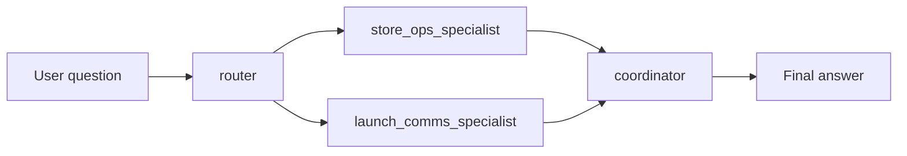

# 多代理程式延伸：情境工作流

這一頁講的是「如果不想把所有能力都塞進同一個 agent，而是拆成不同角色協作，要怎麼做」。

核心概念：Multi-agent 不是重做一遍，而是把原本的能力拆成更清楚的角色分工。真正困難的不是多建幾個 agent，而是怎麼把 **handoff** 設計好。

## 什麼時候該拆成多角色

| 適合拆 | 不需要拆 |
|--------|---------|
| 任務有明確步驟與分工 | 單一步驟問答 |
| 不同角色需要不同工具 | 工具很少、責任單純 |
| 需要分支邏輯或人工介入 | 一個 prompt 就能搞定 |
| 想讓每步中間輸出可見可追 | 不需要除錯中間過程 |

## 目前的角色設計

| 角色 | 主要責任 | 工具模式 |
|------|----------|----------|
| `router` | 重述 incident、定義後續問題與 deliverables | `none` |
| `store_ops_specialist` | 門市應變、批次狀態、reopen blocker | `both`（SQL + Search） |
| `launch_comms_specialist` | 對客說法、海報文案、創意方向 | `search` |
| `coordinator` | 組合前三者輸出，產生 recovery package | `none` |

每個角色只拿自己需要的工具，符合官方最低權限原則。

## 執行流程

輸出分四段可見：router brief → store operations → customer communications → final answer。你可以直接看到不同責任怎麼拆開。

## 兩條學習路徑

| 路徑 | 入口 | 適合先學什麼 |
|------|------|-------------|
| **宣告式 workflow** | `multi_agent/workflow.yaml` + `scripts/15_test_multi_agent_workflow.py` | 角色、步驟、scenario 怎麼拆開 |
| **宣告式（search-only）** | 同上 + `scripts/15b_test_multi_agent_search_only_workflow.py` | 沒有資料查詢能力時的文件路徑 |
| **Code-first workflow（sequential）** | `scripts/16_agent_framework_workflow_example.py` | 最小可跑的程式化 sequential workflow |
| **Code-first workflow（Magentic）** | `scripts/16b_agent_framework_magentic_example.py` | manager 先規劃、再分派 specialist 的 orchestration |

### 宣告式路徑

`workflow.yaml` 同時定義 agent templates、instruction templates、workflow steps 與 scenario catalog。新增情境時不一定要改底層執行程式。

目前採用 **sequential pattern**：router → specialists → coordinator，一步一步往下走。看懂這個後，再延伸到條件分支或 human-in-the-loop 會容易很多。

### Agent Framework 範例

`16_agent_framework_workflow_example.py` 只放兩個角色（`policy-researcher` → `answer-synthesizer`），用 `WorkflowBuilder` 串成最小 sequential workflow。適合從最小可執行程式碼理解多角色概念。

`16b_agent_framework_magentic_example.py` 則改用 `MagenticBuilder`，放一個 `triage-manager-agent` 加兩個 specialists（`queue-ops-agent`、`customer-comms-agent`）。適合理解 open-ended multi-agent orchestration，尤其是「先規劃、再決定下一步找誰」這種模式。

## 與主 workshop 的關係

這條延伸路徑直接重用主 workshop 的基礎：

| 延伸元件 | 重用的既有能力 |
|----------|----------------|
| `store_ops_specialist` | `search_documents` + `execute_sql` |
| `launch_comms_specialist` | `search_documents` |
| Runtime | 與主路徑相同的本機工具執行 |
| Scenario context | `ontology_config.json`、`schema_prompt.txt` |

Multi-agent 改變的是協作方式，不是資料來源本身。本機工具執行也完整保留，demo 時仍可看到每一步呼叫了哪些工具。

!!! tip "Structured handoff 是關鍵"
    多角色能不能長期維護，取決於 handoff 設計：router 先把 incident 與 deliverables 拆乾淨，specialists 各自專注單一責任，coordinator 只做整合。這能降低每個角色的 prompt 負擔，也更容易檢查哪一步出錯。

## 本頁重點

1. Multi-agent 不是重做一遍，而是把同一套能力拆成更清楚的角色
2. 不是每個角色都需要同一套工具
3. 真正難的是 handoff，不是 agent 數量
4. 宣告式 workflow 與 code-first workflow 都合理，看你要控制哪一層
5. 先把單一 agent 主線看懂，再用這一頁學 multi-agent 協作

## FAQ

**這是正式產品架構還是教學延伸？**
教學延伸。示範如何從單 agent PoC 演進到有角色邊界的設計。

**為什麼用 YAML？**
比較容易新增 scenario、調整 instructions、更換 workflow 順序，不必每次改執行程式。

**未來想延伸可以往哪裡走？**
加條件分支、human-in-the-loop、更結構化的 handoff（JSON schema、workflow variables、顯式狀態管理）。

## 官方延伸閱讀

- [What is Microsoft Foundry Agent Service?](https://learn.microsoft.com/azure/foundry/agents/overview)
- [Build with agents, conversations, and responses](https://learn.microsoft.com/azure/foundry/agents/concepts/runtime-components)
- [Build a workflow in Microsoft Foundry](https://learn.microsoft.com/azure/foundry/agents/concepts/workflow)
- [Microsoft Agent Framework overview](https://learn.microsoft.com/agent-framework/overview/)
- [Agents in Workflows](https://learn.microsoft.com/agent-framework/workflows/agents-in-workflows)

---

[← Foundry Control Plane：資源拓撲](04-control-plane.md) | [清理資源 →](../04-cleanup/index.md)
