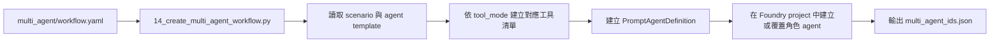
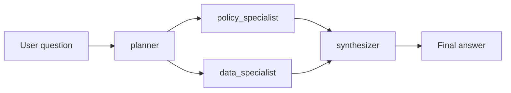

# Multi-Agent Extension: 情境工作流

## 本頁說明的內容

主 workshop 故意維持單代理程式主路徑，方便部署、解說與驗證。但當客戶開始問「如果後面要拆成不同角色、不同責任、不同治理邊界的多代理程式系統，要怎麼往前走？」時，repo 現在也提供一條清楚的延伸路徑。

這條延伸路徑位於：

- `multi_agent/workflow.yaml`
- `scripts/14_create_multi_agent_workflow.py`
- `scripts/15_test_multi_agent_workflow.py`
- `scripts/foundry_multi_agent_runtime.py`

它不是要取代主 workshop，而是示範如何在沿用既有資料、搜尋索引與 tool contract 的前提下，把單代理程式 PoC 擴成情境化 multi-agent workflow。

## 為什麼這條延伸路徑存在

主 workshop 已經回答了「一個 agent 如何同時查文件與查資料」。

多代理程式延伸要回答的是另一組問題：

- 如果不同角色要有不同 tool surface，怎麼拆？
- 如果規劃、政策判讀、資料分析、最終彙整要分開治理，怎麼做？
- 如果未來要加更多情境，而不是一直往同一個 system prompt 疊功能，怎麼維持可維護性？

## 目前 extension 的角色設計

這個 extension 目前把 workflow 拆成四個角色。

| 角色 | 主要責任 | 工具模式 |
|------|----------|----------|
| `planner` | 重述問題、定義需要哪些政策證據與資料證據 | `none` |
| `policy_specialist` | 從文件中找政策、流程、門檻與例外 | `search` |
| `data_specialist` | 對 Fabric SQL 做唯讀查詢並萃取關鍵數據 | `sql` |
| `synthesizer` | 組合前面三者輸出，產生最終回答 | `none` |

這個分工刻意讓不同角色只拿到自己該拿的能力，而不是讓每個 agent 都同時擁有所有工具。

## 宣告式設計長什麼樣子

`multi_agent/workflow.yaml` 是這條延伸路徑的中心。它同時定義：

1. agent templates
2. 每個角色的 instruction template
3. workflow steps
4. scenario catalog

這樣做的重點是，把「情境設計」從 Python orchestration code 裡抽出來。

你可以把它理解成兩層：

- Python 負責執行與接線
- YAML 負責描述角色、步驟與 scenario 差異

## 建立流程

建立 multi-agent set 的流程如下：

建立腳本會針對每個 scenario 建立一組角色 agent，並把 agent id 存回資料夾中的設定檔，供測試腳本後續讀取。

## 執行流程

`scripts/15_test_multi_agent_workflow.py` 會依照 YAML 中定義的 workflow steps，逐步執行整條鏈。

對應的可見輸出分成四段：

1. planner brief
2. policy findings
3. data findings
4. final synthesized answer

這對 demo 很有用，因為它讓使用者清楚看見「規劃」、「找政策」、「查資料」、「彙整」是不同責任，而不是全部都藏在單一 agent 的黑盒子裡。

## 與主 workshop 的關係

這條延伸路徑不是重新發明一套新的底層能力。它直接重用目前 workshop 已經存在的基礎：

| 延伸元件 | 重用的既有能力 |
|----------|----------------|
| `policy_specialist` | `search_documents` 與 Azure AI Search grounding |
| `data_specialist` | `execute_sql` 與 Fabric Lakehouse SQL endpoint |
| `foundry_multi_agent_runtime.py` | 與主路徑相同的本機 tool execution 模型 |
| scenario context | `ontology_config.json`、`schema_prompt.txt`、`fabric_ids.json` |

這代表 multi-agent extension 改變的是 orchestration shape，而不是資料來源或核心 grounding 路徑。

## 為什麼仍然保留本機 tool execution

即使角色數變多，這條延伸路徑仍然沿用目前 workshop 的設計原則：

- Foundry 負責保存 prompt agent definition
- 本機 runtime 負責執行實際工具
- 工具結果再以 `function_call_output` 回傳給模型

保留這個模式有三個好處：

1. 可以沿用既有的 SQL guardrail 與 search behavior。
2. Demo 時仍然看得到每一步到底呼叫了哪些工具。
3. 不需要在 extension 階段就把所有工具執行搬進另一套複雜 hosting model。

## Scenario 設計方式

目前 YAML 已示範三種 scenario：

| Scenario | 目的 |
|----------|------|
| `policy_gap_analysis` | 比對政策門檻與實際營運結果 |
| `exception_triage` | 針對異常事件做政策 + 數據聯合判讀 |
| `executive_brief` | 用政策與資料整理管理層摘要 |

這個設計的重點不是 scenario 名稱本身，而是讓你知道後續若要再擴充，只需要新增 YAML scenario 與對應 prompt，而不是把所有新需求都回寫到主 workshop agent 裡。

## 客戶對話要點

| 問題 | 實務回答 |
|------|----------|
| 「為什麼要做 multi-agent？」 | 「當不同工作需要不同治理邊界時，拆角色比一直膨脹單一 prompt 更容易維護。」 |
| 「是不是每個 agent 都需要一樣的工具？」 | 「不用。這個 extension 的重點就是讓不同角色只拿到需要的 tool surface。」 |
| 「這會不會推翻原本的 workshop？」 | 「不會。它沿用同一批資料、索引與 tool contract，只是把 orchestration 往前延伸。」 |

## FAQ

### 這是正式產品架構，還是教學延伸？

目前是教學延伸。它的價值在於示範如何從單代理程式 PoC，演進到更有角色邊界與工作流概念的設計。

### 為什麼用 YAML，而不是直接把流程寫死在 Python？

因為這樣比較容易新增 scenario、調整角色指令、或更換 workflow 順序，而不必每次都改 orchestration code。

### 這頁最簡潔的對話要點是什麼？

「主 workshop 展示單代理程式主路徑；multi-agent extension 展示如何沿用同一批 grounding 能力，把它演進成多角色情境工作流。」

## 營運要點

這條 multi-agent extension 提供的是一個可治理的延伸方向：

- 角色有清楚責任
- 工具有清楚邊界
- scenario 用宣告式設定管理
- 底層 grounding 資產仍與主 workshop 共用

因此它很適合作為從 demo 到更完整 solution architecture 對話之間的過渡層。

---

[← Foundry Control Plane: 資源拓撲](04-control-plane.md) | [刪除資源 →](../04-cleanup/index.md)