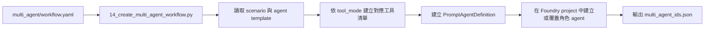
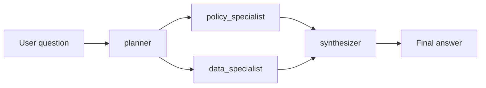

# 多代理程式延伸：情境工作流

## 概要

如果你已經跑完主 workshop，接下來最自然的問題通常是：

「如果未來不想把所有能力都塞進同一個 agent，而是想拆成不同角色協作，要怎麼做？」

這一頁就是在回答這個問題。

它不是要取代主 workshop，而是要幫你從「單一 agent 可以查文件、查資料、回答問題」這條主線，往前延伸到「多個角色如何分工協作」。

## 先抓官網真正想講的重點

如果只看 Microsoft Foundry 與 Microsoft Agent Framework 官方文件，可以先濃縮成下面幾句話。

| 官網重點 | 用白話講是什麼 | 這份 workshop 怎麼對應 |
|----------|----------------|--------------------------|
| 不要為了多 agent 而多 agent | 只有當任務真的有明確步驟、分工、條件分支或人工介入需求時，workflow 才有價值 | 這份 extension 把規劃、政策判讀、資料分析、最終整合拆成不同角色 |
| Agent 不只是一段 prompt | Foundry agent 本質上是「模型 + instructions + tools」的可持續資產 | 這裡每個角色 agent 都有不同 instructions，也只拿自己需要的工具 |
| 多代理程式的關鍵不是人數，而是 handoff | 真正困難的不是多建幾個 agent，而是怎麼把上一個步驟的輸出，穩定交給下一個步驟 | `workflow.yaml` 裡的 step 與 prompt template 就是在做這件事 |
| Workflow 適合做可重複的協調 | Foundry workflow 特別適合順序流程、if/else、human-in-the-loop、群聊型交接 | 這份 workshop 先用最容易理解的 sequential pattern 當起點 |
| Code-first 與 declarative 不是互斥 | 官方同時提供 Foundry workflow 與 Agent Framework 這兩條路 | 這頁同時放 `multi_agent/workflow.yaml` 與 `scripts/16_agent_framework_workflow_example.py` |
| 要把狀態與安全當成正式設計 | 官網特別強調 conversation state、工具輸出、最低權限與不要把秘密放進 prompt | 這份 extension 讓工具權限按角色拆開，也保留本機 runtime 來管控工具執行 |

如果你先記住這張表，後面很多設計就會比較好理解。

## 這頁要學什麼

看完這頁，你應該知道：

- 什麼情況下，單一 agent 應該開始拆成多個角色
- Microsoft Foundry 官網怎麼看 workflow / multi-agent
- 這份 workshop 現在提供哪兩條延伸路徑
- `multi_agent/workflow.yaml` 如何把角色、步驟與 scenario 拆開
- `scripts/16_agent_framework_workflow_example.py` 想示範什麼

如果你是第一次接觸 multi-agent，先把這頁當成「角色分工的入門頁」就好，不需要一開始就把所有框架與 API 細節全部吃下來。

## 什麼時候該從單一 agent 走向 multi-agent？

根據 Foundry workflow 官方文件，workflow 特別適合下面幾種情況：

- 你要協調多個 agent，而且流程是可重複的
- 你需要明確步驟，而不是把所有判斷都塞進同一個 prompt
- 你需要分支邏輯，例如 if/else、條件判斷、例外路徑
- 你需要 human-in-the-loop，例如澄清問題、人工確認、人工批准
- 你希望不同角色拿不同工具，而不是所有 agent 都擁有同一套能力

反過來說，如果只是單一步驟問答、工具很少、責任邊界也很單純，單一 agent 通常仍然是更好的起點。

所以這條延伸路徑的重點不是「multi-agent 比較高級」，而是：

當需求開始變長、責任邊界開始分開、不同角色需要不同工具時，多角色工作流通常會比一直擴充單一 prompt 更好維護。

## 官網怎麼看 agent、workflow 與 code-first？

官方現在大致把 agent 分成三種：

| 類型 | 官網定位 | 什麼時候適合 |
|------|----------|--------------|
| Prompt Agent | 用設定建立的單一 agent | 快速原型、單一角色、工具不多 |
| Workflow Agent | 用宣告式流程協調多步驟或多角色 | 順序流程、分支邏輯、human-in-the-loop、可重複流程 |
| Hosted Agent | 你自己用程式碼控制完整編排邏輯，Foundry 負責託管 | 複雜工具整合、自訂控制、多代理系統、需要更高自由度 |

這份 workshop 的 multi-agent extension，剛好對應兩條最值得學的路：

- 宣告式 workflow：比較接近 Foundry workflow 的思路
- Code-first workflow：比較接近 Agent Framework 的思路

你可以把這兩條路理解成：

- 一條強調「流程怎麼描述」
- 一條強調「流程怎麼用程式碼組起來」

## 先用學員角度理解這條延伸路徑

主 workshop 的重點，是讓你先看懂單一 agent 如何同時：

- 查文件
- 查資料
- 回答問題

多代理程式延伸則是往前一步，讓你看到另一種拆法：

- 把「規劃」交給一個角色
- 把「政策判讀」交給一個角色
- 把「資料分析」交給一個角色
- 最後再由一個角色整合答案

對學員來說，這頁最重要的不是背 API，而是理解一個設計判斷：

同一套資料來源與工具，不一定只能由一個 agent 全包。當責任可以拆開時，把角色拆開，通常更容易維護、調整與除錯。

## 為什麼這條延伸路徑存在

主 workshop 已經回答了「一個 agent 如何同時查文件與查資料」。

這條延伸路徑要回答的是另一組更接近實務的問題：

- 如果不同角色要有不同工具權限，怎麼拆？
- 如果規劃、政策判讀、資料分析、最終彙整想分開處理，怎麼做？
- 如果未來要加更多情境，而不是一直往同一個 system prompt 疊功能，怎麼維持可維護性？
- 如果我想讓每一步的中間輸出變得可見、可追、可調整，應該怎麼設計？

你可以把它理解成「同一套接地能力，換一種協作方式」。

## 官網特別強調的另一件事：狀態怎麼傳

Foundry runtime 官方文件一直在講三個核心元件：

- Agent：定義模型、instructions、tools
- Conversation：保存多回合歷史與中間項目
- Response：每次執行後產生的輸出

這對 multi-agent 很重要，因為多角色流程的核心其實不是「有四個 agent」，而是：

- 前一個角色到底輸出了什麼
- 後一個角色拿到的是原始問題、摘要，還是結構化結果
- 工具呼叫與工具輸出能不能被看見、追蹤與重用

換句話說，多代理程式最重要的設計，不是把角色名字取好，而是把 handoff 設計好。

這也是為什麼這份 workshop 的 YAML 會明確區分：

- agent template
- workflow step
- step 間傳遞的內容
- scenario 對 prompt 的差異

## 目前 extension 的角色設計

這個 extension 目前把 workflow 拆成四個角色。

| 角色 | 主要責任 | 工具模式 |
|------|----------|----------|
| `planner` | 重述問題、定義需要哪些政策證據與資料證據 | `none` |
| `policy_specialist` | 從文件中找政策、流程、門檻與例外 | `search` |
| `data_specialist` | 對 Fabric SQL 做唯讀查詢並萃取關鍵數據 | `sql` |
| `synthesizer` | 組合前面三者輸出，產生最終回答 | `none` |

這個設計很符合官網在 workflow 與工具最佳實務裡反覆強調的原則：

- 不是每個 agent 都拿同樣的工具
- 每個角色只拿自己真的需要的能力
- 最終答案不是靠一個超大 prompt 硬做出來，而是靠前面角色先把任務拆乾淨

對學員來說，這是 multi-agent 最值得看的第一個觀念。

## 你會看到兩條主要延伸方式

這份 workshop 現在提供兩條主要學習路徑，讓你用不同角度理解 multi-agent。

| 路徑 | 你會看到什麼 | 適合先學什麼 |
|------|---------------|----------------|
| 宣告式 workflow 路徑 | `multi_agent/workflow.yaml`、`scripts/14_create_multi_agent_workflow.py`、`scripts/15_test_multi_agent_workflow.py` | 看角色、步驟、scenario 如何拆開，最接近 Foundry workflow 的思考方式 |
| 宣告式 workflow（search-only） | `multi_agent/workflow.yaml`、`scripts/14b_create_multi_agent_search_only_workflow.py`、`scripts/15b_test_multi_agent_search_only_workflow.py` | 沒有 Fabric 時，先用文件路徑理解角色拆分 |
| Code-first workflow 路徑 | `scripts/16_agent_framework_workflow_example.py` | 看最小可跑的程式化 workflow 長什麼樣子 |

雖然表面上看起來是三組腳本，但概念上其實是兩條路：

- 宣告式路徑
- Code-first 路徑

這兩條路都在教同一件事：把原本單一 agent 的能力，延伸成更清楚的角色協作。

## 宣告式 workflow 路徑在教什麼

`multi_agent/workflow.yaml` 是這條延伸路徑的中心。它同時定義：

1. agent templates
2. 每個角色的 instruction template
3. workflow steps
4. scenario catalog

對學員來說，這樣設計最大的好處是：新增情境時，不一定要先改底層執行程式。

你可以把它理解成兩層：

- Python 負責執行與接線
- YAML 負責描述角色、步驟與 scenario 差異

這很接近 Foundry workflow 官網想傳達的重點：

- 流程可以視覺化或宣告式表達
- 流程裡的節點不只是 agent，也可以包含邏輯、資料轉換與變數
- 你真正維護的核心，不只是 prompt，而是整個 orchestration

所以你在學這一段時，可以先把注意力放在「工作怎麼拆」，而不是先卡在低層 API 細節。

## 這份 workshop 主要對應哪種 workflow pattern？

Foundry workflow 官網目前特別提到幾種常見模式：

- Sequential：照固定順序一步一步往下走
- Human-in-the-loop：中間需要使用者輸入、澄清或批准
- Group chat：根據規則或上下文，在角色之間動態交接

這份 workshop 目前最明確對應的是 `sequential` pattern。

也就是說，這裡先教你最容易看懂的一種形式：

- 先規劃
- 再找政策
- 再找資料
- 最後整合答案

這個切入點很合理，因為一旦 sequential 看懂了，你之後再往下延伸到：

- 某個情況才需要資料分析
- 某個情況需要人工確認
- 某個情況改由另一個專家接手

就會容易很多。

## 建立流程

建立 multi-agent set 的流程如下：

學員可以把這支建立腳本理解成「把 YAML 裡定義的角色，變成 Foundry project 裡真的可以執行的 agent」。

建立腳本會針對每個 scenario 建立一組角色 agent，並把 agent metadata 存回設定檔，供測試腳本後續讀取。

## 執行流程

`scripts/15_test_multi_agent_workflow.py` 會依照 YAML 中定義的 workflow steps，逐步執行整條鏈。

對應的可見輸出分成四段：

1. planner brief
2. policy findings
3. data findings
4. final synthesized answer

這對學員特別有幫助，因為你不只看到最終答案，還能直接看到不同責任是怎麼拆開的。

這也正好呼應官方 runtime 文件裡很重要的一件事：工具呼叫與中間輸出不是雜訊，而是 workflow 可觀察性的一部分。

## 為什麼這頁會一直強調 structured handoff？

官網在 workflow 這條線上，很強調幾件事：

- 變數要清楚
- 節點輸出最好可預期
- 複雜流程應該把步驟拆小
- 不要把秘密放進 prompt、JSON schema 或 workflow variables

這些看起來像 implementation detail，但其實就是多代理程式能不能長期維護的關鍵。

在這份 workshop 裡，對應做法是：

- planner 先定義 downstream 需要什麼證據
- policy 與 data specialist 各自專注在單一任務
- synthesizer 不再自己查資料，只做整合

這種拆法能降低每個角色的 prompt 負擔，也讓你更容易檢查哪一步出錯。

## 新增的 Agent Framework 最小範例

這裡另外放了一支 `scripts/16_agent_framework_workflow_example.py`，目的不是取代 YAML workflow，而是補一個更小、更直接的學習入口。

這支腳本示範的是：

- 用 Microsoft Agent Framework 直接在程式碼中建立 agent
- 用 `WorkflowBuilder` 把兩個角色串成順序 workflow
- 用串流方式輸出最終結果
- 繼續使用 Foundry project endpoint 與模型部署

它目前只放了兩個角色：

| 角色 | 在範例中的用途 |
|------|----------------|
| `policy-researcher` | 先整理和問題最相關的政策重點 |
| `answer-synthesizer` | 把前一步內容整理成使用者可直接採取的下一步 |

如果你對照 Agent Framework 官方文件，這支範例其實就是在示範最小版的 sequential workflow：

- 先建立專門 agent
- 再用 builder 接邊
- 再用串流執行觀察過程

如果你是第一次接觸 Agent Framework，這支腳本最適合拿來看三件事：

1. 多角色不一定要先從複雜 scenario catalog 開始
2. workflow 也可以完全用程式碼定義
3. 同樣的多角色概念，可以用不同框架承載

## 什麼時候看 YAML 路徑，什麼時候看 Agent Framework 範例？

| 如果你想學的是… | 先看哪個 |
|------------------|-----------|
| 情境如何擴充、角色如何宣告 | `multi_agent/workflow.yaml` 路徑 |
| 最小可跑的 code-first workflow 長什麼樣子 | `scripts/16_agent_framework_workflow_example.py` |
| 如何把多個角色串成更正式的教學延伸 | 兩個都看，先 YAML 再看 Agent Framework |

簡單講：

- 想學 orchestration 設計，先看 YAML
- 想學 code-first 心智模型，先看 16

## 與主 workshop 的關係

這條延伸路徑不是重新發明一套新的底層能力。它直接重用主 workshop 已經存在的基礎：

| 延伸元件 | 重用的既有能力 |
|----------|----------------|
| `policy_specialist` | `search_documents` 與 Azure AI Search 接地能力 |
| `data_specialist` | `execute_sql` 與 Fabric Lakehouse SQL endpoint |
| `foundry_multi_agent_runtime.py` | 與主路徑相同的本機工具執行模型 |
| scenario context | `ontology_config.json`、`schema_prompt.txt`、`fabric_ids.json` |
| `16_agent_framework_workflow_example.py` | 用另一種 framework 示範相同的多角色延伸概念 |

也就是說，multi-agent 改變的是協作方式，不是資料來源本身。

## 為什麼仍然保留本機工具執行

即使角色數變多，這條延伸路徑仍然沿用目前 workshop 的設計原則：

- Foundry 負責保存 prompt agent definition
- 本機 runtime 負責執行實際工具
- 工具結果再以 `function_call_output` 回傳給模型

保留這個模式有三個好處：

1. 可以沿用既有的 SQL guardrail 與 search behavior
2. Demo 時仍然看得到每一步到底呼叫了哪些工具
3. 可以把工具權限與執行面留在你自己可控的 runtime，而不是一開始就把所有事情塞進更重的 hosting 模型

這也和官網的安全建議一致：

- 工具要用最低權限
- 不要把秘密直接放進 prompt 或歷史內容
- 要清楚知道資料會經過哪些工具與哪些步驟

## Scenario 設計方式

目前 YAML 已示範三種 scenario：

| Scenario | 目的 |
|----------|------|
| `policy_gap_analysis` | 比對政策門檻與實際營運結果 |
| `exception_triage` | 針對異常事件做政策 + 數據聯合判讀 |
| `executive_brief` | 用政策與資料整理管理層摘要 |

對學員來說，這裡真正要學的不是 scenario 名稱，而是擴充方法：

- 要加新情境時，先想角色責任有沒有變
- 再決定 prompt 和 workflow step 要不要變
- 最後才考慮要不要新增工具

這比把所有新需求都繼續堆回主 workshop agent，更容易維護。

## 先記住這五件事

1. multi-agent 不是重做一遍，而是把原本的能力拆成更清楚的角色
2. 不是每個角色都需要同一套工具
3. 多代理程式真正難的是 handoff，不是 agent 數量
4. 宣告式 workflow 與 code-first workflow 都合理，重點是你要控制哪一層
5. 這一頁的重點是看懂分工與 orchestration，不是一次學完所有框架細節

## FAQ

### 這是正式產品架構，還是教學延伸？

目前是教學延伸。它的價值在於示範如何從單代理程式 PoC，演進到更有角色邊界與工作流概念的設計。

### 為什麼用 YAML，而不是直接把流程寫死在 Python？

因為這樣比較容易新增 scenario、調整角色 instructions、或更換 workflow 順序，而不必每次都改執行程式。

### 為什麼又新增一支 Agent Framework 範例？

因為有些學員比較容易從最小可執行程式碼理解 workflow，而不是先從宣告式 YAML 開始。這支範例就是拿來補這個學習入口。

### 如果未來想往官網的 workflow 能力再延伸，可以延伸去哪裡？

通常會往三個方向走：

- 加條件分支，例如某些情況才查資料
- 加 human-in-the-loop，例如澄清或審批
- 加更結構化的 handoff，例如 JSON schema、workflow variables、顯式狀態管理

### 如果只記一句話，要記什麼？

「先把單一 agent 主線看懂，再用這一頁學會怎麼把同一套能力拆成多角色協作。」

## 官方延伸閱讀

- Foundry agent 基本觀念
    - [What is Microsoft Foundry Agent Service?](https://learn.microsoft.com/azure/foundry/agents/overview)
    - [Build with agents, conversations, and responses](https://learn.microsoft.com/azure/foundry/agents/concepts/runtime-components)
    - [Microsoft Foundry quickstart](https://learn.microsoft.com/azure/foundry/quickstarts/get-started-code)
- Foundry workflow 與多代理程式概念
    - [Build a workflow in Microsoft Foundry](https://learn.microsoft.com/azure/foundry/agents/concepts/workflow)
    - [Agent development lifecycle](https://learn.microsoft.com/azure/foundry/agents/concepts/development-lifecycle)
- Microsoft Agent Framework 與 code-first workflow
    - [Microsoft Agent Framework overview](https://learn.microsoft.com/agent-framework/overview/)
    - [Agents in Workflows](https://learn.microsoft.com/agent-framework/workflows/agents-in-workflows)
    - [Microsoft Foundry provider for Agent Framework](https://learn.microsoft.com/agent-framework/agents/providers/microsoft-foundry)

---

[← Foundry Control Plane: 資源拓撲](04-control-plane.md) | [刪除資源 →](../04-cleanup/index.md)