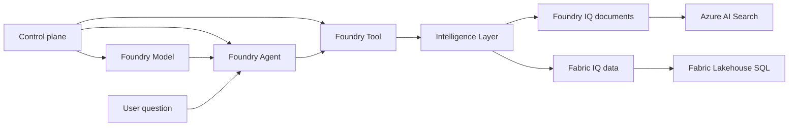

# Deep dive

This section prepares you for technical questions during customer conversations.

## The five axes

The workshop story now hangs on five technical axes. Each axis answers a different customer question.

| Axis | Core question | Primary page |
|------|---------------|--------------|
| **Foundry Model** | Which model deployments are required, and which are optional? | [Foundry Model: Deployment Strategy](00-foundry-model.md) |
| **Foundry Agent** | Where does orchestration happen, and how is the runtime loop structured? | [Foundry Agent: Runtime Orchestration](02-foundry-agent.md) |
| **Foundry Tool** | What functions can the agent call, and what guardrails exist? | [Foundry Tool: Function Contract](03-foundry-tool.md) |
| **Intelligence Layer** | How does the solution ground answers in documents and business data? | [Foundry IQ: Documents](01-foundry-iq.md) and [Fabric IQ: Data](02-fabric-iq.md) |
| **Control Plane** | Which Azure resources, connections, and permissions make the runtime possible? | [Control Plane: Resource Topology](04-control-plane.md) |

## Relationship map

Read the pages in this order if you want the shortest path from infrastructure to answer quality.

## How the pages connect

1. **Model** explains what gets deployed and why the main path stays narrow.
2. **Agent** explains how the prompt agent is created, fetched, traced, and eventually published.
3. **Tool** explains the strict function contract and the local execution loop.
4. **IQ** explains how the answer is grounded in documents and data.
5. **Control Plane** explains which Azure resources and identities support everything above.

## Deep-dive pages available now

| Page | Focus |
|------|-------|
| **Foundry Model** | Required and optional model deployments, plus skip strategy |
| **Foundry Agent** | Prompt agent definition, runtime loop, tracing, and publish boundary |
| **Foundry Tool** | Function-tool schema, execution loop, and optional-extension layering |
| **Foundry IQ** | Document retrieval, citations, and agentic retrieval behavior |
| **Fabric IQ** | Ontology-driven NL→SQL and business data access |
| **Control Plane** | Foundry project, connections, telemetry, and resource topology |

## Which page answers which question

| If the customer asks... | Start here |
|-------------------------|------------|
| "Why these model deployments?" | **Foundry Model** |
| "How does the agent actually run?" | **Foundry Agent** |
| "How do you control tool behavior and safety?" | **Foundry Tool** |
| "Why should I trust the answer?" | **Foundry IQ** and **Fabric IQ** |
| "What Azure resources are required?" | **Control Plane** |

## Common Customer Questions

### "How is this different from ChatGPT?"

> **Your answer:** "ChatGPT uses general internet knowledge. This agent is grounded in YOUR documents and YOUR data. It can't hallucinate about your outage policies because it retrieves the actual policy. It can't make up ticket metrics because it queries your actual database."

### "Is our data secure?"

> **Your answer:** "Everything runs in your Azure tenant. Documents stay in your AI Search index. Data stays in your Fabric workspace. The AI models are Azure OpenAI, not public endpoints. Authentication uses your Entra ID."

### "How accurate is it?"

> **Your answer:** "Foundry IQ uses agentic retrieval — the AI plans what to search, evaluates results, and iterates if needed. For data, Fabric IQ translates to SQL and runs against actual data. Both provide citations so users can verify."

### "How hard is it to set up?"

> **Your answer:** "This PoC took [X] minutes. For production, you'd connect your real documents and data sources. The accelerator handles all the plumbing — embedding, indexing, agent configuration."

## Deep Dive Pages

- **[Foundry Model: Deployment Strategy](00-foundry-model.md)**: chat, embeddings, and optional model deployment behavior
- **[Foundry Agent: Runtime Orchestration](02-foundry-agent.md)**: agent definition, create/test flow, trace, and publish boundary
- **[Foundry Tool: Function Contract](03-foundry-tool.md)**: core tools, schema, execution loop, and extension strategy
- **[Foundry IQ: Documents](01-foundry-iq.md)**: how agentic retrieval works
- **[Fabric IQ: Data](02-fabric-iq.md)**: how ontology enables NL→SQL
- **[Control Plane: Resource Topology](04-control-plane.md)**: project resources, connections, and tracing topology

---

[← Test Your PoC](../02-customize/03-demo.md) | [Foundry Model: Deployment Strategy →](00-foundry-model.md)
