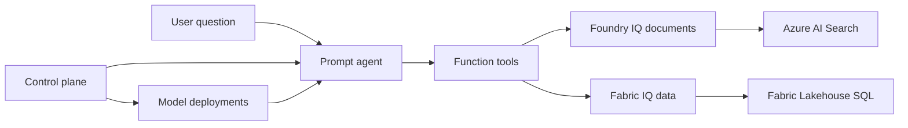

# Deep dive

This section prepares you for technical questions during customer conversations.

## Architecture Overview

## Deep-dive pages available now

| Page | Focus |
|------|-------|
| **Foundry Model** | Required and optional model deployments, plus skip strategy |
| **Foundry IQ** | Document retrieval, citations, and agentic retrieval behavior |
| **Fabric IQ** | Ontology-driven NL→SQL and business data access |
| **Control Plane** | Foundry project, connections, telemetry, and resource topology |

## Common Customer Questions

### "How is this different from ChatGPT?"

> **Your answer:** "ChatGPT uses general internet knowledge. This agent is grounded in YOUR documents and YOUR data. It can't hallucinate about your outage policies because it retrieves the actual policy. It can't make up ticket metrics because it queries your actual database."

### "Is our data secure?"

> **Your answer:** "Everything runs in your Azure tenant. Documents stay in your AI Search index. Data stays in your Fabric workspace. The AI models are Azure OpenAI, not public endpoints. Authentication uses your Entra ID."

### "How accurate is it?"

> **Your answer:** "Foundry IQ uses agentic retrieval — the AI plans what to search, evaluates results, and iterates if needed. For data, Fabric IQ translates to SQL and runs against actual data. Both provide citations so users can verify."

### "How hard is it to set up?"

> **Your answer:** "This PoC took [X] minutes. For production, you'd connect your real documents and data sources. The accelerator handles all the plumbing — embedding, indexing, agent configuration."

## Deep Dive Pages

- **[Foundry Model: Deployment Strategy](00-foundry-model.md)**: chat, embeddings, and optional model deployment behavior
- **[Foundry IQ: Documents](01-foundry-iq.md)**: how agentic retrieval works
- **[Fabric IQ: Data](02-fabric-iq.md)**: how ontology enables NL→SQL
- **[Control Plane: Resource Topology](04-control-plane.md)**: project resources, connections, and tracing topology

---

[← Test Your PoC](../02-customize/03-demo.md) | [Foundry Model: Deployment Strategy →](00-foundry-model.md)
