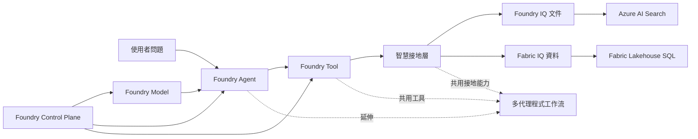

# 深入解析

本節不是要把你變成這套方案的維運者，而是幫你把前面跑過的流程一一對回去，弄清楚「剛剛到底發生了什麼」。

如果你已經把 workshop 主流程跑過一次，現在最適合做的事不是背術語，而是把這六個學習主題和你剛剛看到的體驗對起來。

## 六個學習主題

前五個主題對應單一 agent 主流程，第六個主題則是主線跑通之後的延伸閱讀，幫你理解怎麼把同一套能力拆成多角色工作流。

| 主軸 | 核心問題 | 主要頁面 |
|------|----------|----------|
| **Foundry Model** | 你看到的回答，背後到底用了哪些模型？哪些是主線必要，哪些是延伸選配？ | [Foundry Model: 部署策略](00-foundry-model.md) |
| **Foundry Agent** | 問題進來之後，agent 怎麼決定下一步？ | [Foundry Agent: 執行時協調](02-foundry-agent.md) |
| **Foundry Tool** | agent 可以做哪些事？哪些事它不能做？ | [Foundry Tool: 函式工具合約](03-foundry-tool.md) |
| **智慧接地層** | 為什麼它回答的是你的文件和你的資料，而不是一般常識？ | [Foundry IQ: 文件](01-foundry-iq.md) 和 [Fabric IQ: 資料](02-fabric-iq.md) |
| **Foundry Control Plane** | 背後有哪些 Azure 資源在支撐整個體驗？你現在先需要記住哪些？ | [Foundry Control Plane: 資源拓撲](04-control-plane.md) |
| **多代理程式延伸** | 如果以後不想把所有事都塞給同一個 agent，可以怎麼拆角色？ | [多代理程式延伸：情境工作流](05-multi-agent-extension.md) |

## 關係圖

如果你想用最少的心力把這一章看懂，建議順序不是從 Azure 資源開始，而是從「問題怎麼被回答」開始，再慢慢往下追。

## 各頁面怎麼讀最順

1. **先看 IQ**，先理解答案為什麼不是憑空生成
2. **再看 Agent**，理解誰在協調工具和回答節奏
3. **接著看 Tool**，確認 agent 實際可呼叫的能力和限制
4. **再回頭看 Model**，補上模型部署在整條路徑中的角色
5. **最後看 Control Plane**，理解背後有哪些 Azure 資源在支撐體驗
6. **多代理程式延伸** 留到最後，等你先把單一 agent 主線看懂之後再看

## 目前可用的深入解析頁面

| 頁面 | 重點 |
|------|------|
| **Foundry Model** | 主流程用到哪些模型，以及你可以先忽略哪些選配部署 |
| **Foundry Agent** | agent 定義怎麼建立，以及執行時誰負責做什麼 |
| **Foundry Tool** | 工具合約、執行迴圈，以及哪些 guardrails 在保護主流程 |
| **Foundry IQ** | 文件如何被索引、搜尋，最後變成可引用的答案片段 |
| **Fabric IQ** | 資料問題如何被引導成唯讀 SQL，最後回到答案中 |
| **Foundry Control Plane** | 支撐這些流程的 Azure 資源地圖，以及你先需要記住的最少概念 |
| **多代理程式延伸** | 單一 agent 看懂後，如何把同一套能力拆成多角色工作流 |

## 你卡在哪裡，就先看哪一頁

| 如果你現在卡在… | 從這裡開始 |
|-------------------|-----------|
| 「我知道它能回答，但還不懂它為什麼知道答案」 | **Foundry IQ** 和 **Fabric IQ** |
| 「我不確定 agent 什麼時候會查工具」 | **Foundry Agent** |
| 「我想知道它能做哪些事、不能做哪些事」 | **Foundry Tool** |
| 「我不確定主流程實際依賴了哪些模型」 | **Foundry Model** |
| 「我看到很多 Azure 名詞，但不知道哪些才是主線必要」 | **Foundry Control Plane** |
| 「我想把單一 agent 再拆成多個角色」 | **多代理程式延伸** |

## 常見學習問題

### 這跟一般聊天模型有什麼不同？

你可以先這樣理解：一般聊天模型主要靠通用知識回答；這個 workshop 的主線則是讓模型先去查你的文件和你的資料，再把查到的內容組合成答案。

### 資料是怎麼被保護的？

先記住主線就好：文件留在 Azure AI Search，資料留在 Fabric，模型與驗證都走 Azure 內的資源與身分。等你需要部署或治理細節時，再回頭看各頁的補充說明。

### 為什麼這個答案比較值得信任？

因為這個 workshop 的主路徑不是黑盒回答。文件答案會回到實際索引的文件片段，資料答案會回到實際執行的唯讀 SQL 結果。你不是只能看到一句答案，而是能沿路追到它用過哪些證據。

### 需要一次看懂所有底層細節嗎？

不用。你先看懂「答案從哪裡來」和「agent 怎麼決定下一步」就夠了。像連線、追蹤、角色指派這些底層細節，等你要部署、治理或延伸時再回頭補就可以。

!!! note "導覽順序說明"
    深入解析導覽會把 **智慧接地層** 拆成兩頁來講：先是 **Foundry IQ**，再是 **Fabric IQ**
    所以導覽列看起來會比這裡多一頁，但你可以把它們當成同一個學習主題的上下兩半來讀

## 深入解析頁面

- **[Foundry Model: 部署策略](00-foundry-model.md)**：chat、向量嵌入，以及選配模型部署行為
- **[Foundry Agent: 執行時協調](02-foundry-agent.md)**：代理程式定義、建立/測試流程、追蹤與發佈邊界
- **[Foundry Tool: 函式工具合約](03-foundry-tool.md)**：核心工具、結構描述、執行迴圈與擴充策略
- **[Foundry IQ: 文件](01-foundry-iq.md)**：文件如何被索引到 Azure AI Search，並由 `search_documents` 取回引用段落
- **[Fabric IQ: 資料](02-fabric-iq.md)**：情境設定與 schema prompt 如何引導唯讀 NL→SQL
- **[Foundry Control Plane: 資源拓撲](04-control-plane.md)**：支撐主流程的 Azure 資源地圖，以及你先需要知道的最少概念
- **[多代理程式延伸：情境工作流](05-multi-agent-extension.md)**：單一 agent 主線看懂後，如何再往多角色工作流延伸

---

[← 建置與測試 PoC](../02-customize/03-demo.md) | [Foundry Model: 部署策略 →](00-foundry-model.md)
