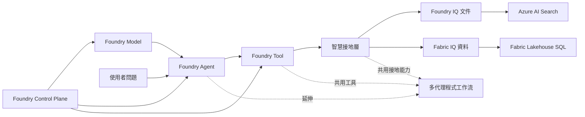

# 深入解析

本節協助你把前面跑過的流程，對應回底層技術設計。

## 六個技術主題

Workshop 的技術故事現在掛在六個技術主題上。前五個主題解釋核心單代理程式路徑，第六個主題說明如何在不破壞核心教學的情況下，往後延伸成情境化多代理程式工作流。

| 主軸 | 核心問題 | 主要頁面 |
|------|----------|----------|
| **Foundry Model** | 哪些模型部署是必要的？哪些是選配的？ | [Foundry Model: 部署策略](00-foundry-model.md) |
| **Foundry Agent** | 協調發生在哪裡？執行時迴圈如何運作？ | [Foundry Agent: 執行時協調](02-foundry-agent.md) |
| **Foundry Tool** | 代理程式可以呼叫什麼函式？有什麼防護措施？ | [Foundry Tool: 函式工具合約](03-foundry-tool.md) |
| **智慧接地層** | 方案如何在文件與商業資料中接地答案？ | [Foundry IQ: 文件](01-foundry-iq.md) 和 [Fabric IQ: 資料](02-fabric-iq.md) |
| **Foundry Control Plane** | 哪些 Azure 資源、連線與權限支撐執行時？ | [Foundry Control Plane: 資源拓撲](04-control-plane.md) |
| **多代理程式延伸** | 如果後面要加更多情境，如何拆成多個角色與工作流？ | [多代理程式延伸：情境工作流](05-multi-agent-extension.md) |

## 關係圖

如果你想找到從基礎架構到答案品質的最短路徑，請按此順序閱讀。

## 各頁面如何互相連接

1. **Model** 說明部署了什麼，以及為什麼主流程保持精簡
2. **Agent** 說明提示詞代理程式如何建立、取得、追蹤，以及最後發佈
3. **Tool** 說明嚴格的函式工具合約和本機執行迴圈
4. **IQ** 說明答案如何在文件與資料中接地
5. **Foundry Control Plane** 說明哪些 Azure 資源和身分支撐上述所有內容
6. **多代理程式延伸** 說明如何把既有工具與 grounding 能力拆成多角色工作流，新增更長的客戶情境

## 目前可用的深入解析頁面

| 頁面 | 重點 |
|------|------|
| **Foundry Model** | 必要與選配模型部署，以及 skip 策略 |
| **Foundry Agent** | 提示詞代理程式定義、執行時迴圈、追蹤與發佈邊界 |
| **Foundry Tool** | 函式工具結構描述、執行迴圈與選配擴充分層 |
| **Foundry IQ** | 文件如何進入 Azure AI Search，並透過 `search_documents` 提供引用段落 |
| **Fabric IQ** | 情境與 schema 脈絡如何引導 agent 產生唯讀 SQL 查詢 Fabric 資料 |
| **Foundry Control Plane** | Foundry project、連線、遙測與資源拓撲 |
| **多代理程式延伸** | 宣告式 YAML、角色分工、情境工作流與延伸教學策略 |

## 哪個頁面回答哪個問題

| 如果客戶問… | 從這裡開始 |
|-------------|-----------|
| "為什麼部署這些模型？" | **Foundry Model** |
| "代理程式實際上如何運作？" | **Foundry Agent** |
| "你們如何控制工具行為和安全性？" | **Foundry Tool** |
| "為什麼我應該信任這個答案？" | **Foundry IQ** 和 **Fabric IQ** |
| "需要哪些 Azure 資源？" | **Foundry Control Plane** |
| "如果我要把這個 PoC 擴成 multi-agent 體驗？" | **多代理程式延伸** |

## 常見學習問題

### "這跟 ChatGPT 有什麼不同？"

> **你的回答：** "ChatGPT 使用一般網路知識。這個代理程式是接地在你的文件和你的資料上。它不會虛構你的停機政策，因為它擷取的是實際政策。它不會編造工單指標，因為它查詢的是你的實際資料庫。"

### "我們的資料安全嗎？"

> **你的回答：** "一切都在你的 Azure 租用戶中執行。文件留在你的 AI Search 索引中。資料留在你的 Fabric 工作區中。AI 模型是 Azure OpenAI，不是公用端點。驗證使用你的 Entra ID。"

### "準確嗎？"

> **你的回答：** "這個 workshop 的主路徑不是黑盒產品功能，而是透明的兩段接地流程。文件部分先進 Azure AI Search，再由 `search_documents` 回傳帶來源與頁碼的段落；資料部分則由 agent 根據情境與 schema 脈絡產生唯讀 SQL，並在實際 Fabric 資料上執行。"

### "設定有多難？"

> **你的回答：** "這個 PoC 的最小可行版本可以在幾十分鐘內完成。對於正式環境，你只需連接你的真實文件和資料來源。加速器處理所有底層工作——向量嵌入、索引建立、代理程式設定。"

!!! note "導覽順序說明"
    深入解析導覽會把 **智慧接地層** 拆成兩頁來講：先是 **Foundry IQ**，再是 **Fabric IQ**
    因此導覽列會看到七個頁面項目，但底層仍然是這裡定義的六個技術主題

## 深入解析頁面

- **[Foundry Model: 部署策略](00-foundry-model.md)**：chat、向量嵌入，以及選配模型部署行為
- **[Foundry Agent: 執行時協調](02-foundry-agent.md)**：代理程式定義、建立/測試流程、追蹤與發佈邊界
- **[Foundry Tool: 函式工具合約](03-foundry-tool.md)**：核心工具、結構描述、執行迴圈與擴充策略
- **[Foundry IQ: 文件](01-foundry-iq.md)**：文件如何被索引到 Azure AI Search，並由 `search_documents` 取回引用段落
- **[Fabric IQ: 資料](02-fabric-iq.md)**：情境設定與 schema prompt 如何引導唯讀 NL→SQL
- **[Foundry Control Plane: 資源拓撲](04-control-plane.md)**：專案資源、連線與追蹤拓撲
- **[多代理程式延伸：情境工作流](05-multi-agent-extension.md)**：如何用 YAML 和額外腳本，把單代理程式 workshop 延伸成多角色情境流程

---

[← 建置與測試 PoC](../02-customize/03-demo.md) | [Foundry Model: 部署策略 →](00-foundry-model.md)
