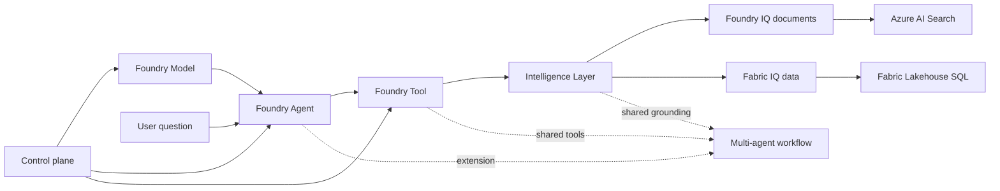

# Deep dive

本節協助你準備回答客戶對話中的技術問題。

## 六主軸

Workshop 的技術故事現在掛在六個主軸上。前五個主軸解釋核心單代理程式路徑，第六個主軸說明如何在不破壞核心教學的情況下，往後延伸成情境化 multi-agent workflow。

| 主軸 | 核心問題 | 主要頁面 |
|------|----------|----------|
| **Foundry Model** | 哪些模型部署是必要的？哪些是選配的？ | [Foundry Model: 部署策略](00-foundry-model.md) |
| **Foundry Agent** | 協調發生在哪裡？執行時迴圈如何運作？ | [Foundry Agent: 執行時協調](02-foundry-agent.md) |
| **Foundry Tool** | 代理程式可以呼叫什麼函式？有什麼防護措施？ | [Foundry Tool: 函式工具合約](03-foundry-tool.md) |
| **Intelligence Layer** | 方案如何在文件與商業資料中接地答案？ | [Foundry IQ: 文件](01-foundry-iq.md) 和 [Fabric IQ: 資料](02-fabric-iq.md) |
| **Control Plane** | 哪些 Azure 資源、連線與權限支撐執行時？ | [Control Plane: 資源拓撲](04-control-plane.md) |
| **Multi-Agent Extension** | 如果後面要加更多情境，如何拆成多個角色與工作流？ | [Multi-Agent Extension: 情境工作流](05-multi-agent-extension.md) |

## 關係圖

如果你想找到從基礎架構到答案品質的最短路徑，請按此順序閱讀。

## 各頁面如何互相連接

1. **Model** 說明部署了什麼，以及為什麼主流程保持精簡。
2. **Agent** 說明提示詞代理程式如何建立、取得、追蹤，以及最後發佈。
3. **Tool** 說明嚴格的函式工具合約和本機執行迴圈。
4. **IQ** 說明答案如何在文件與資料中接地。
5. **Control Plane** 說明哪些 Azure 資源和身分支撐上述所有內容。
6. **Multi-Agent Extension** 說明如何把既有工具與 grounding 能力拆成多角色工作流，新增更長的客戶情境。

## 目前可用的 Deep Dive 頁面

| 頁面 | 重點 |
|------|------|
| **Foundry Model** | 必要與選配模型部署，以及 skip 策略 |
| **Foundry Agent** | 提示詞代理程式定義、執行時迴圈、追蹤與發佈邊界 |
| **Foundry Tool** | 函式工具結構描述、執行迴圈與選配擴充分層 |
| **Foundry IQ** | 文件擷取、引用與代理式擷取行為 |
| **Fabric IQ** | 本體驅動的 NL→SQL 與商業資料存取 |
| **Control Plane** | Foundry 專案、連線、遙測與資源拓撲 |
| **Multi-Agent Extension** | 宣告式 YAML、角色分工、情境工作流與延伸教學策略 |

## 哪個頁面回答哪個問題

| 如果客戶問… | 從這裡開始 |
|-------------|-----------|
| "為什麼部署這些模型？" | **Foundry Model** |
| "代理程式實際上如何運作？" | **Foundry Agent** |
| "你們如何控制工具行為和安全性？" | **Foundry Tool** |
| "為什麼我應該信任這個答案？" | **Foundry IQ** 和 **Fabric IQ** |
| "需要哪些 Azure 資源？" | **Control Plane** |
| "如果我要把這個 PoC 擴成 multi-agent 體驗？" | **Multi-Agent Extension** |

## 常見客戶問題

### "這跟 ChatGPT 有什麼不同？"

> **你的回答：** "ChatGPT 使用一般網路知識。這個代理程式是接地在你的文件和你的資料上。它不會虛構你的停機政策，因為它擷取的是實際政策。它不會編造工單指標，因為它查詢的是你的實際資料庫。"

### "我們的資料安全嗎？"

> **你的回答：** "一切都在你的 Azure 租用戶中執行。文件留在你的 AI Search 索引中。資料留在你的 Fabric 工作區中。AI 模型是 Azure OpenAI，不是公用端點。驗證使用你的 Entra ID。"

### "準確嗎？"

> **你的回答：** "Foundry IQ 使用代理式擷取——AI 會規劃要搜尋什麼、評估結果，並在需要時反覆迭代。對於資料，Fabric IQ 轉譯為 SQL 並在實際資料上執行。兩者都提供引用讓使用者可以驗證。"

### "設定有多難？"

> **你的回答：** "這個 PoC 花了 [X] 分鐘。對於正式環境，你只需連接你的真實文件和資料來源。加速器處理所有底層工作——向量嵌入、索引建立、代理程式設定。"

## Deep Dive 頁面

- **[Foundry Model: 部署策略](00-foundry-model.md)**：chat、向量嵌入，以及選配模型部署行為
- **[Foundry Agent: 執行時協調](02-foundry-agent.md)**：代理程式定義、建立/測試流程、追蹤與發佈邊界
- **[Foundry Tool: 函式工具合約](03-foundry-tool.md)**：核心工具、結構描述、執行迴圈與擴充策略
- **[Foundry IQ: 文件](01-foundry-iq.md)**：代理式擷取如何運作
- **[Fabric IQ: 資料](02-fabric-iq.md)**：本體如何實現 NL→SQL
- **[Control Plane: 資源拓撲](04-control-plane.md)**：專案資源、連線與追蹤拓撲
- **[Multi-Agent Extension: 情境工作流](05-multi-agent-extension.md)**：如何用 YAML 和額外腳本，把單代理程式 workshop 延伸成多角色情境流程

---

[← 建置與測試 PoC](../02-customize/03-demo.md) | [Foundry Model: 部署策略 →](00-foundry-model.md)
