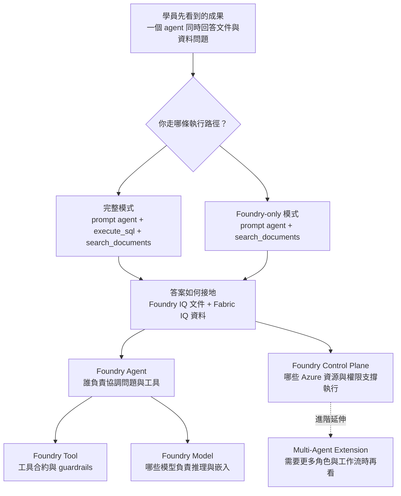

# 總覽

這個 workshop 的目標，是讓你親手完成一個能同時回答文件問題與資料問題的 AI PoC。你會從可運作的範例開始，理解它的部署方式、接地方式，以及後續如何改成自己的情境。

你可以把這套內容當成一條學習路徑：先把 PoC 跑起來，再回頭理解底層設計，最後再把它改成自己的 use case。

## 先掌握主線，再逐步展開

這個 workshop 的 runtime 先刻意維持簡潔，讓你可以先把主流程跑通，再逐步理解背後的技術設計：

- 完整模式下：一個 prompt agent、兩個 core tools、兩條 grounding path：文件走 Foundry IQ，商業資料走 Fabric IQ
- Foundry-only 模式下：一個 prompt agent、一個 core tool、一條 grounding path：只走 Foundry IQ 文件路徑

當你把主線跑通之後，可以再從首頁先認識五個核心主軸；`Multi-Agent Extension` 會另外放在延伸主題中介紹：

| 主軸 | 你可以先這樣理解 |
|------|------------------|
| **Foundry Model** | 說明哪些模型部署提供推理能力，哪些部署提供嵌入與其他延伸能力 |
| **Foundry Agent** | 說明 agent 如何結合 instructions 與 tools 來協調回應 |
| **Foundry Tool** | 說明 agent 如何透過內建工具與自訂函式安全地取用資料或執行動作 |
| **Foundry IQ + Fabric IQ** | 說明答案如何 grounded 到文件與資料 |
| **Foundry Control Plane** | 說明 Foundry project、connections、managed identity 與 Azure RBAC 如何治理資源存取 |

首頁這裡先幫你抓住主線；等你對 PoC 的執行方式有感覺之後，再回頭看這五個主軸，會比較容易把技術細節對上實際操作。

如果你要再往後延伸成更多角色與工作流，請到 deep dive 章節查看第六個主題：**Multi-Agent Extension**。

## 選擇你的路徑

這個 workshop 提供兩種起點，請依照你現在手上的環境來選：

| 路徑 | 適合誰 | 你會完成什麼 |
|------|--------|----------------|
| **管理員部署與分享** | 你要自己把整套 Azure 與 Fabric 環境準備好 | 部署 Azure 資源、設定 Fabric，並整理出可重複使用的環境 |
| **學員執行與驗證** | 你已拿到現成環境，只需要實際跑 workshop | 使用已準備好的環境驗證範例情境並執行代理程式 |

如果你是從零開始準備環境，建議先走「管理員部署與分享」，之後再回到「學員執行與驗證」把主流程完整跑過一次。

## Workshop 流程

| 步驟 | 你會做什麼 | 參考時間 |
|------|--------------|----------|
| **1. 部署方案** | 依你的角色選擇「管理員部署與分享」或「學員執行與驗證」，把 workshop 所需環境準備好，並確認預設情境可以正常使用 | ~15 min |
| **2. 依使用案例自訂** | 換成你想示範的產業與使用案例，重新產生資料、文件與測試問題，讓 PoC 更接近你的實際情境 | ~20 min |
| **3. Deep dive** | 回頭理解這個 PoC 背後的模型、代理程式、工具、接地流程與控制平面，方便你回答 Q&A 或往後延伸 | ~15 min |
| **4. 清理** | 示範完成後刪除 Azure 資源，避免持續產生成本 | ~5 min |

## 如何理解這套架構

如果你是第一次接觸這套 workshop，建議你把它看成一條由外到內的學習路徑：先看最後做出來的成果，再回頭理解執行時路徑，最後才展開底層技術主軸。

你可以用下面這個順序來讀這張圖：

- 第一層先看最上面，確認這個 PoC 最後要達成的成果是什麼。
- 第二層看中間，分清楚完整模式和 Foundry-only 模式各自會走哪些步驟。
- 第三層再往下看，理解這個體驗是怎麼由 IQ、Agent、Tool、Model、Control Plane 一起支撐起來的。
- 最右下角的 Multi-Agent Extension 是延伸主題，建議等你先把主線跑通之後再看。

如果你想用最省力的方式理解這套架構，建議順序是：

1. 先把 PoC 跑起來。
2. 再回頭對照這張圖，把你剛剛做的步驟和主流程對起來。
3. 最後才進入 Deep dive，看每個技術主軸的細節與延伸方向。

!!! tip "PoC 前建議"
    1. 先完整做一次 **Step 1**，確認部署與流程可正常運作
    2. 再執行 **Step 2**，針對你的使用案例做客製化
    3. 最後閱讀 **Step 3**，準備回答技術問題

!!! note "文件位置"
    本 workshop 的完整文件請直接參考本網站內容。
    若需要查看原始 Markdown 檔案，位置在 `workshop/docs/`。

---

[快速開始 →](00-get-started/index.md)
