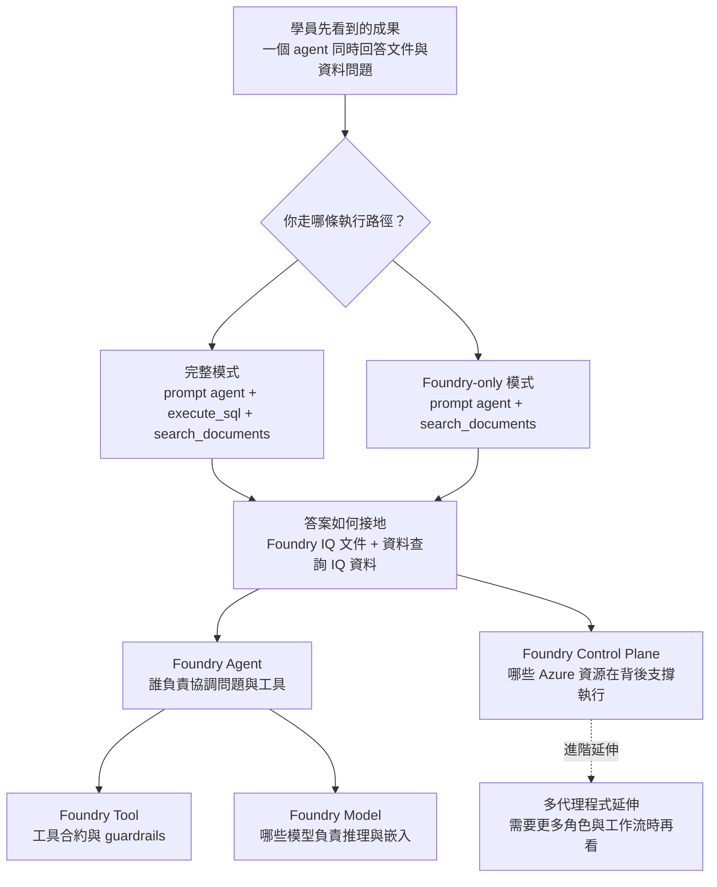

# 總覽

這個 workshop 的目標，是讓你親手完成一個能同時回答文件問題與資料問題的 AI PoC。

這一頁只做三件事：先幫你抓住主線、選對起點、知道後面各章節要怎麼讀。

## 先掌握主線，再逐步展開

這個 workshop 刻意把主流程維持得很單純，讓你先抓住「問題怎麼被回答」，再往下看背後的設計：

- 完整模式下：一個 prompt agent、兩個 core tools、兩條 grounding path：文件走 Foundry IQ，商業資料走資料查詢 IQ
- Foundry-only 模式下：一個 prompt agent、一個 core tool、一條 grounding path：只走 Foundry IQ 文件路徑

當你把主線跑通之後，再回頭看下面五個核心主軸會比較容易。它們不是要你一開始全部背起來，而是幫你把剛剛跑過的流程拆開看清楚：

| 主軸 | 你可以先這樣理解 |
|------|------------------|
| **Foundry Model** | 哪些模型真的在主流程裡用到，哪些只是延伸選配 |
| **Foundry Agent** | agent 怎麼決定何時查文件、何時查資料、何時整合答案 |
| **Foundry Tool** | agent 可以呼叫哪些工具，以及這些工具怎麼避免亂查亂做 |
| **Foundry IQ + 資料查詢 IQ** | 文件答案和資料答案分別是怎麼接地出來的 |
| **Foundry Control Plane** | 背後有哪些 Azure 資源在支撐整個體驗，以及你現在其實不用一次記住全部 |

首頁先幫你抓住主線。等你對 PoC 的執行方式有感覺之後，再回頭看這五個主軸，技術細節才不會變成一串抽象名詞。

如果你後面想把單一 agent 再拆成多個角色協作，請到深入解析章節查看第六個延伸主題：**多代理程式延伸**。

## 選擇你的路徑

這個 workshop 提供兩種起點，請依照你現在手上的環境來選：

| 路徑 | 適合誰 | 你會完成什麼 |
|------|--------|----------------|
| **管理員部署** | 你要自己把 Azure 與 Foundry 主線先準備好 | 部署 Azure 資源、完成主線驗證，再視需要回到附錄補資料延伸 |
| **學員執行與驗證** | 你已拿到現成環境，只需要實際跑 workshop | 使用已準備好的環境驗證範例情境並執行代理程式 |

如果你是從零開始準備環境，建議先走「管理員部署」，之後再回到「學員執行與驗證」把主流程完整跑過一次。

## Workshop 流程

| 步驟 | 你會做什麼 | 參考時間 |
|------|--------------|----------|
| **1. 部署方案** | 依你的角色選擇「管理員部署」或「學員執行與驗證」，把 workshop 所需環境準備好，並確認預設情境可以正常使用 | ~15 min |
| **2. 依使用案例自訂** | 換成你想示範的產業與使用案例，重新產生資料、文件與測試問題，讓 PoC 更接近你的實際情境 | ~20 min |
| **3. 深入解析** | 回頭理解這個 PoC 背後的模型、代理程式、工具、接地流程與支撐資源，方便你把剛剛做過的事看懂 | ~15 min |
| **4. 清理** | 示範完成後刪除 Azure 資源，避免持續產生成本 | ~5 min |

## 如何理解這套內容

如果你是第一次接觸這套 workshop，建議你把它看成一條由外到內的學習路徑：先看最後做出來的成果，再回頭理解執行時路徑，最後才展開底層技術主軸。

資料附錄內容已移到附錄。建議先把 Foundry 線全部跑完，再回頭補 [附錄：資料延伸](05-appendix/index.md)。

你可以用下面這個順序來讀這張圖：

- 第一層先看最上面，確認這個 PoC 最後要達成的成果是什麼
- 第二層看中間，分清楚完整模式和 Foundry-only 模式各自會走哪些步驟
- 第三層再往下看，理解這個體驗是怎麼由 IQ、Agent、Tool、Model、Control Plane 一起支撐起來的
- 最右下角的多代理程式延伸是延伸主題，建議等你先把主線跑通之後再看

如果你想用最省力的方式理解這套架構，建議順序是：

1. 先把 PoC 跑起來
2. 再回頭對照這張圖，把你剛剛做的步驟和主流程對起來
3. 最後才進入深入解析，看每個技術主軸的細節與延伸方向

!!! tip "PoC 前建議"
    1. 先完整做一次 **Step 1**，確認部署與流程可正常運作
    2. 再執行 **Step 2**，針對你的使用案例做客製化
    3. 最後閱讀 **Step 3**，準備回答技術問題

!!! note "閱讀建議"
    如果你是第一次接觸這套內容，先專注在「把流程跑通」和「理解答案從哪裡來」就夠了
    像 RBAC、project connection、追蹤設定這類細節，等你需要部署或延伸時再回頭看就可以

---

[快速開始 →](00-get-started/index.md)
